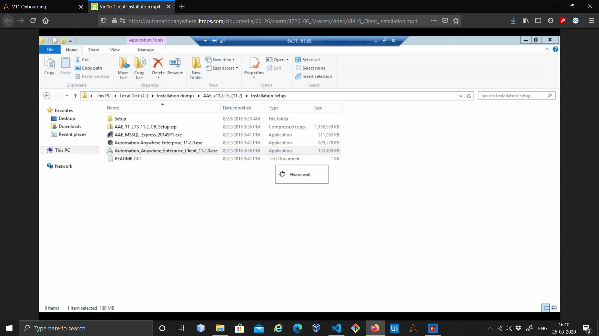
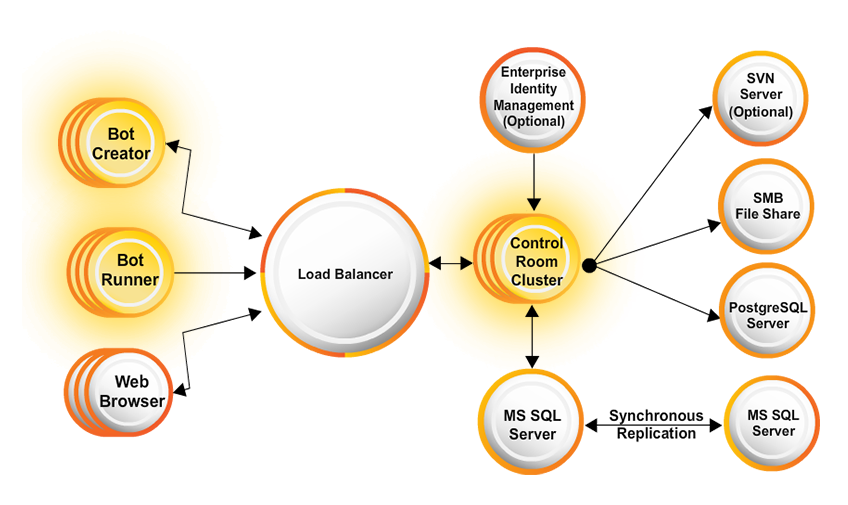
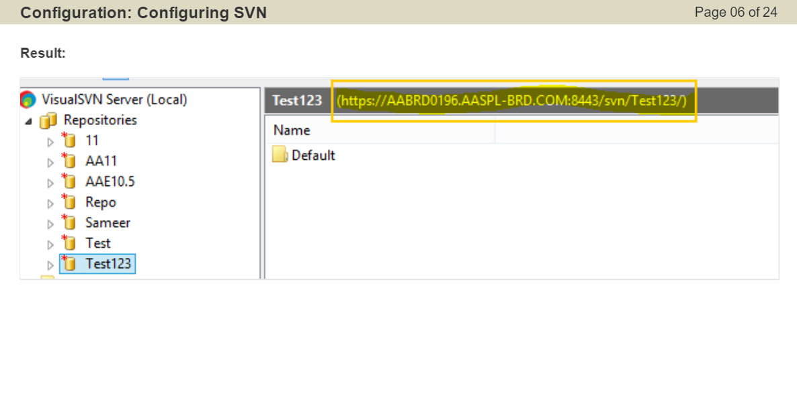
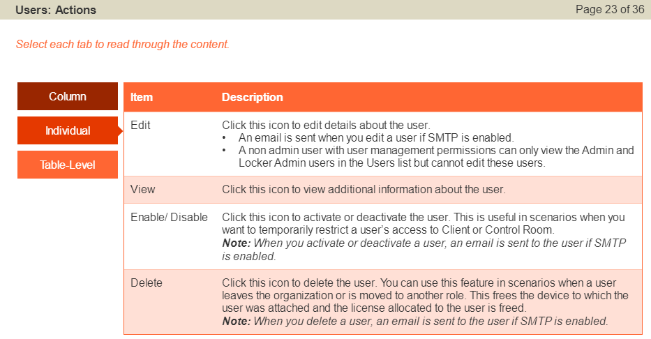

# Automation Anywhere
## Date: 2nd October 2019

## Agenda
1. Intro
2. Automation anywhere architechture
3. Web control room
4. Bot creator
5. Bot runner
6. Best Practice and techniques


# Intro
* Bot insight -> analytics platform
* Rpa platform -> task and meta bot, meta bot is the advanced version of the task bot
* Cognitive platform-> IQ bot 

# RPA platform
* Rule based
* front end automation
* Multi system integration
* Structured Data

# Cognitive platform
* Algorith based decision
* self learning activity
* Vision,NLP
* Semi structured data
* Dark data ->semi structured(pdf,images) or unstructured , 80 % data is in this form
* IQ bots helps to work on semi structured or unstructred data
* ML and AI abilities are supported with IQ bots

# Analytics Platform
* Provides business insights
* measures effectiveness
* make scaling decisions
* how much should be invest to make sure revnue is being generated

# Able to automate
* reading data from certain platform and writing to another
* works both for web bases and desktop based
* works awesome with Structured Data and good with semi-structured
* rule based decisions

# lacks
* Not able to work with handwritten data
* non rule based general calls

# Notes
* Once bot is set up on control room then it can be used to all other machines connected with same control room
* There are 2 types of clint: 
  1. Development Client -> bot creators
  2. Runtime Client -> bot execution, required once the bot is deployed to control room
* v-10.5, 8GB of RAM is required, CLient only would require 4gb RAM
* current version-: 11.3.3
* Latest Version of AAE Client requires around 16GB RAM
* Control room is equipped with lots of tools and activities, its different in version 11 then 10
* AA community is applicable only for 1 month
* License in AA are customized thus can be developed based on requirements and charges will be applicable as per the needs
* To execute or use the Control Room , we require License to be uploaded on server through the control room application only
* Bots can be scheduled to be execute at certain time only
* autologin feature -> it allows the machine to unlock the software, login the client and do the automated tasks
* Ram usage can be found using variable ```RamUsage``` and CPU usage using ```CPUUsage```.
* ```Secured Recording``` ~> It is set disabled by default and can be set active from the control room,While its active no sensitive data is captured during the recording
* A BOT is developed to ```Shrink Deployment Time```, ```Reduced Operational Costs``` and ```Amplify ROI from RPA```


# Runtime Client
* It is classified into 2 catgories:
  1. Attended -> Requires human interaction
  2. Unattended -> no human interaction required
  
# Time to Create
* KeyStrokes -> insert data in some other application
* Select Window shows the list of all applications opened on your system
* to perform certain hotkey actions just choose options from given list
e.g [ENTER]
* the commands can be reordered by move up or move down option
* Open Program/Files -> to open application,just type its name
* To upload your bot to main control room , just right click on bot file and click upload
* Community edition software does not have access to control room(users can not be created, licenss can not be managed)
* ```atmx``` standard bot file extension
* Repository Manager -> it allows the control room admin to run or schedule the uploaded bots
* To create a user:
  1. Actions Tab
  2. Create User Tab
  3. Set the details and all details are editable
* Various Roles available
  1. Admin -> can never login to the client and make bot, License Allocation:None
  2. AnalyticsConsumer -> work on BotInsight platform, utilize the reports
  3. AnalyticsExpert -> work on BotInsight platform, process the reports
  4. Basic -> mandatory, as it allows to login , for both runner and developer client
  5. IQBotServices  -> Cognitive platform
  6. IQBotValidator -> Cognitive platform
* Automation Anywhere works on R back policy, custom bots can be created to restrict or determine the permissions allowed for a user
* Control Room Recognizes the ```BOTS``` based on their machine id
* Operation Room -> Shows the task that are currently in progress
* Audit Trail -> Its the log file which stores the data regarding each and every activity, success / failures , reasons etc.
* Roles and Permission -> These can be set in control room and custom roles can be created as well
* App Management -> To integrate the system with other applications
* Outgoing Mail Server Application -> to send mails with reference to working or progress of any bots can be set
* On Installation of Control Room , two categories or options are available:
  1. Express Mode -> the master key gets set with machine
  2. Manual Mode -> master key is need to be given at every login instance
* Secure Recording -> It is required to be ```enabled``` so that the recorder would not record snapshots and take only Abstract information
* Help / Support -> it can be customized as per the need

## To Set Auto Login
* Click on Tools
* Click Options
* In Login Settings
  * Set Username and Password
  * Check auto login and scheduler task
  * Finally Apply
 
## Workflow Designer
* Helps to maintain the libraries of the bots
* every workflow can have only single start button
* To Create a ```WorkFlow```
  1. Click on Workflow
  2. Click New Workflow
  3. Drag and Drop ```Start``` activity
  4. ```Run Task``` -> this activity selects the pre build bots or tasks
    * ```Repeat``` -> recursive action
    * ```speed``` -> the way to complete the task, in real time , at backend etc
    * ```Variable``` -> to set dynamic variables for our task such as login credentials
* Its a kind of UML Diagram which can be designed as well as executed at the same moment

## Properties
* ```View Logs``` -> this option is used to check the log file
* ```TimeOut``` -> any bot can be given a timeout after which even if the application wouldn't have completed execution, it will be terminated
* ```Notification``` -> once email settings are done, one can use it to send mails with email trigger
* ```HotKey``` -> shortcut can be set to run some bot

## SCHEDULE
* It can be used to schedule a particular bot and for it t, the machine password is mandatory to be specified

# Practical
# Recorders
* There are 3 types of Recorders:
  1. Smart Recorder
  2. Screen Recorder
  3. Web Recorder
  
## Smart Recorder
* It captures the coordinates
* It captures the image in background
* It captures the object
* Smart Recorder has the inherent ability to identify keystroke actions such as ‘Shift + A’ as capital A. Also, special keystrokes such as ‘Tab’ and ‘Enter’ are saved as separate actions in the command.
* Use Smart Recorder:
    1. To record tasks in Internet Explorer 8 and above only.
    2. To navigate across controls, it is recommended that you use 'Click' action instead of 'TAB'.


## Screen Recorder
* Captures mouse movements,clicks and keystrokes

## Web Recorder
* Based or made for internet related tasks, IE supportable 100% and only
* It provides encoding feature of different languages
* When a task is recorded using Web Recorder, if the layout of a web page changes and the web controls move to a different location on the page, Automation Anywhere is capable of locating the new position of these controls and running the task correctly.

# 3rd October
## DataBase
* Microsft Access -> Microsoft Jet 4.0 OLE DB Provider
* Connect -> this is command used to connect MS access with AA
* Prompt -> Used to prompt user to get an input for True/False or Yes/No which can be stored in a variable
* It has 4 types of commands:
  * Prompt for Value
  * Prompt for File
  * Promp for Folder
  * Prompt for Yes/No
* In prompt, there is option for ```Select Window``` in that use ```Don't write in Any Window``` to make sure what screen will be seen in background while prompt is there
* SQL Commands are not supposed to end with semi-column ```;```
* The input given by user is ```Generic``` by default

    


## Variable Manager
* Create custom variables
* Value Type -> start with 'v' letter for variable name
* Array Type -> start with 'arr' letter for array name
* List Type -> start with 'list' word for list name
* New variables can be created by just using the ```Add``` button

## Read From CSV/Text
* It is an activity which can be used to read data from CSV or Text File
* ```Delimeter``` -> used to differentiate data
* By default Read CSV file activity iterates over line by line
* ```$Counter$``` is an inbuilt function which can be used to iterate and show no of iterations done

## Error Handling
* Isolates errors that occur when running tasks
* To Continue the task even if some error occurs , it is used
* Various Error Handling Options are:
  1. Take Snapshot -> save a pic of error
  2. Run Task -> run any other task
  3. Log Data Into File -> create an log file for errors
  4. Send Email -> To send an email regarding the error
  5. Variable Assignment
  6. Set task status
  
* In error Handling ..if any task fails to accomplish, we can set it to do any of the above tasks
* There are 2 System Variables made to be used for error handling 
   * Error Description
   * Error Line Number
* <b>Variable Watch Table </b> -> it is used to check the variables changing if...```Dynamically```
* <b> Toggle Break Point </b> -> It is use to freeze the executing script and run a step of the process by self click only
* <b> Step Over </b> -> It is clicked to run the next step of process when the code is freezed
* Enabling ```Error Debugging``` mode gives you access to remove errors using its inbuilt features


## PDF Integration
* It allows you to copy text from pdf
* to merge or split two or more pdfs
* to encrypt or make pdf password protected and to decrypt as well

## Encryption
* It is of 2 types:
  1. Symmetric  -> same lock and unlock key
  2. Assymmetric -> differnt lock and unlock key
* In AA, we have 3 activities with us
  1. Encrypt Files -> easily set passphrase and encrypt with any given algorithm
  2. Decrypt Files
  3. Create keys
* Various Symmetric Algorithms available are:
  1. Idea
  2. TripleDES
  3. CAST5
  4. Blowfish
  5. AES128
  6. AES192
  7. AES256
  8. Twofish256
* ```Create keys``` is used to create the public and private keys 
* The file extension of keys should be ```.snk```
* The files Encrypted with ```Public keys``` can only be saved with ```Private Keys```

# 4th October 2019
## Smart Recorder
* It can work with object,image or even coordinates
* ```control``` is keyword to refer to control panel
* It can be used to easily automate ```Coursera``` with less chances of ```Re-Captcha``` detection

## Screen Recorder
* It is dedicated to Static pages

## Email Automation
* Connect to email server (imap.gmail.com) port: 993
* monitor email activities
* download attachments to proper folder
* Extract emails and data based conditions

* To get all messages, Requires
1. HostName
2. UserName
3. Password
* Select Server type
* Insert port number
* specify which mails to read
* Specify message format

* Use ```Get All Messages``` activity to access all the mails
* it can fetch eith ```all``` or ```unread``` or ```read``` mails


## System Variables
* It contains all pre-built system variables 
* the variables such as:
  1. Date/Time
  2. Loop
  3. Excel
  4. Email 
  5. Trigger
  6. PDF
  7. System

## Metabots
* using metabots we can clone a certain application on local machine and can be used for re - use with similar environment
* It is used when certain pages, fields are dynamic in nature and tend to have changes with field positions
* There are 2 types of metabots
  1. Asset -> Screen Capturing and calibration with actual screen and captured screen ( the acceptance should be more than 80 %)
  2. Logic -> Capture the fields and insert data
  
## XML
* Processig XML information generated from web services and cloud computing applications
* Supports sessions,node editing, based on a tree structure of an XML document
* To find any ```Tag``` data in ```AA``` use ```Get Node``` activity
* Format to write node name is ```//node-name``` ... example ```\\IP```
* ```Save Session Data``` -> used to save the processed file as another file
* Functions like ```sum``` can be used

## Certification Process
* Practice 40Hr 
* We have to face 40 Questions at test1 (MCQ Type) Passing Marks: 75% above
* Use case will be given at round 2 , develop a bot with proper format
* need to submit both bot file and output file
* The formats should be checked before submitting files
* Criterias:
  1. components used
  2. Best Practices
* Complete E-learning tutorial


# Automation Anywhere

## RPA
* Rule-Based Robotic
* Front-End Automation
* Multi-System Integration
* "Democratize" Automation
* Structured Data

## Cognitive Platform 
* Algorithm-Based Decision Making
* Self Learning Ability
* Subject Matter Experts - Vision,NLP etc
* Semi-Structured Data

## Analytics Platform
* Business Insights
* Effectiveness Measurement
* Scale Decision Making

## Process Maturity Model
* PMM is an evolutionary improveent path. This path guides organizations as they move towards automated business processes
* Each stage of the PMM is a foundation for the next stage to build upon, and the improvement strategy frawn from a PMM provides a roadmap for continuous process improvement.
* It has 5 stages:
    1. Automation Pipeline ~> This stage helps in identifying and prioritizing processes eligible for automation and includes two phases.These are:
        * Top Level Benefit Analysis
        * Candidate prioritization
    2. Feasibility Analysis ~> This is analysis ad evaluation of a process in the automation pipeline to understand if it is technically feasible within a specific cost bracket
    3. Complexity Assessment ~> This assessment helps determine the effort required to develop and standardize an automated process
    4. ROI Analysis ~> Return-on-Investment analysis helps determine the returns that will be gained upon investing in Automation
    5. Automation Design ~> This is the stage during which process-specific and infrastructure-specific automation solutions are designed
* Each of these stages is an elimination round for processes.Those that do not satisfy the requirement of any of these stages get eliminated from the automation pipeline

# Control Room Settings
* A role-based accessibility model ensures each User views information or data relevant to the role assigned to the User by the Control Room Administrator
* Web CR acts as a centralized server that enables monitoring,deploying and scheduling of Bots anywhere, anytime
* Repository Path ~> It is the shared path of the Control Room repository where physical files are stored
* Client Service Port ~> It is the default port used to communicate with the Enterprise Client
* WebSocket Service Path ~> It indicates the location of the machine from where the WebSocket service is hosted
    click ```tool icon``` to open in edit mode and input the IP or the Hostname and the Port
* The CR Acess URL indicates the path to either the local IIS, the reverse proxy or the load balancer - whichever is used for your web environment
    click ```tool icon``` to open in edit mode and input the IP or the Hostname and the Port
* Outgoing Mail Server Configuration ~> used to send email notifications which can be updated using this command
* Credential Vault ~> To Configure the settings for the Credential VAult, A super admin has tp choose between Express or Manual Mode where
    Express Mode: Use this to auto-connect to the Creential Vault(master key will be stored)
    Manual Mode: Use this to manually connect to the Credential Vault(Highly Secure as need passkey everytime)

## Highlights
* Version Control Integration with SVN
* Browser-Based Access
* Interactive Dashboard with real-time data
* Multiple Admin Support
* Role-based access control
* Centralized Licensing
* Audit trail & Analytics
* Credential vault
* App Management

## Control Room Activities
1. Dashboard ~> it allows you to view task-relevant activities
2. Repository Manager ~> It is used to manage the automation files repository.Schedule , Deploy and , or Run tasks
3. Operations Room ~> View the Control Room history and tasks in progress
4. User Management ~> Used to configure Users, which include both the Client and the Administrator , and maintain their rights and permissions. Users can be activated, deactivated or even deleted if necessary
5. Audit Trail ~> It displays recent activities of Users and Administrators
6. Task Schedules ~> It is used to view or create schedules for task execution on Runtime machines
7. Security ~> USed to manage roles. You can create new roles and manage existing roles
8. Clients ~> Displays details relevant to registered client users,including client type, clients machine name , User name , and Application Path
9. Credential Manager ~> location for securely creating and storing sensitive information that is included in automation tasks in the form of Credentials
10. App Management ~> Allows you to edit registration details of existing apps as well as register new apps

## Components of Web CR includes:
    1. Control Room Settings
    2. License Management
    3. Support Site
    4. User Profile
    5. Features Panel

## Admin Privileges
* Can Configure and update the Control Room Settings, such as Repository Path, Web-Socket Service, Control Room Access URL Version Control,Outgoing Mail Server,email Notifications,Credential Vault and URLs for App Management
* WebSocket Service PortNo and Control Room Access features are available in case of Distributed Installation only

## Client Configuration
* It enables you to control the mode of recording done by a Client for business processes.Control Room Administrator can go to CR Setting > Select Client Configuration, where the option Secure Recording is available
* What is:
    1. Secure Recording ~> It ensures none of the objects and properties that comprise sensitive information are captured (Default: Disabled)
    2. Automation Anywhere URLs ~> If you click AA's URLs,you are navigated to the default AA Support Site else 
    3. Product help URLs enable you to redirect user to the links for your own Customer Support Portal
    
## Client Usage Status 
* This tab shows the details regarding License Type , Purchased and Used Licensed
<b> License Type </b> ~> Basically there are 2 types of Licenses
    1. Development Clients are the ones who are given the privilege of creating tasks in Enterprise Client
    2. Runtime Clients are Users who are allowed to run tasks and if purchased, IQ-Bots and MetaBots
<b> Purchased </b> ~> The Purchased Licensed Type displays the number of licenses that have been purchased for Development Clients and TaskBot Clients
    1. Development Client Users can be allowed to create tasks that could include IQ-Bots and/or MetaBot if the required plugins have been installed
    2. The Runtime Client Users can be allowed licenses to enabe the Scheduling Manager - User with scheduling privileges , to run tasks on TaskBot Client User machines

## Allocate License to Client
1. Select the ```tool``` icon to launch the Client ```License Allocation" window and Select the Client type
    1. Select Development type for Bot Creator
    2. Select Runtime for BotRunners
    3. Select None,when you want to allocate license to the non-client users that is Users who are neither Bot Creators not Bot Runners
    

# Workshop Automation Anywhere Student Certification ( 11th to 13th November )
* Bot Heart Beat ~> Failure Rate
* MVP ~> 
* Status ~> Status of each bot
* SLA ~> How many devices can be run at a time in a pool

## Task Bot
* Operates in the presentation layer of any desktop-based application
* Execute multistep Process
* Around the clock
* No errors

## Recorder
1. Standard ~> Captures all mouse clicks and keystrokes
2. Object ~> Ideal for desktop applicatios , captures windows control actions
3. Web ~> Process and extract data from web appications

## Variable Operation
* It is used as an Assign activity

## IQ Bots
* It adds cogitive abilities to automated business processes
* It Provides:
    1. Computer Vision
    2. Multiple AI Techniques
    3. Intelligently digitize and extract data
* Dark Data ~> Semi-Structured and Unstructered Data that can be handled by IQ Bots
* Task Bot users also
    1. Create Learning Instances on the IQ Bot Portal
    2. Deploy the learning instances from staging to production environments
    3. validate documents with exception

## Features and Benefits
1. Semantic Analysis
    * Automated Classification
    * Extracts Data accurately
    * Categorizes various document types and formats
2. Accurately digitizes documents
3. Simplifies the process of training the bots
    * Auto-detects field values
    * Auto-corrects exceptions
    * Flags Exception
    * Provides cross-field mapping rules
    * Resolves field collisions
    * Helps training verification via result preview
4. Handles exceptions faster and seamlessly
5. Supports many languages

## Meta Bots
* Visual Captures ~> GUI Components of screen
* Application APIs ~> Allow low level operations of an application by evading GUI, Supports API on dll
* Navigational flows ~> Pre configured use cases of an application and Leverage visual captures and APIs and Screen and DLLs form the Assets


* STP ~> Number of documents that are processed end-to-end without human intervention


# WorkBench
* It allows the ```Business Process Specialist``` and ```IT Staff``` for ```Streamlining, enhancing and Deploying``` the automated tasks
* Non technical can build automated processes using drag and drop

## Components of Workbench are:
1. Commands Panel ~> Drag and Drop command in Actions list panel and edit or move in bulk 
2. Actions List ~> Opens and Edits multiple task/metabots side by side
3. Actions Buttons (New,Record,Run,Save,Enable Debugging, Set snappoint)
4. Error View Tab ~> Manages Errors,Simultaneous Debugging and Track Progress of longer tasks and debug them
5. Variable Manager tab ~> Displays user defined local variable
6. Filters box ~> Manage time consuming tasks
7. Bot Dependencies/Manage Dependencies ~> Exports depended files to COntrol Room and deploy when required by the  TaskBot

# Tool and Commands 
## Read from CSV/Text
* Used to List sepearated or Tab delimited data
* Read multiple lines
* Encode data into ANSI,UNICODE or UTF8 Encryption format

## Variables
* There are 4 types of Variables
1. List ~> This holds multiple values in a single dimesnion. It is used for retrieving multiple values, or Sending email to multiple recipients or Passing different values inside of a loop or Searching multiple web addresses.
2. Array ~> This is a multi-dimensional variable that holds multiple values in a table of rows and column. Arrays are used for 
    1. Extracting data from web Pages
    2. Extracting multiple rows of data 
    3. Reading or writing data
    4. Filling out order forms
3. Value Variable ~> This is created when a user needs to hold a single value and use it in multiple places
4. Random Variable ~> This generate a random , repetitive or a numerical set. Generally used to create sample test data in form of String or Numerical

* ```AAControlRoom``` ~> System variable used to show the Control room URL
* Variable Manager can be used to Add,Edit,Delete or copy the variables
* ```Table Column``` System Variable Stores the Content from the table extracted through Web Recorders Extract Table Command
* ```List`` Loop is used to perform loop operation based on the selected variable

## Image Recognition
* The Comparison Mode allows 4 options:
    1. Advance(Default & Recommended) ~> Provides accurate results in cases where the screen resolution/zooming or application scaling is subject to change
    2. Normal Mode ~> Compares the RGB components of the pixels with the source
    3. Gray-Scaled mode ~> Converts pixels to an appropriate level of gray-scale prior to comparing
    4. Monochrome mode with Threshold ~> Converts pixels to either black or white prior to comparing
* Image Recognition command allows you to locate an image after the image might be moved, for example, from one location on a web page to another.
* It also allows you to use Image based automation when application UI elements may not be available for automation. For example, when application is exposed over Citrix or when application accessed from RDP, or when object detection is not as reliable such as legacy applications, you can use the Image Recognition command.

## Insert Work Item
* In order to use Work Item command, there are some criteria to be considered. These Include
    1. You need to have a Bot Creator license
    2. You need to have setup the Queue in the Control Room Workload page prior to using it in a Task Bot
    3. You must be added as a participant in a Queue or queues in the Control Room,otherwise, Not Enough Privileges error condition occurs.
* If the queue is in run mode and associated with a bot to prcess work items in the Queue, a ```STAGED``` error condition occurs.


## Error Handling
* The Error Handling command is used to handle errors while running a task and aids in debugging the task
* The Error View Tab in the Workbench can be used to manage errors
* It updates the changes automatically and Tracks and debygs longer tasks
* Error Handling Options are:
    1. Take Snapshot ~> Captures and saves a screenshot of the error screen as file in a default temp folder where file is timestamped with Day, Month, Year, Hour and Minute
    2. Run Task ~> Run another task , when the current task encounters an error
    3. Log Data into File ~> Logs the error data into a file
    4. Send Email ~> Send an email with Snapshot of Screen,Text file containing the value of all variables(user / system)
    5. Variable Assignment ~> Specifies a value to a particular variable and sets a Task Status, while you continue running a task
* By using the Error Handling commands, you can isolate errors that occur when running your TaskBot / MetaBot Logic.
* When an error occurs, you can continue the TaskBot / MetaBot Logic after the error, or stop the Taskbot / MetaBot Logic.


## Manage Web Control Commands
* The Manage Web Controls subcommand is located inside the Web Recorder command
* Web controls are objects on webpages that run when the page is requested and render markup to a browser
* It can be used to insert actions to the following:
    1. Links
    2. Drop Down menus
    3. Checkboxes
    4. Radio buttons
* It can be used to insert text or ```set values``` in Web based text fields same as ```Type Into command``` of UiPath


## Log To File Command
* A log file can be saved with ```.csv``` or ```.txt``` extension
* It provides encoding in the ```ANSI```,```UNICODE``` and ```UTF8``` format
* This command helps to 
    1. Verify that TaskBot or MetaBot logic runs properly
    2. Create a new log file if one does not already exist
    3. Specify custom text to be included in the file
    4. Add a timestamp to the file and
    5. Use the file as a variable


## IF/Else Command
1. Window Exists/Window does not exist ~> It checks or verifies that a specific application is open, checks whether an error has occurred and checks whether a file download has completed or not
2. Script Successful/Unsuccessful ~> Integrates third-party scripts(VB,JavaScript) with automation taskbot/metabot logic,Determines if the script ran successfully after the runs and issues a return code and it also integrates scripts with the automation TaskBot/MetaBot logic for scripts already developed
3. File Date ~> Checks the date and time that a file was created or last modified, Specifies a date range using ```between``` or ```before``` keywords and uses a number of days or a time schedule in the ```hh:mm:ss``` format.
4. Image Recognition ~> Checks whether an image exists within another image, Recognizes image stored in files or captured from a window when the TaskBot/Metabot Logic runs , It specifies a minimum ```percentage match``` for the image captured and It enables to perform click action on the captured image if found within larger image
5. Windows Control ~> Checks whether a specific control exists in an active window such as command buttons, list box items, text boxes or menu tabs


## Manage Windows Control Command
* Controls are UI elements that enable user interaction with an application
* Generally includes Buttons,Text-Boxes,ComboBoxes,List box items,Menu tabs, checkboxes and tables
* This command is useful in:
    1. Performing actions on the controls
    2. Assigning captured properties to variables and
    3. Recording actions that are performed simultaneously
* it can be used to 
    1. Get Name Text
    2. Get Value Text
    3. Click on Link
    4. Get Name of All Children
    5. Get Value of All Children
    6. Left Click
    7. Right Click
    8. Double Click


## File/Folder Command
* The File and Folder commands provide an easy way to operate files and folders
* Various Sub-commands includes
    1. Create
    2. Open
    3. Copy
    4. Delete
    5. Rename
    6. Organize
    7. Move
* Few advanced operations are also possible based on ```Size``` and ```Date created or modified```


## Object Cloning command
* Used to capture an object,its co-ordinates and images from desktop and web-based application
* Capture objects within windows that use technologies such as Flex,Silverlight,Java and Html etc.
* ```Re-Capture Image``` ~> Used to recapture the image in case of any discrepancy in captured co-ordinates or image
* Select object in ```object``` mode and if it doesn't work then only go for ```coordinates``` or ```image``` mode.


## Insert KeyStrokes Command
* It supports German,French,Italian and Spanish language


# MetaBots
* Metabots are the Automation building blocks which are the Reusable application blueprints of an application
* Metabot is application resilient, which means anytime an application ```Updates``` or ```Changes```, the user can make minimal edits to the Bot itself and those changes will automatically be applied to any process
utilizing that bot
* The Automation blue prints can be constructed using the elements present in metabots such as
    1. Visual Captures ~> GUI components,screensof an application
    2. Application API's ~> which are interfaces that allow low level operations of an application by circumventing GUI(most common is DLL)
    3. Navigation Flows ~> Pre-configured use cases of an application and leverage visual captures and API's
* Benefits of MEtabots
    1. Accelerated automation ROI
    2. Eliminates navigational errors
    3. No live access requirement
    4. Easy calibration
* With Metabot Designer we can ```Create,Manage,Conceptualize bots``` and upload the metabots to the ```control room``` for use by other enterprise client users and edit metabots created by other users
* Visual Captures are referred as ```Screens```
* Screens and DLLs form the Assets using which you can define and pre-configure any use in case of a target application to create a navigational flow, known as Logic
* If Version Control is enabled for controlled edits of Metabots, a BotCreator can Check Out the MetaBot for editing and view Version History
* The MetaBot tab opens each MetaBot in its own tab. This tab is dedicated to the Assets and Logic for that particular MetaBot
* The Add Folders option organizes your MetaBot using ```Folders```.This enables you to easily manage all your screens and DLLs that are to be uploaded or have been uploaded
* Various Options that can be used in ```Asset``` view are:
    1. The ```Add Screen``` Option captures a single screen for an executable application, that is running
    2. If your Screens are set at lower resolutions such as ```1024x768``` , the ```Add Folder``` and ```Add Screen``` options can be accessed from the ```Edit``` menu
    3. The ```Record Screen``` option captures multiple screens of the related application or webpage at one go. And Every Screen or Menu Item or Pop-up or Context Menu that you interact with during the recording gets caotured
    4. The ```Add DLL``` option adds the ```Application Programming Interface``` or ```DLL``` within your MetaBot.Remember though, you cannot include ```special characters``` in DLL names
    5. The ```Configure```option edits properties for the ```recorded``` or ```added``` screens such as Name,Path,Value etc. Thus improving the reliability of your automation
    6. The ```Calibrate``` option instantly compares an existing screen with a newer screen of an application to identify any changes when the application has been updated with improvements and newer features
    7. The ```Delete``` option removes the MetaBots that are no longer required.
* If an application has multiple ```exe's```, you are required to create a separate MetaBot for each
* Various Options that can be used in ```Logic``` view are:
    1. The ```Add Folder``` option is similar to that under Assets. It organizes your Logic using ```Folders```
    2. The ```Add Logic``` option allows to create the ```navigational flows``` in the Logic Editor
    3. The ```Record Logic``` option records the logic flow and automatically saves ```Screens``` in Assets.
    4. The ```Edit``` option makes changes to an existing navigational flow
    5. The ```Delete``` option deletes the ```obsolete Logic```
* We Can use the ```MetaBot Workbench``` to create simple,manageable and independent naviagtional flow to be integrated into other automation TaskBots/MetaBot logics.
* BotCreator user with MetaBots Repository access permissions can create,record,upload and delete MetaBots
* Notes:
    1. MetaBots are highly re-usable; create once, use everywhere. They can be leveraged by any automation task.
    2. Enterprises can leverage MetaBot library to standardize org-wide automation in a rapid manner.
    3. MetaBots ensures systematic, accelerated automation ROI.
    4. MetaBots help to eliminate common navigational errors in complex automation tasks.
    5. MetaBots help to automate without requiring access to live application.
    6. MetaBots can be easily calibrated to newer versions of applications to ensure compatibility.
* Deleting a MetaBot from the MetaBot Designer doesn’t delete it from Control Room.

## Making an MetaBot
* On creating on ```New MetaBot```, New MetaBot Application opens and lists all applications currently opened in system and gives us two options for MetaBot Type
    1. Application Specific ~> Create automation using Screens from single application
    2. All Applications ~> Create automation using combination of Screens from different applications
* Click on ```Add Screen```, an Open Screens window opens that shows all instance of currently open screens of the selected application
* We have 2 methods to capture type for Screen Objects that are ```Standard``` and ```OCR```
* Select ```Standard``` when using technology such as ```MSAA,html``` etc
* Select ```OCR``` when capturing objects from application images which are exposed over applications such as ```Citrix``` or ```RDP```


# Bot Insight
* Bot Insight ~> Captured data ~> Aggregated Volumes ~> Transaction Throughput ~> Failure Rates ~> Trends,Events and Changes
* Bot Insight provides ```Operational Intelligence```,```Historical Information```,```works 24/7``` and ```Health and Performance``` of Bots
* Operational Managers and Practitioners can constantly monitor the efficiency and effectiveness of the digital workforce 
* Includes APIs that allows IT Professionals and Centralized IT groups to eagerly ```extract``` , ```load``` and ```transform``` RPA data into their databases.
* It is packed with ```Quick Tagging```,```Tailored Dashboards```,```Interactive Analysis``` and ```Central Management```
* It helps Any organizations Operational management to ```derive revenue```,```increase customer satisfaction```, ```reduced costs```,```error margins``` and
* Positively impact the companies by leveraging Operation and Business Insights

## Business Analytics
* Business Analytics can be performed using Automation Anywhere's Bot Insight product,which is a web-based application
* Transactional Analytics enables you to quantify business value added by Bots and identify new opportunities from business insights.This analysis is used by operational business executives

## How it Works?
1. Tag the data variables
2. Click on log for analysis ooption in variables
3. After tagging and logging the data,click the Analyze tab.This will auto-build the task Dashboard template in Bot Insight site's Configure tab
4. Once the Dashboard is generated,you need to Save and Publish the Dashboard in order to see the Cumulative data
5. Then,upload the bot to the Control Room for execution
6. After publishing Dashboard and uploading task to Control Room,execute the bot on a Bot runner device in Control Room
7. The data will be analyzed if task execution happens locally in the Bot runner client or from Control Room.

## Types of Roles
1. <u>Analytics Experts</u> 
This role allows the user to tag the variables of the bots on client machine and customize ,create copies of the dashboard in the Bot Insight environment
* Can view 2 tabs ```Dashboard``` and ```Data Profile```
    1. Dashboard ~> It provides a customizable reports that can be published to be viewed by Analytics Consumers .The Data filter slider at the bottom can be used to interactively analyse the data over a chosen timeframe for the entire dashboard
    2. Data Profile ~> It allows you to inspect the data profile against each variable that was marked for Analytics within the task.It provides complete description of the tagged variable along with the statistical information
* An Analytics Expert can use the various options provided by the tool to customize the chart widget.The options include:
    1. Filters that allows you to sift the data plotted on the chart
    2. Sort and Limit that allows you to sort and restrict the data displayed
    3. Color Settings that allows you to change the color palette of the chart
    4. Export that allows you to export the information displayed on the chart to different formats
    5. Chart Style that allows you to change the chart type,if it is not appealing enough and needs to be changed
    6. Time Bar that allows you to change the time line attribute against which the information is displayed
* An Analytics Expert can also:
    1. Share the generated dashboard or reports via email
    2. Bookmark the customized dashboard
    3. Save the modified system generated dashboard
    4. Publish System generated and customized dashboard, and
    5. Compare customized Dashboards in the configure section

2. <u>Analytics Consumers</u>
* This role allows the user to have access only to Published Dashboard and analyse the data in Bot Insight
* A User with this role can:
    1. Share reports via email
    2. Bookmark the dashboards and
    3. Compare dashboards

3. <u>Admin</u> ~> This role allows the user to assign the other to roles to a new user
* With Business Analytics, you can:
    1. Quantify business value added by Bots,
    2. Identify new opportunities from business insights,
    3. Quickly prototype, measure and showcase new RPA candidates (that is Bots), and
    4. Scale up automations and improve business process efficiency.


# Operational Analytics
* The information about 
    1. which bots are scheduled to run
    2. which bots failed to run
    3. which of the bots use the most system resources, and
    4. what percentage of bots are in progress,paused,unknown and completed
* Operations manager and practitioners can constantly monitor the efficiency and effectiveness of their digital workforce, and easily quantify processe's operational performance on demand
* It is free and integrated within the Web Control Room
* The operational related information about the bot can be accessed from the :
1. <u>Bots Page</u>
It provides a graphically summarized view of all the deployed bots in the Control Room
It consists of widgets such as:
    * <b>Bot Hearbeat</b> ~> Widget that provides a statistical representation of the relationship between the failure score of a bot and the respective bot
    * <b>MVP Bots</b> ~> Widget that displays bots based on their maximum processing time and the number of times they are run
    * <b>Bot Status</b> ~> Widget that tracks the task progression based on the status: Deploy Failed,Stopped , Started, Failed, Completed
    * <b>Top Failure Reasons</b> ~> Widget that categorizes the errors that your bots may encounter into varios groups and shows the count of each group
2. <u>Audit Page</u>
The Audit page allows a Control Room user with View Dashboards permission to view a snapshot of audit information as processed in the Control Room.
It allows you to monitor various events such as the highest percentage of a particular activity being performed based on either user name or host machine type, and a visual representation of the failure log


# Web Control Room
1. <u>Dashboard</u>
* It provides a bird's-eye view of the entire automation to the Control Room administrator with an graphical insight.It represents the RPA infrastructure in the form of meaningful visuals and charts.This leads to informed decisions and coorective actions.
* The Control Rooms built in interactive dashboard can be customized to show critical data upfront with customizable widgets with flexibility to drill it down by applying specific filters.It contains:

    1. Home ~> Displays information of total active users,status of the executed bots, total number of bots scheduled, and total number of queues and BOt velocity  
    2. Bots ~> displays a graphically summarized view of all the deployed bots in the CR and provides operational analytics on BOTS in your RPA platform
    3. Devices ~> displays the Bot Runner machine;s relevant data and where Bots are deployed and lets you view the stability of your RPA environment at a glance
    4. Audit ~> allows you to monitor various events such as the hoghest percentage of an activity being performed based on username or host machine type and a visual representation of the failure log
    5. Workload ~> allows you view workload status of the device pools,queues and workitems in the workload executive and operation managers dashboard
    6. Insights ~> It helps automation experts and consumer to interactively analyse test data and enhance widget 

2. <u>Activity</u>
* Used to monitor all tasks that are running or have been deployed to clients or have been scheduled to run as per the plan
* It consists of 3 sub-modules:
    1. In-progress ~> Gives a live status of all the on going activities in the Control Room
    2. Scheduled ~> displays a list of activities that have been scheduled for a later time
    3. Historical ~> It chronologically lists all the activities that have occured, and those that have finished running

3. <u>Bot Repository</u>
* It displays all the bots uploaded from the AAE client application
* It consists of 2 sub-modules:
    1. My bots ~> A Centralized location where all the Bots,Workflows,Reports,Documents are uploaded from the enterprise client on to the control room.It provides the ability to run and schedule tasks on 'Bot Runners'
    2. Credentials ~> It is a centralized location for securely creating and storing sensitive information that is included in the automation tasks in the form of credentials
    * It asks for Attribute Name,Attribute Description,Attribute Value

4. <u>Devices</u>
* It lists all the devices that are registered and connected to the control room in the My Bot page
* It allows you to create and view a list of Device Pools
* Device pools are a collection of devices provisioned to run bots with queues as a part of the Workload Management
* In the ```My Device``` tab , the status of the device can either be:
    1. Connected ~> when the user is logged on to the Control Room
    2. Disconected ~> when the user is not logged on to the Control Room
    3. Offline ~> when the device user, has been unregistered or disabled by the Control Room Admin
* In the ```My Device Pools``` tab , the status of the device pool can either be:
    1. Connected ~> If the bot runners assigned to the device pool are logged into the control room,or
    2. Disconnected ~> If the assigned bot runners are not logged into the control room

5. <u>Workload</u>
* It allows you to manage your work items by dividing them into small yet logical modules.
* Simultaneouly, the Workload module processes these small, logical modules to ensure time-based ```Service Level Agreement``` or SLA's are met and resource utilization is optimized
* It consists of 2 sub-modules:
    1. Queues ~> These are a collection of work items,that is , a defined set of columns that constitute a single unit of work
    Is Created by a Control Room admin with Create Queues privilege
    Can be defined by manually setting up columns or using Excel worksheet as its base
    Three kind of statuses are assigned to Queues which are ```In Use,Draft and Not in Use```

    2. S-L-A Calculator ~> It helps in calculating either the processing time or the number of devces required to meet the desired S-L-A by estimating the device pool size or time required for a given queue

* You can use ```Workload Management``` to:
    1. Manage work items using queues
    2. Create,update and control the way work items are included in queues
    3. Modify the work items distributed to Bot Runners that are assigned to Device Pools,and
    4. Estimate SLA
* Benefits :
    1. Centralized definition and management of work items is made easy
    2. A row of data in a queue can be processed on a collection of devices in a device pool as well
    3. Queues can be added manually as well as atomatically using Control Room or using the "Insert Work Item" command in the Workbench
    4. Specific roles and permission element in the Workload further enhances the control over the queue system

6. <u>Audit Log</u>
* Captures details of all activities performed on RPA platform
* Provides read-only records of all the important actions performed in Control Room and by the client
* This helps enforce internal compliance regulations as well as prevent tampering with mission-critical processes. 
* One of the most important aspect of Audit log is that it allows you to back up all the actions performed in the form of a ```CSV``` file,if required.
* Only a Control Room Admin or a user with Audit Log privileges can select an activity from the Audit Logs to view its details.
* The Audit log allows you to view actions based on the
    1. Status
    2. Action Type
    3. Item Name
    4. Action taken by

7. <u>Administration</u>
* It is used to control and manage the general settings of the entire AA RPA platform in the organizations network.
* It's sub-modules include:
    1. Settings ~> Manages users and administrators who play various roles in automation
    2. Roles ~> Manages or assigns roles required to perform various functions by users
    3. Licenses ~> Installs and manages product licenses
    4. Migration ~> Assists in migrating data from the CR v10 into the Cr v11
* The Administration page of the Control Room can be used to perform the following actions:
    1. Create Roles/Users
    2. Edit Roles/Users
    3. Delete Roles/Users
    4. Change General Settings
    5. Install,view and manage licenses
    6. Migrate Information to new Control Room version
* The Administration module consists of five sub-components,which are:
    1. <u>Settings</u>
    <b>General</b> ~> Editing General Settings and Control ROom database
    <b>Bots</b> ~> Enable or disable Version Control in Bots
    <b>Client Application</b> ~> Enable or disable Secure recording,set product help URLs, and configure Device health checks in Client applications
    <b>Credentials</b> ~> Configure the connection mode to the Credential Vault in Credentials,and
    <b>Email</b> ~> Enable or disable the email settings

    2. <u>Users</u>
    * As a Control Room admin with user management privileges, you can view,create,edit,delete, and enable or disable a user
    * You can also perform other actions,such as ```delete multiple users```,```export the list of users in CSV format```,```refresh the list in the Users table```,```Create a user and assign a role to it```

    3. <u>Roles</u> 
    * The Roles page provides information of the role defined for each user such as Administrators,Clients, and non-Clients.
    * This role-based accessibility model or ```RBAC``` ensures each User, views information or data that is relevant to the role assigned to them
    * Use this page to create roles,edit and delete roles for various features and operations in the Control Room
    * There are 2 types of roles:
    ```System-created``` ~> Pre-configured during the Control Room installation
    ```User Created``` ~> Created by the user themselves and can be customized accordingly
    * Participant ~> Roles added as participants in a queue are allowed to view the queue and add work items to the queue but are not allowed to edit any other properties of the queue
    * Consumers ~> Roles added as consumers of the queue can view the work items in the queue,edit work items in the queue, or use the queue when running bots.Users expected to run bots with queue should have roles as a consumer in both the queue and the device pool

    4. <u>License</u>
    * It provides detailed information about the current license installed. It also allows Admin's to monitor license details and usage statistics
    * View Product license details any time and avail information about the list of purchased products,along with license version and product license status as used, not used, or not applicable

    5. <u>Migration</u>
    * Used to migrate data from a previous Control Room version 10.x to 11.x
    * Need to be a Control Room Administrtor to access the Migration wizard tool
    * Use the tool to migrate data either on the basis of Roles or Users in phases depending on your business requirements
    * Dependent data such as licenses,credentials, bots,and schedules are also migrated automatically when you migrate roles or users

## Notes
* Failure Score = 0.5*Memory Usage + 0.3*CPU Usage + 0.2*HDD Usage 
* Bot HeartBeat ~> Provides a statistical representation of the relationship between the failure score of a bot and the respective bot
* Bot Status ~> Tracks the task progression based on the status: Deploy Failed,Stopped,Started,Failed and Completed
* Most Valuable Process (MVP Bots) ~> Displays bots based on their maximum processing time and the number of times they are run
* Top Failure Reasons ~> Categorizes the errors that your bots may encounter into various groups and shows the count of each group
* Upcoming Schedule widget ~> Displays all bots that are scheduled to run,which are sorted by the number with which they are run
* Backlog = Number of hours it takes to complete the existing work items from all automations in that pool
* Wait time = Automation start or resume time Processing start time
* The owner can manage the Operation Manager's Dashboard
* The Chart Editor allows you make changes to the widget
* ```Not Started``` is the invalid status of the bot in Historical Feature
* The automation of a bot will fail if you do not have folder privileges on the dependencies
* The System role AAE Pool Admin must be assigned for a user to Administrator all device pools and by default the AAE Admin role will only see device pools where they are assigned as a device pool owner
* If the queue is not being used or is in draft state, the Automation Name and Automation Status column will show Not Application and shows the automation name if in use.
* The ```Calculation``` tab in the SLA Calculator populates the number of work items processed and average processing time of a work item for the selected automation
* ```Reactivation Threshold value``` ~> This is the minimum no of new work items that should be present in the queue to resume the queue process after all the work items in the queue are processed
* A first-time user has access to trial license for a period of 30 Days, after which a user can continue with an extended trial license or install a new license
* The View and manage ALL scheduled activity allows a bot creator to manage and view scheduled activities for all users.
* Permissions that any Enterprise Control Room user has access to by default are: View Dashboard, Manage my credentials and locker, View and manage my queues.
* Permissions that a non-admin user has no access to are: Admin, BotFarm Admin, Pool Admin, Locker Admin.
* Wild Cards can be used in AA such as ```*``` and ```?``` same as UiPath
* With Secure Recording Option enabled, we can not re-capture the image 

## Lockers

* This enables separation of duties for credential management and consumption. Users with the following permissions can work with lockers:

    1. Manage my lockers: This permission allows you to create and manage your own locker.

    2. Administer ALL lockers: This permission allows you to view all the lockers and perform limited actions on them. This permission is available for AAE_Locker Admin role only

* The roles and permissions related to locker management are:

    1. Locker Owner: A locker owner can edit, view, delete a locker and can add or remove other owners.

    2. Locker Manager: A locker manager has access to all the functionality like a locker owner, but does not have permission to add owners, managers, or participants to the locker.

    3. Locker Participants: A locker participant has access to view a locker and participants and can also add own credentials to a locker. A locker participant does not have access or visibility of credentials created by other users.

    4. Locker Consumers: You must select one or more user-defined roles and the users belonging to these selected roles are the consumers of the locker. These users have access to view a locker and input credential value.

## Benefits of Features Panel
1. Simplified and improved monitoring
2. Convenience in accessing and managing tasks , clients, users
3. Monitor task progress and status
4. Increased collaboration
5. Accomodate Scaling
6. Enforce controlled edits 
7. Enforce role-based access

## Credentials
* A Centralized location for securely creating and storing sensitive information that is included in automation tasks in the form of credentials
* It consists of 3 tabs:
    1. My Credentials ~> It lists the credentials created by a User.All Users have permission to see their credentials
    2. My Lockers
        * Displays the list of user created Lockers
        * Allows user with Locker Admin/Manage My Locker permission to create Locker
        * Allows users to view lockers created by them or the lockers they are members of
        * Allows user to give permission to use credentials in the locker
    3. Credential Requests
        * Displays the list of user-provided credentials requests sent to a Locker Admin and Locker owner
        * Sends a credential request to fill in the credential value for credential created with user-provided attribute


# Center of Excellence Team Structure
1. <u>Bot Framework and Library Management Team</u>
    * Develop reusable bots and scripts
    * Devlop best practices, common framework, and reusable fast Meta-bots
2. <u>Demand Management Team</u>
    * Identify automation opportunities
    * Process prioritization automation pipeline management
3. <u>Risk and Control Team</u>
    * Check bots operational risks and control methods
    * Handle password management policies
4. <u>Production Support and Monitoring Team</u>
    * Maintain runbooks 
    * Resolve common infrastructure issues and root cause analysis of bot production issues
5. <u>Research Team</u>
    * Identify new technologies(AI,IQ-bot,Analytics,Meta-bots)
    * Manage internal demos and Proof of Concepts(POCs)
6. <u>RPA Scripting Team</u>
    * Write Scripts (Core Scripting Team:Developers and Solution Architect)
    * Deliver bots

* It is divided into 3 Teams:
    1. Business Excellence Team ~> Demand Management-Process Verification-Bot Definition and Solution
    2. Scripting Team ~> Developent in UAT Applications-Bot UAT and Demo
    3. Scripting and Operations Team ~> Production Readiness-Test in Production Application-Deployment in Production

* <u>Business Excellence Team</u>
    1. Process assessment and prioritization
    2. BRD Documents
    3. UAT Application (Mainframe,WebApps,Windows applications) access for developers
    4. Process flow documents
    5. Solution mapping with process flow
    6. Effort estimation in bot development
    7. Application test against Automation Anywhere

* <u>Scripting Team</u>
    1. Modulation of bots as indepedent deliverable entities
    2. Development in UAT Applications
    3. Parameterize parameters which will change from development to production in configurations
    4. Continuous communications with demand management to discuss the changes and demo of progressed bot

* <u>Scripting and Operations Team</u>
    1. Bug fixing
    2. Test environment's test acceptance approval
    3. Bot performance assessment
    4. Bot Machines count estimations
    5. Robotics ID access raised for production application involved in automation process
    6. Process owner training (education on how to run bots,raise issues,password change)
    7. Bug fixing which appeared because of bot migration into production environment
    8. Bot production deployment and execute production parallel phase

## Deployment Planning 
The purpose of deployment planning is to:
1. Define and agree deployment plans with customers/stakeholders
2. Ensure that all deployment packages can be tracked,installed,tested,verified,and/or uninstalled or backed out, if appropriate
3. Ensure that change is managed during the deplyment activities
4. Ensure that there is knowledge transfer to enable the customers and users to optimize their use of the service 

# Bot Lab Control Room

1.dashboard
  registered clients
  active users
  failed tasks in last 2 days
  task in progress
* Client Service Port for our CR = 8001

# Assesment (Recorders)
1. While building a task using Screen Recorder, which of the following points should be kept in mind?
Ans. ```Use the same screen resolution for task recording and execution,Use the same operating system for task recording and execution```
2. Which recorder is best used for Internet-based processes
Ans. ```Web Recorder```
3. Which method is used in Smart Recorder to select a button?
Ans. ```Use Click Action```
4. Ginny faced an application error while executing the recorder in Opera. Which web browser is generally recommended to use with recorders?
Ans. ```Internet Explorer 9+```
5. Sharan wants to use a recorder that works primarily by using objects. Which recorder should he use?
Ans. ```Smart Recorder```
6. Which recorder primarily utilizes screen coordinates, mouse clicks, and keyboard operations?
Ans. ```Screen Recorder```
7. Which of the following web-based technologies does Smart Recorder capture?
Ans. ```HTML```
(Score 100%)

# Assessment (BOT)
1. When using the Log Data into File option of the Error Handling command, what happens when you press the F2 key while your cursor is in the Log File (filename) field.
Ans. ```It will insert a variable```
2. Which of the following commands allows you to specify a time to wait for the condition to be true before taking another action?
Ans. ```If/Else command```
3. Suraj wants to copy data from a website and verify that the data he copied matches a specific text string. Which If/Else Condition option should he select?
Ans. ```Variable```
4. Nancy is using the Error Handling command to log information to a file when an error occurs. She wants to record the time and date when the error occurred. Which option should she select in the Log to file section of the Error Handling command?
Ans. ```Add Timestamp```
5. In the Image Recognition command, which of the following values of Match Percentage ensures all the pixels match between the two images captured using Image Recognition command?
Ans. ```100```
6. The Insert Keystrokes command is the best match for which of these business use cases:
Ans. ```Data entry```
7. A STAGED error condition occurs when _________________?
Ans. ```The Queue is in run mode and associated with a bot```
8. In order to verify if a specific application is open on the Windows desktop, which If/Else condition option should you select?
Ans. ```Window exist```
9. Dona is trying to insert work items in a TaskBot but is failing every time. What could be the reason?
Ans. ```Must be a participant in a Queue```
10. Bob wants to change the name of a folder to the current date. Which command should he select for this task?
Ans. ```Files/Folders - Rename Folder```
11. Steffi, a new programmer wants to use the Insert Keystrokes command to automate an application. However, she is unable to locate the application title in the command window. What should her first troubleshooting step be?
Ans. ```Verify the application window is open```
12. Emily is working on an automation project and wants to use Error Handling to capture information should an error occur. Which option should she select to capture a picture of the bot runner desktop?
Ans. ```Select the Take Snapshot option```
13. Janet is creating a task to manage folders on her laptop. She wants the process to create a new folder where she will copy some filtered data files. Which command group will help her automate the process of creating a new folder?
Ans. ```Files/Folder command```
14. Jack is working on a task that is using the Error Handling command to capture errors and log the error data to a file. Now, he wants to specify a value to a variable to set a task status. Which Error Handling option should he use?
Ans. ```Variable Assignment```
15. When using the Image Recognition command, click the _______ button to check if the target image is identified in the source window. 
Ans. ```Quick Test```
(Score 93%)
16. Polly asked Gautam for help adding a command to click a button she missed when using the Web Recorder. What command is used for this?
Ans. ```Manage Web Controls```
17. While working in Error Handling, Matt wants to add an additional line error data to an existing log file. Which option should he use?
Ans. ```Append into Log file" under "Log Data into File```
(Score 86%)


# Assesment (MetaBot)
1. Alexa is working on MetaBot Designer and wants to capture multiple screens of the webpage on one go. Which view should she use?
Ans. ```Assets view```
2. What is the primary benefit of using MetaBots?
Ans. ```Can reduce operational costs```
3. When using a Metabot to automate a process that multiple Tasks use, updating the function of the Metabot will...
Ans. ```Update the functionality for all the Tasks```
4. Which option allows a Metabot to access an external library of functions?
Ans. ```Add DLL```
5. What three elements can comprise a Metabot?
Ans. ```Other then license```
6. Metabot screen shots can be captured using which two commands?
Ans. ```Add Screen,Record Screens ```
7. Which view displays captured application screen shots and allows screen shots to be recorded?
Ans. ```Assets View```
(Score 100 %)

# Assesment (Bot Insight)
1. To enable a Task bot to generate an operational dashboard, the following steps should be completed in order within a Bot Creator client:
Ans. ```1. Enable Analytics 2. Tag Variables 3. Run Bot 4. Analyze the Default Dashboard```
2. Saima is using Bot Insight and wants to analyze the data in it. Which role should she use?
Ans. ```Analytics Consumers```
3. When Analytics is enabled for a Task bot, the values of variables marked as "Tagged for Analytics" can be viewed by clicking on the Analyze tab in the Workbench to view _________________
Ans. ```Auto-generated Dashboards```
4. Which role allows the user to create copies of the dashboard in the Bot Insight environment?
Ans. ```Analytics Expert```
5. Bhavisha is using Bot Insight and wants to confirm the data types in the Data Profile tab. Which role should she be assigned?
Ans. ```Analytics Expert```
6. Bot Insight enables the operations organization to discover which two of the following?
Ans. ```Operational Insights,Business Insights```

(Score 100%)

# Assesment (Web Control Room)
1. Which of the following components is not a part of the Activity page?
Ans. ```Workload Activity```
2. What does the HDD utilization widget display?
Ans. ```Number of devices that crossed the threshold for HDD usage```
3. Roshni is working on Bots and wants to move Bots from one automation room to another. Which option should she use?
Ans. ```Export Bots```
4. Sohab wants to use a component that will manage the work items and estimate Service Level Assessment or SLA. Which of the following component will help him achieve the task?
Ans. ```Workload```
5. What is the function of the Audit Log?
Ans. ```Enforces internal compliance regulations```
6. Which option schedules a Bot to be executed at a specific point in time
Ans. ```Schedule Bots```
7. In My Device tab, what are the three status that a device can be in?
Ans. ```Connected,Disconnected,Offline```
8. The _________________provides a centralized location for securely creating and storing sensitive information included in automation task.
Ans. ```Credentials```
9. Rohit wants to access a Bot from the laptop while travelling. Which interface will help him to complete his task?
Ans. ```Device Interface```
10. Nitya is a Control Room Administrator and wants to know the permissions granted to him as an admin. Which of the following features provides this information in the Control Room application?
Ans. ```Administration```
11. Diya wants to transfer data from a previous Control Room Version 10.x to the current version. Which option will she use?
Ans. ```Migration```
12. Cyrus needs to monitor certain events like the highest percentage of a particular activity being performed based on either user name or host machine type. Which of the following components will help him achieve this task?
Ans. ```Insight component```
13. Which of the following details are displayed on the Home dashboard?
Ans. ```Active users,Failed tasks,Registered Clients```
14. Which option allows a user to manage roles by modifying roles and users?
Ans. ```Administration```
15. What are the benefits of workload management?
Ans. ```Assists in management of work items,Adds queues manually and automatically,Enhances the control of queues```
16. Priya has opened up the Dashboard. She is now wondering what the insight component helps with. Help her by choosing the right option.
Ans. ```Analyse task data in real-time```
17. Which of the following options defines number of work items and number of devices required to process?
Ans. ```SLA Calculator```
18. What is the function of a Roles option in Administration?
Ans. ```To manage or assign roles```
19. Which dashboard helps consumers to analyse task data and enhance widgets?
Ans. ```Insights Dashboard```
20. Which option in the Administration panel allows the user to view a list of purchased products?
Ans. ```License```
(Score 80%)
21. Which of the following actions are allowed by the Action bar?
Ans. ```Refresh the table contents to view the latest audit logs,Export data based on month, filters or selection,Show or hide specific columns in the audit table ```
22. Reena is a Control Room Admin and wants to check the different errors that the Bots may have encountered? Which of the following widgets provide this information on the Bots page.
Ans. ```Top Failure Reasons widget```
23. Gunjan wants to learn how to create a locker. A locker can only be created with ____________________.
Ans. ```Manage My Locker Permission```
24. Prathik is viewing details of an action to ensure that he can track all the changes that are being made in Control Room. Which of the following option will not appear in update settings?
Ans. ```Action attribute```
25. Karan is a new automation anywhere user. He wants to know what will the Bots option help him with?
Ans. ```Graphically summarized view of Bots```
26. What actions can you perform via the Audit Log page?
Ans. ```Type of action performed,Date and time of the action ```
(Score 80%)

# BOT Deployment Assessment
1. After deployment of the bot, the Development Team is given access to which folder?
Ans. ```DEV```
2. Mark, a tester, was performing a smoke test on a newly developed software bot which automates the process of mapping audio files with their script. After testing, he reported a number of bugs whose resolution was easily available, and their hot fix was coming shortly. What category do these bugs belong to?
Ans. ```Category 2```
3. Where is the fully tested signed off package moved?
Ans. ```PROD folder```
4. Which of the following team is responsible for mapping solutions with process flow?
Ans. ```Business Excellence Team```
5. Before giving sign-off, the Business needs to perform which of the following step?
Ans. ```UAT```
6. Which of the following team is responsible for identifying new technologies?
Ans. ```Research Team```


# Extra Questions(Non AA)
1. Choose the commands that support Secure Recording mode select one or more in AA
Ans. ```Object cloning ,Image Recognition```
2. RPA interacts with multiple applications at the———–Layer in AA.
Ans. ```Presentation```
3. Is it possible to check broken links using a web recorder in Automation Anywhere?
Ans. ```Yes```
4. Greater resilience is achieved in RPA through———- in AA?
Ans. ```Functional approach```
5. What is a Default mode of Credential Manager in AA?
Ans. ```The default mode of the credential manager is express mode.```
6. Which Subversion (SVN) is used in AA for creating and maintaining a repository?
Ans. ```Automation anywhere supports Apache subversion.```
7. Which browsers are supported in AA?
Ans. ```IE 10 & 11,FIREFOX 45,46,47,CHROME 49 and above,Chrome is not supported in meta bot designers.```
8. Which type of script is supported by AA?
Ans. ```AA support two types of scripting: 1).  Java script,2). VB script```
9. Tell the name of App integration commands in Automation anywhere?
Ans. ```Browser, Dos Command prompt, Java Applet```
10.  What is the AA meta bot file extension?
Ans. ```.MBOT```
11. What is the AA report Designer file extension?
Ans. ```.RTDX```
12. What is the workflow file extension in AA?
Ans. ```.WKFX```

Ans. ```You can configure your own format for the Date variable.```
13. From which console in the Control Room can we assign user roles and relevant privileges?
Ans. ```Security Console```
14. In which console of the Control Room you can view the status of tasks that have been played successfully or have error-ed out during play time
Ans. ```Operations Room```
15. Repository Manager can be used to schedule a task on clients with:
Ans. ```Bot Runner privileges```
16. Automation can be extended to business process consisting of conditional processing using which capability of AA?
Ans. ```Workflow Designer```
17. Credential Vault uses industry standard Enterprise grade security encryption and can be accessed by ALL users across the enterprise```
Ans. ```False```
18. A System task can be scheduled to execute when:-
Ans. ```when computer starts,user logs on```
19. Which Bot can be used to create black boxes of automation leveraging multi level integrations to create repeatable,complex system to system automation in conjunction with Task bots?
Ans. ```MetaBots```
20. A bug, belonging to which of the following category, makes the bot impossible for Go-live?
Ans. ```Category 3```
21. Shortcut key combination to stop the recording is
Ans. ```Ctrl+Alt+S```


# Terminal Emulation
* A Terminal is a device with a computer screen and a keyboard used to communicate with a minicomputer or mainframe computer
* A terminal emulator is an application that allows PC users to talk with mainframes as if they were using a terminal
* Automation Anywhere is an automation software that has a terminal emulator build into it
* You can use terminal emulation commands to perform various operatins,such as connect,send text,get text,set value and disconnect
* Terminal Model ~> It Enables you to connect to various Terminal Workstations and Displays such as IBM 3477,IBM 3278 and more as listed in the command UI
* Code Page ~> Enables you to set the encoding type such as German 273, Iceland 871 etc. for the Terminal

* Various Commands of Terminal Emulator are:

1. Connecting to a remote system
    * Using the Connect command, we cam remotely connect to a terminal.Terminals with which we can connect are:
    ```ANSI,VT100,TN3270,TN5250```
    * With SSL ~> ensures a secure connection for Terminal Types ```TN3270 and TN5250``` with the default port ```992```
    * Selecting ```Enable TN3270E Support``` allows you to choose a ```Connection Method```,which could be either ```Generic``` or ```Specific```
    * Generic ~> Input the Device Name
    * Specific ~> Input the Device Name and Resource LU Name (Only on enabling TN5250 Support
    

2. Sending Text
    Using the ```Send Text``` command,you can send text to the remote system,similar to how you send keystrokes by using the ```insert keystrokes``` command

3. Setting a field value
    Using the ```Set Field``` command, you can set a field value,similar to how you assign a value to an input box on an HTML page.Fields are defined by name or index,so be sure and get the field name or index ahead of time

4. Recieving Text
    After sending text,you can recieve the response from the terminal using the ```Get Text``` command,which is coordinate-based

5. Receiving a field value
    Using the ```Get Field``` command, you can get a field value,which is similar to getting the value of an input box on a HTML page.

6. Recieving all field values
    You can also use the ```Get All Fields``` command to recieve all the field values and their field names into an array.Getting all fields allows you to reverse engineer a terminal field set that was not documented or for which the documentation was lost.

7. Waiting for a response
    Use the ```Wait``` command to wait for a specific bit of text to be sent to the emulator from the mainframe.This allows for a good pacing of messaging because the older systems tend to make some time to respond to messages

8. Controlling the cursor positioning
    Using the ```Control``` command,you can also control terminals cursor positioning, similar to the cursor positioning available on the old IBM terminals

9. Disconnecting from the remote system
    Once all the data is sent and recieved, you can disconnect from the remote system using the ```Disconnect``` command


# IQ Bot
An IQ bot is Automation Anywhere's global digital workforce platform that learns from human behaviour and is built for business people,by solving specific use cases without requiring AI experts or data scientists.


# Installation Of CR and AAE Client
### Installation Files for CR,SQLSeverand Client



* The Control Room(CR) is an central interface to manage and monitor all the processes of your RPA infrastructure
* It allows us to :
    1. Manage bots
    2. Monitor activities
    3. Create and manage users and roles
    4. Monitor connected and disconnected devices
    5. View audit logs
    6. Schedule bots, and much more

* The Automation Anywhere Enterprise (AAE) Client allows you to create automated tasks with ease by providing you the essentials features to record, modify and run simple or complex tasks.

## Control Room
## Hardware and Software Prerequisites
1. Supported Operating System ~> AAE CR runs on the Standard and Datacetre Editions of Microsoft Windows Server 2012 (R2) and Server 2016.
2. Minimum Hardware Configuration ~> 
    * Processor -- 8 Core Intel Xeon Processor
    * RAM -- 16 GB
    * Disk Space -- 500 GB
3. Supported Browsers and Version Control ~>
    * <u>Browsers</u> ~> 1. Google Chrome v57 and above
    2. Internet Explorer v1 and v11
    3. Firefox v52 and above

    * <u>If Version Control is enabled</u> ~> 1. For subversion 1.9.7 - Visual SVN 3.6.x
    2. For subversion 18.15 - Visual SVN 3.3.x
    3. For subversion 1.7.2 - Visual SVN 2.5.2
4. Supported MS SQL Servers and .NET Frameworks ~> AAE CR can run on Microsoft SQL Server 2012,2014(SP1), 2016 & 2017. Microsoft.NET 4.6 framework is also needed

## Installation Modes
* AAE Control Room can be installed in the following 2 modes:
1. Express Mode ~> It is for quick setup with default configurations.This is recommended for demonstrating, Training, Evaluation or internal use
2. Custom Mode ~> It is used to configure a customized setup and is recommended for an Enterprise Environment setup with needs like high productivity, high availability and disaster recovery

## Express Mode
1. SQL Server Parameters
<table>
<th>Parameter</th>
<th>Default Value</th>
<tr>
<td>SQL database instance </td>
<td>SQLEXPRESS</td>
</tr>
<tr>
<td>Authentication type </td>
<td>Windows authentication</td>
</tr>
<tr>
<td>Control Room Database </td>
<td>CRDB-NEW</td>
</tr>
<tr>
<td>Bot Insight database</td>
<td>Bot Insight</td>
</tr>
<tr>
<td>Port</td>
<td>1433</td>
</tr>
</table>

2. PostgreSQL Server Parameters
<table>
<th> Parameter</th>
<th>Default Value</th>
<tr>
<td>PostgreSQL Server database</td>
<td>zoomdata</td>
</tr>
<tr>
<td>PostgreSQL Server username</td>
<td>zoomdata</td>
</tr>
<tr>
<td>Port</td>
<td>5432</td>
</tr>
</table>

3. Installation Path,repository path and Ports
* Default Installation to:
```C:\Program files\Automation Anywhere\```
* Default CR Repository path:
```C:\user\public\documents\Server Files\```
* Database Authentication Ports ~> Since Express mode uses ```Non-AD Authentication```, the default ports for HTTPS are ```81 and 443```

## SQL Express Installation and CR
* Click and Run the AAE_MSSQL_Express installtion file
* accept all default values
* Set Protocols for SQLExpress by
    1. Enable the TCP/IP protocol
    2. Double click TCP/IP
    3. Go to IP Addresses Properties and remove the default value for TCP Port
    4. Set value as 1433
* Select SQL Server Services
    1. Restart SQL Server (SQLEXPRESS)
    2. Verify all protocols get enabled
    3. open cmd and type ```telnet localhost 1433```
    4. If above command fails make sure that port number is added to Inbound And Outbound rules of your Server-Firewall
* Click and Run the AutomationAnywhereEnterprise_11 executable installation file
* Launch the AAE CR application and enter the details in the welcome page
* Copy the master key into notepad

## Custom Mode
There are a large number of customisation options available in custom mode, such as:
1. choose an installation folder destination for Control Room
2. Configure Cluster using system IP for High Availability Setup
3. Use Certificate Authority (CA) or a self-signed certificate to configure the application Transport Layer Security (TLS)
4. Use Certificate Authority(CA) for secure connection with SQL, Mail and LDAP(Lightweight Directory Access Protocol used for accessing and maintaining distributed directory information services over an IP network) servers
5. Configure service credentials to use Localsystem or Windows user account (or sevice account)
6. Select the database server, port and mode of authentication to connect to database(either SQL or Windows Authentication database)
7. Select a pre-created database for Control Roo and Bot Insight or create a new one during installation
8. Choose to install Postgre SQL with Control ROom setup, or connect an existing/pre-install PostgreSQL instance on another machine
9. Choose to configure Control Room authentication modes such as LDAP,SAML-2(Security Assertion Markup Language is an open standard for exchanging authentication and authorization data between parties, in particular, between an identity provider and a service provider.) or non-Active Directory modes
example: ```ldap://brdad.brdst.com```<br>
        ```Domain:brdst\aatest```<br>
        ```Password: *****```


### Control Room installation in Custom Mode 
* Click and Run the AutomationAnywhereEnterprise_V11 installation file
* Select custom mode
* Select the installation path for Control Room
* Select / Enable the cluster setup, To setup cluster please click on ```Enable Cluster Setup``` and provide static IP for cluster nodes(applicable for HA and DR setup) or click Next
* On TLS Configuration Page, Provide HTTP(81) and HTTPS ports(443)
* Note:
    If you want to redirect HTTP to HTTPS then you can check ```Forect HTTP Traffic to HTTPS``` and its recommended to use the CA trusted certificate for your Control Room server/LB in PFX format and provide its private key  password
    If the CA trusted certificate is not available, check the Self Signed Certificate box and installer will create a Self-Sign certificate for HTTPS communication
* Database Server: Select the SQL Database as ```(local)\SQLEXPRESS11,1433``` where ```1433``` is the port number and in such case keep the ```Database Port``` field empty
* The user allotted during configuration should have Database creating authority that is basically ```sysadmin```
* PostgreSQL uses port ```5432```

### High Availability and Disaster Recovery with CR
* High - Availability Deployment Model


* High Availability and Disaster Recovery Deployment Model


* for HA Configuration , following things should be kept in mind
    1. Installation process is same as normal
    2. while checking for database and port, open ```pg.hba.conf``` file and add a tag at last of file that is ```host all all ip-of-server/port-of-server md5```

### Control Room: Post Installation Configuration
Once installation is complete. We configure the following aspects of Control Room:
1. Repository Path
2. Control Room Access URL (Local or Load Balancer-based)
3. Control Room Authentication; which could be:
    * Non-Active Directory Authentication
    * LDAP Authentication
    * SAML2 Authentication


## FAQs 
### (Licenses)
1. I have just installed license v11.x Why is it still asking me to provide a license key?
Ans. ```Please make sure that you have never installed v11.x in the past on this machine, whose 30-day trial period expired. If you have tried to change the date in your system during the trial period, your license will have expired, and you need to provide the correct license.```
2. Can I use my v10.x license for v11.x CR?
Ans. ```No```
3. Can the Master Key be regenerated after 1st setup of CR
Ans. ```No```
4. Can License service port be changed post istallation
Ans. ```Yes, with certificate import via command line in Installation guide, you can update the SSL certificate in case of expiration, SAN addition, or modification. You must then restart AAE Reverse proxy service to let the certificate take effect.```

### (Servers)
1. Does v11 support Cloud based setup and what are the best practices for cloud setup?
Ans. ```Yes,you just need to use same database for CR and BotInsight```
2. Does v11 support DB as PaaS for SQL and Postgres database?
Ans. ```Yes```
3. What is the minimum server requirement for HA setup of v11 CR?
Ans. ```The server requires a minimum of 2 CR application nodes, in case of SQL as separate 2 SQL cluster node for DB, 1 Load balancer, NAS or SAN file repository for SMB file share. If Postgres is used as remote then additional Postgres server. ```

### (Ports)
1. Can LDP for child domain URL be used for LDAP authentication setup with port 389 and 636?
Ans. ```No, v11 only supports LDAP for Global CataLog of Parent domain. The Global CataLog LDAP works over ports 3268 and 3269. E.g. if your domain is oprInd.oprGlob.com then the LDAP URL “ldap://oprInd.OprGlob.com” which would be your India level Domain would not work, you need to use parent domain LDAP URL i.e. “ldap://OprGlob.com” (over 3268) ```
2. What is the Postgres server recommendation for remote Postgres installation to be used?
Ans. ```V11 does support remote Postgres for version 9.5.x only. For versions prior to v11.2 you need to use a default database named “zoomdata”, with “postgres” as the default username and “5432” as the default port. From version 11.2 onwards can customise the database name, user or port. ```
3. What are the other ports used by v11 CR which are not provided during installation?
Ans. ```Besides HTTP/HTTPS port, SQL and Postgres ports provided during installation, AAE Control Room uses 8080 or next available port for License service. Port 5672, range 47100-47200 and 47500- 47600 are used for cluster communication in HA & DR setup. ```
4. Can the cluster communication ports be changed post installation?
Ans. ```No, the cluster communication ports cannot be changed and are set as default, you need to keep these ports open in local as well as network firewall for seamless cluster communication. ```

## Migration from v10.x to v11.x

### Migration Prerequisites
Before beginning migration, make sure you have all the right things in place.

These include:
1. Taking backups
2. Recording credentials and other details
3. Installing destination infrastructure
Note: If one migration process is already underway, do not initiate another migration process.

### AA Prerequisite Checklist
Make sure that:
1. Automation Anywhere Licensing service is running on port 8080. (For more information on port configuration, see How To Change Automation Anywhere License Service Port)
2. Automation Anywhere Licensing service is running under a domain user account and this account has access to Control Room v10.x repository path using a shared drive

### Backups
Here is a list of backups you need to have in place.

1. Control Room v10.x* SQL database
2. Control Room v10.x* shared repository
3. Control Room v10.x* SVN database (where applicable)
4. Bot Insight SQL database (where applicable)
5. Bot Insight meta-data database (where applicable)

* Includes Automation Anywhere Enterprise 10 LTS, 10 SP2, and hot-fixes with these as base versions. Please refer to Installation Guides of particular versions for details.

### Credentials
Please keep the following credentials handy.
1. Credentials to connect to Control Room v10.x* SQL database
2. Master key to connect to Credential Vault of Control Room v10.x
3. Shared path to v10.x repository
4. Credentials to connect to Bot Insight SQL database (applicable only if using Bot Insight with Control Room v10.x)
5. URL of Bot Insight meta-data database
* Includes Automation Anywhere Enterprise 10 LTS, 10 SP2, and hot-fixes with these as base versions.

### Migration Options
* We can use the tool to migrate data in phases depeneding on business requirements
* Following are migrated independently
    1. Roles
    2. Users
    3. Bots

### Migration Considerations
The Automation Anywhere Enterprise 10.x environment should be strictly controlled and monitored once the migration process is initiated. Hence, it is recommended ```that you do not```:
1. Create users, roles, and permissions
2. Create and upload any meta data (such as new automation bots)
3. Create new schedules
4. Check out bots (if version control is enabled)
5. Schedule and deploy on-demand bots

* Data that can be migrated includes:
1. Repository data
2. Meta-data available in database. Users, roles, licenses, and permissions
3. Automation schedules
4. System defined credentials
5. Application settings
6. Automation bots with version history (if applicable)
7. Bot Insight data

* Data migration excludes:
1. Devices/Clients
2. Audit logs
3. License information of source Control Room
4. User defined credentials
5. Version Control Settings
6. Schedule history
7. You cannot migrate from Automation Anywhere Enterprise v9.x If you are using a version older than v10 LTS, you should first migrate to v10 LTS using the v10 LTS Migration Utility and then migrate from v10 LTS to v11.x
Note: Hot fixes on v10 LTS are supported for migration to v11.x.
8. Migrating data from 11 GA (v11.0) to v11.2 is not supported.
9. If Version Control is enabled in v10.x Control Room then you must enable the same in v11.x Control Room manually since the settings for Version Control are not migrated. It is mandatory to use a fresh SVN database for   v11.x and ensure that it is different from the v10.x SVN database.
10. Ensure the SQL database service is running during the migration process.
11. Migration of SAML configuration data is not supported.
12. Data from source Control Room configured for one user type cannot be migrated to destination Control Room configured for another user type, i.e. user data configured for Active Directory cannot be migrated to a Non Active Directory.

### Migration Process


# AAE Client Installation

## Hardware and Software Prerequisites
1. Required Operating Systems

AAE Client will run on the following operating systems:
1. Microsoft Windows Server 2016 – Datacenter or Standard Editions
2. Microsoft Windows 8 or 8.1 Pro or Enterprise Edition
3. Microsoft Windows Professional Edition
4. Microsoft Windows Server 2012 R2 – Standard Edition
5. Microsoft Windows Server 2012 – Standard Edition
6. Microsoft Windows Server 2008 R2 – Standard Edition
7. Microsoft Windows 10* – Pro or Enterprise Editions
```AA does not support Automation using Flex technology, nor does it support triggers for Windows Store or Metro UI apps.```
2. Minimum Hardware Configuration
    * Processor – Minimum 3.5 GHz+ with 4 cores
    * RAM – 8 GB
    * Disk Space – 300 MB for installation
Note:
* An average Automation Anywhere script is approximately 100-150 KB in size. Additional free disk space is required to develop automation projects, as Automation Anywhere creates temporary files like screenshots, server logs, audit files etc. during script execution.
* The actual free space required increases with project size. We recommended at least 40-50 GB of free disk space to implement long term projects.
* You might have to upgrade to a higher configuration post installation depending upon product usage. For instance, in MetaBot Designer - log files, Logic creation, etc. might require more disk space later.
3. Supported Browsers
    * Internet Explorer: v10 and v11
    * Google Chrome: v49 and higher
    * Microsoft Edge: Only if on a Windows 10 OS.
    * Automation through Chrome and Edge is not supported in Metabot
4. Supported Plugins
<table>
<th>Plugin</th>
<th>Version</th>
<tr>
<td>Silverlight</td><td>5.1.x</td>
</tr>
<tr>
<td>Adobe Flex</td><td>24</td>
</tr>
<tr>
<td>Internet Explorer 11</td><td>11.0</td>
</tr>
<tr>
<td>Chrome</td><td>49 and above</td>
</tr>
<tr>
<td>EDGE</td><td>-</td>
</tr>
<tr>
<td>MODI</td><td>12.0</td>
</tr>
<tr>
<td>TOCR</td><td>5.0</td>
</tr>
</table>

### FAQ
1. How should I resolve Error 27502 during installation?
Ans. 

```
Here are a list of steps to help resolve the issue:
1. Check that the SQL server/instance is accessible from Control Room server over a specified port, you can check telnet command to validate connectivity from CR to SQL server over the specified port.
2. Make sure you are entering correct SQL server, Port and User details.
3. Ensure Database authentication credentials (SQL or Windows) have SysAdmin rights to the Database server/instance.
4. If using custom port (besides 1433) use DB connection to provide port with server name. e.g. “SQLserver,\<port>”.
5. You can try using SSMS or other such tools to validate SQL connection and user access to the provided SQL server and database.
Select this <a href="https://automationanywhere.litmos.com/cloudmedia/66126/scorm/4726166_3/assets/pdf/matrix_table.pdf">link</a> to download a matrix for creating databases, tables and services.
```

## Client Server Components

### Core Services
1. Automation Anywhere Control Room Caching ~> Used for distributed cache storage which includes vault status,Credential Vault(CV) private key, and Client Tokens
Restart of cache service disconnects connected clients and vault status.Can be mitigated by setting up distributed mode of CR
Vault configured in Express mode, opens automatically on cache service start-up.
2. Automation Anywhere Control Room Messaging ~> Ensures all events starting from Client side operations to server side activities are logged in database (DB) as Audit Entries.Audit logs are managed by this service
3. Automation Anywhere Control Room Reverse Proxy ~> Receives all incoming HTTP(s) requests for Automation Anywhere (AA) products and forwards to the correct service.Core Control Room components requests are redirected to Control Room service
4. Automation Anywhere Control Room Service ~> Receives and processes Application Programming Interface (API) requests for the Control Room. Accepts requests redirected from reverse proxy server and takes care of schedule invocation and deployment
5. Automation Anywhere Control Room Licensing ~> Manages Licensing information for AA products and services

### Client Core Components
1. Bot Runner Desktop Components
    1. Bot Player ~> used to run a bot ```AAPlayer.exe```
    2. Reports ~> Graphical Reports to measure success and ROI,display the status of the tasks,workflows and ROI over time
    3. Event Watcher ~> Manages easy task execution facilities such as triggers or hot key
2. Common Background Services
    1. Auto-Login ~> Responsible for machine unlock and executing task in Run and Scheduled cases
    2. Client Services ~> Keeps alive AAE Client application,Receive run request from CR and invoke Execution based on run request
    3. Local Scheduler ~> It Involves task execution for local schedules
3. Bot Creator Desktop Components
    1. Task Editor
    2. Event Watcher
    3. Reports
    4. Bot Player

### Client Server Communication
<u>Refresh Token</u>

* A mechanism to maintain a unqiue sesion for every user
* Unique json token (JWT) which keeps changing at regular intervals
* Introduced to authenticate the REST calls from AAE Client
* Control Room Server returns respose with payload containing status codes for each incoming access token to be refreshed
* Life cycle of refresh token is:
    1. Create Token
        * A Token is composed of client information & License details
        * First login access token from server is passed on to client service to refresh at a regular interval of 5 mins.
    2. Refresh Access Token
        * Client Service(Windows service) is responsible for refreshing the token at the predefined interval
        * Runs on a separate thread from the existing ping call to the Control Room
        * Control Room validates the access token
        * If validation fails,
            * Unauthorized access response is sent back
            * Service clears the user session from memory
            * All Client applications,except player, gets terminated with notification,after 5 minutes
        * If validation succeeds, a new access token will be returned
    3. Token Expiry
        * When the user token expires,Refresh Token will return the empty token
        * Client service will terminate all AAE Client Applications after notification
        * User can re-login to the client
    4. License Change
        * If there is any change in license on server side,RefreshToken will return the License Changed flag as "True"
        * Client service will terminate all AAE Client APplications after notifications
        * User can re-login to the client and new license changes can take effect
* Refresh Token Configuration
    1. Access Token Refresh Time Interval = Max 300 seconds
    2. Fail Over Retry Count = Max3
    3. Time Between Retry = Max 15 seconds(default 3)
    4. Request Time Out In Second = Max 60 seconds (default 15)
    
    These Configurations can be configured from ```AAClietService.exe``` config file
    (Default file Path: C:\Program Files (x86)\Automation Anywhere\Enterprise\Client\AAClientService.exe config)
    Note: Restart Automation Anywhere Client Service, for the changes to take effect


# Bot Deployment

## Pre-Requisites
1. A Bot Runner machine registered with Control Room 
2. A Bot to be deployed
3. A Control Room User with permission to deploy a Bot.Following visibility parameters are driven by Role and permissions which assigned to User:
    * Run Button 
    * Bot
    * Devices

## API Overview
* A CR user use 3rd party API's to deploy Bots or tasks to Bot Runners on commencement of external 3rd party or an external application
* Key features and business benefits of Control Rooms APIs:
    1. Bots can be deployed from an external third party systems susing AAE APIs
    2. The input and output of APIs is JSON based (industry standard data-interchange format)
    3. Bot Deployment can be orchestrated from an External Application/Workflow using a combination of scripts and AAE APIs
* The Bot Deployment API can only be invoked once the system/user has authenticated using the Authentication API
* Deployment API is used to deploy Bots to Bot Runners.User will need to have "Run my Bots" privileges and the privileges of the Bot Runners on which the Bot is to be deployed


* Once the bot is created on the CR, a deployment notification is sent to the Bot Client.

## Troubleshooting for Bot Deployment: Best Practices
1. For all types of deployment
* Ensure Bot Runner machine reachable from Control Room machine via FQDN(Fully Qualified Domain Name) as displayed on Bot Runner machine's computer properties
* Ensure Auto-Login settings are enabled to Clint machine to ensure player invocation in corect user profile
2. For RDP based deployment
* Tools ~> Options:
    * Username and Passwords need to be set
    * "Auto Login your computer when the task runs" needs be checked
    * "Bypass legal disclaimer" needs to be unchecked
* Machine status should be either "Locked" or "Log off"
* Legal Disclaimer should be disabled
* Player should not be running on machine
* Remote connection should be allowed from machine

## Overview
* Dependency scanner ~> the mechanismo of scanning the child tasks,MetaBots , and referenced documents is known as dependency scanner
* Prerequisites:
    1. Ensure all the dependent files are uploaded and available on CR
    2. Control Room user who initiates the Run or creates schedules, must have permissions of folders where dependent files are available
    3. When Apache Subversion (SVN) is integrated, Run Event will deploy latest version of SVN copy,hence, it doesn't verify the production is set or not.However , while scheduling a Bot, it will check the production version of all child Bots, hence ensure production version is set for all child Bots.
* TroubleShooting ~ when dependent files are shown as missing, ensure that:
    1. Production Version is set in case SVN is enabled
    2. File does exist on server, and should be on same path as referred in Master Bot
    3. Folder permission must be available to the user
    4. No custom variables are used.Encourage to use ```$AAAPlicationPath``` system variable to get the dependency auto resolved

# SVN
* Mechanism of versioning and revision control of tasks
* AA manages the Subversioning using Visual SVN server which is updated to Apache Subversion
* Version Control Integration, if enabled in Automation Anywhere is carried out through Subversion,provided by the Apache Subversion software project
* Distributed as open source under the Apache License
<table>
<th>Apache Subversion</th>
<th>SVN Server</th>
<tr>
<td>Subversion 1.9.7</td><td>Visual SVN Server 3.6.x</td>
</tr>
<tr>
<td>Subversion 1.8.13 and 1.8.14</td><td>Visual SVN Server 3.3.x</td>
</tr>
<tr>
<td>Subversion 1.7.2</td><td>Visual SVN Server 2.5.2</td>
</tr>
</table>

## <u> SVN Repositories</u>
* There are 2 kind of Repositories
1. Control Room Repository ~> Folder/file-based structure on DIstributed File System (DFS),Network Attached Storage(NAS),Storage Area Network(SAN) or any other windows-based file loctaion
2. SVN Repository ~> Internal SVN Repository,not visible from functioning point of view

## Configuration - SVN Repos
1. Create the Repositories ~> For this, right-click Repositories because AA product only supports empty Repository
2. Don't forget to create an Empty Repository because AA product only supports empty Repository
3. Add the Internet Information Service(IIS) application pool Identity user in the SVN Repositor permissions
4. After creating the repository, Create User in the SVN by Launching Visual SVN Server,Right-Click Users, and Create User
5. Enter User Name and Password in the pop-up window
Also, make sure the user in the SVN has Read/Write permissions to the SVN repository created
6. Once a Repository is created,you will see a similar screen

 
7. The actual Repository path will be displayed at the top of the screen. This path can be used to browse the Repository from the Web Browser.

## Integrating SVN with AA
1. Launch Control Room -> Administration -> Settings -> Bots
2. Enter the details
3. Connect
* Syncing of Control Room and SVN Repository is known as ```Base Version Upload```
* Do not interrupt the process
* It may take hours, depending on the size of the Control Room Repository and uplaod speed between CR and SVN servers

## AA Client Upload Life Cycle

```Upload file from Client``` -> ```Validate the upload permission for the User``` -> ```CR recieves the file and sends to ``` ->
1. ```QueueStore Folder``` -> ```Sends a copy of file to SVN Repository```
2. ```CR Repository Path``` -> ```Confirmation sent to client machine for successful upload```


1. File Splitter ~> Split the file into multiple parts , that 4mb of each by default (is configurable)
2. File Parts Uploader ~> Sends HTTP/HTTPS request to CR to initialize the File Upload
3. FileParts Storage Folder ~> As soon as files are recieved at CR , its created by default in the Repository application Path if not present
4. A Unique session ID is allotted to all the chunks/parts of the file being uploaded
5. Chunk Collector ~> Collects all the file parts being uploaded through AAE Client and sequentially stores them in File Parts Storage to prevent its corruption
6. Chunk Merger ~> As soon as all parts are uploaded, merge all the file parts and check the checksum value to be same as sent by the Client in the original request
7. After the above process, the file is updated in the meta data and stored in the Database
8. If the SVN is on, file is also copied to SVN's QueueStore Folder and one by one sent to SVN

## AA Client Download Life Cycle


1. Downloading is initiated from Client Side by sending an HTTP/HTTPs request to CR
2. On receiving the request for download from the AAE Client, the CR splits the file into chunks and sends information about number of chunks and the checksum of the whole file to AAE Client
3. The file that is to be downloaded is split up into parts in this filesplitterstorage folder and each will have the unique download session ID
4. If the SVN is on and requested file version is available, The Queue Store/SVN Store will send each part and the chunks will be collected by Chunk Collector in the AAE Client
5. Once all chunks are downloaded,they are merged by the Chunk Merger and it gives a response stating download is successful


# Credential Vault
* A Credential Vault provides a secured way to manage common and user specific credentials.It also provides a way for Bots to consume the credentials in a secure way.
* Base CV functionality is to:
    1. Create my own credentials and locker to group credentials
    2. Grant owner and participant permission to manage locker and locker content (i.e credentials)
    3. Grant Usage privilege on a Locker via Role (i.e. Grant Role(s) use access to a Locker)
    4. Access credentials from the CV while running a TaskBot
    5. Use user-specific / common credentials while running a TaskBot
    6. Audit usage of credentials
    7. All credentials are persisted in database in encrypted form and decrypted in runtime when needed

## CV Keys


* while generating keys, ```private key``` is saved externally by the admin
* AAE works with ```CYBERARK``` to provide CV to users
* You are not required to :
    1. Store your sensitive data in two places or copy and paste data such as your passwords from CyberArk Password Vault to Automation Anywhere Credential Vault
    2. Maintain data security in two places
* Key Benefits:
    1. Clients get the ability to securely retrieve the credentials needed for the Bots to perform their functions.
    2. CyberArk rotates the credentials to ensure the Client stays in compliance with corporate policies and industry guidelines.
    

# License Management
## Bot User Licenses
1. Bot creator (Development) ~> Users with privilege to create and automate Bot(s) in Client
2. Bot runner(Run time with TaskBots) ~> Users with privilege to run Bot(s)
3. BotFarm (Run time) ~> Bot user count of licenses, measured in number of hours used by all runtime clients within BotFarm to execute a Bot
4. Bot Insight ~> It shows 2 things:
    * The number of users having Business Analytics role, i.e., Bot Insight Consumer or Expert
    * The Application Program Interface (API) count measured in number of rows that API fetches from Bot Insight database
    * If you have a Bot Insight license, Operational Analytics is available by default with CR v11.0

## License Installation Steps
* A CR Admin or a user with License management permission can install a License and evaluate Control Room version 11.0
* By default, a trial license(30 D) is shipped that offers three Bot Creators and two Bot Runners
* To Install a License
```Select Administration -> Licenses tab``` ~> ```Select Install License button``` ~> ```Browse the License file``` ~> ```Select Install```


## Error Messages
1. When a file with invalid or an expired License is selected
2. When a file with different extension other than ```.License```, is selected
3. When a file is either deleted or moved to another location
4. When current License is expired

## Role Based Access Control : Role Types
* The Control Room license management is made more granular and controlled via seperate permissions
1. ```View License Permission``` ~> View license details from the Licenses page
2. ```Manage User Device License Permission``` ~> Allocate / deallocate / release licenses
3. ```Install License Permission``` ~> Install a new Control Room license
* The License Management access can be set while creating Roles


## Mechanism of License Installation
* Ensure that ```Automation Anywhere Licensing``` service is up and running during installation of licenses adn through out the usage of product
* Ensure that the ```8080``` port is vacant before installation and no other application on the server machine is assigned to use the 8080 port because the licensing service gets installed and runs on 8080 port
* Validate if the license service is running on the 8080 port, in case of any Licensing Server / service related error messages
* Ensure that licensing service is able to reach Control Room DB server and the user configured to run the service has access of the Control Room Database


##  License Downgrade Scenario
* License downgrade is a scenario or condition where devices counts (Bot Creator, Bot Runners) are lesser than the existing utilized counts
* In Such scenario ,the Admin will be required to first deallocate the license and bring the used counts equal or less to counts availed in new license file


# Control Room Administration

## Configuration Settings   
* As a Control Room admin , you can change the Access URL if the CR is setup in custom mode
* Website Security ~> shows the type of security protocol used - http or https and is configured during installation and is not editable
* Website Configuration
    1. Express installation ~> One host name is shown
    2. Custom Installation ~> Multiple host names are shown provided CR is listed in Cluster mode
    3. Usernames and Passwords are not shown
    4. This setting is configured during installation and is not editable
* Control Room Users    ~> Shows the Authentication type used to log on to CR instance by Bots and configured during installation and is not editable
    1. Active Directory ~> Active Directory users are configured when you want Bots of a specific domain to be authenticated with their Active Directory credentials
    2. Single Sign-On(SAML 2.0) ~> These are configured when you want Bots to be authenticated using ```SAML 2.0 protocol ```and log on using the organizations ```ldp server credentials```
    3. Database ~> Database users or Non-Active Directory users are configured when you want Bots to be authenticated using the Control Room Database

* Control Room Database 
    1. Windows Authentication ~> It is the authentication type used to connect to the database server.It shows ```Enabled``` when Windows Authentication is selected while configuring the database in installation. It shows ```Disabled``` when default database authentication is used
    2. Server Host Name ~> It is the fully qualified name of the CR database server
    3. Server Port ~> It is the port to which the database is configured
    4. Database Name ~> It is the database that will be used to store CR data
    5. The values are not displayed

* Control Room Administration
    1. Control Room repository shows the location where all Bots,application files, and supporting files are stored
    2. Default location: ```C:\ProgramData\AutomationAnywhere\Server Files```
    3. The default path can be edited post installation but just remember to :
        * Copy the existing files to another location
        * Put the CR in maintenance mode
        * Inform users to disconnect their devices from the CR instance
    4. ```Select Edit``` ~> ```Change Path``` ~> ```Save Path```

* Login and Session Settings
    1. Login Settings ~> Allow to automatically time-out users from the CR browser session after 20 minutes of inactivity
    2. Session settings ~> Allow or disallow users to be automatically logged into CR when they navigate to the Control Room URL via browser if Control Room is configured for Kerberos enabled Active Directory Authentication
    3. By default these settings are ```Enabled```
    
* Deployment Settings ~> Shows whether the users with run and schedule privileges can choose to run Bot Runner session on CR when you deploy or schedule a Bot

* Security
    1. It defines the password policy settings for all the CR users
    2. We can customize the password length,password content , and/or select the number of log on attempts allowed
    3. Password policy is only enabled for a CR that is configured for Database authentication type

## Client Application Settings
* Device Health Check Configuration ~> It allows you to set the time interval for Device Health check that includes parameters such as Central Processing Unit or CPU, Memory and Disk usage etc. You can set the frequency at which the data is exchanged between Control Room and connected Clients
* To modify Device health check configuraton:
    1. First Select the Client application
    2. Then Click Edit, the page opens in edit mode wherein the ```Blip interval during bot execution``` can be enabled.The default value is set to 60 seconds
    3. Change the Blip interval time as required.Please note that ,you cannot input less than sixty or empty value otherwise an error is shown
    4. After changing interval, click ```Save Changes```

## Email Settings
* As CR admin, we can send email notifications to other CR users when certain activities that affect the users are updated
* By default, email notifications are disabled
* When they are enabled, all users have to confirm their account by clicking on the confirmation link that they receive in their email account, set the password and security questions, and login to the CR

## Users
* View the detailed information of existing users
* with user management privileges, you can view,edit,delete, and enable or disable a user
* Perform other actions, such as delete multiple users, export the list of users in CSV format, refresh the list in the Users table, and show or hide columns in the Users table and you can also Create a user and role
* when you specify search parameters for the same column, the system searches using ```OR``` operator. When you specify search parameters for different columns, the system searches using ```AND``` operator
* when you use special keys ```_``` or ```-```, the system lists all Usernames instead of Usernames having these parameters





## Create Active Directory Users
* To create an active directory user, the user must be a part of an active directory
* Perform the given steps to create an active directory user:
    1. First, log on to CR with administration privileges
    2. Navigate to the Users page
    3. Click, create user link
* In the General details area:
    1. Select the ```Enable user``` check box to enable the user
    2. Select the active directory name for the user.The list displays all domains that are available in Active Directory domain controller
    3. Type a user name for the user, the ```Check name in Active Directory``` button is enabled
    4. When you click ```Check name in Active Directory``` button, one of the following happens
        * If the user name is present in the Active Directory, the First,Last name, email and confirm email fields are automatically displayed
        * If the user name is not present in  the active directory, an error message is displayed

## Edit Directory User Details
* As an administrator, You can edit the details of an active directory user from the Users page
* But you cannot change the Username and Active Directory domain for a user nor your own profile
* You need to contact an administrator to change the username of an active directory user
* When you edit the details of a user, an email is sent to the user
* These changes are audit logged and authorized users can refer to it in the future

## Managing Users
* To remove redundant users, and free allocated license, a CR Admin user can delete users
* When an admin user deletes a user from CR, the user is displayed as Inactive appended to their name
* One of the details shown in the ```USER DETAILS``` section on the Users page is ```License Status```


## Data Migration and Version Comparison
* Before starting data migration between client v10.x and client 11.x , ensure that
    1. Backup is created for 10.x AA applcation folder , public documents, and program data
    2. 10.x LTS CR must be migrated to 11.x
    3. User must be migrated to 11.x CR


* After Migration process, a file named ```Flips Data Migration``` that is the log file of migration is located at the application path

* Various Differences between V10 and V11 are


## Audit Trail Reading
* Understanding Basic Table Elements
    1. Status ~> Displays the status of the action - whether it is "successfull" or "unsuccessful"
    2. Time ~> Displays the data and time of performed action
    3. Action Type ~> Displays the type of action performed by users
    4. Item Name ~> Displays the entity on which action was performed
    5. Action Taken By ~> User that performed the action
    6. Source Device ~> Displays the device/machine name/IP address used to perform the action
    7. Source ~> Displays the component from where action originated or was performed such as the CR,Client or API.

* The Audit Details Page is divided into 2 sections:
    1. Action Details ~> Shows details including Status,Object type,and Time
    2. Action Type Details ~> Shows details such as ATTRIBUTE and VALUE


## Workload Management Queue
* Used for processing of data round the clock by creating a pool of Runners and executing tasks, so that the Runners are utilized in better way and data can be processed in parallel
* WLM Queue ~> Collection of all data (work items) to be processed and associated configuration
* WLM Device Pool ~> Collection of all Runners on which Bot is executed and associated configuration
* WLM Bot ~> Bot marked with queue category in variable manager
* Insert Work Item(Queue) ~> Command is used to push work item in queue
* Work Item (Column name) ~> Variables used in Bot to pull data from queue and process further

* Various Roles and their funcationalities in WLM are:
    1. Queue Admin ~> User with Queue Admin role can create a queue
    2. Pool Admin ~> User with Pool Admin role can create Device Pool
    3. CR Admin ~> CR Admin can create these users or one user can have both these roles
    4. Queue Participant ~> Queue Participant needs a user defined role and it makes all users with that role a participant of the queue - they can push work items to queue
    5. Queue Consumer ~> Queue Consumer needs a user defined role and it makes all users with that role as consumer of queue - they can consume work items in Bot from queue
    6. Pool Consumer ~> Pool Consumer needs a user defined role and it is associated with Queue Consumer as unless both are in synch, queue cannot be scheduled on device pool

* WLM Component : Queue
1. Owners: Can be many owners and is advised to add CR admin as owner of queue as admin privileges are required to stop the queue
2. Partipants : Users who can add work item to a queue.Select a user defined role which is assigned to user
3. Consumers : Users, generally Runners, who will consume work items from queue. Select a user defined role which is assigned to user
4. Work Item Structure : Defines work item in queue. Queue Category is mandatory and it works like business process mapping of a queue.Column Structure is associated with queue category.So, if you create a new queue and map same category, column structure is copied to new queue.Queue Category is then mapped with Bot in Variable Manager to indicate which queue is accessible for Bot
5. Reactivation Threshold ~> Needs to be defined the time of queue creation which indicates on how many new work items in queue, queue gets activated again

* <u>WLM Components : Device Pool Execution</u>
For Successful device pool execution,the Queue Consumer and the Pool Consumer must have the same role
* For execution of multiple queues on the same Device Pool , the Pool Admin can configure execution in two ways:
    1. Round Robin
    2. Priority
* Round Robin ~> Round Robin configuration gives a time slice, which indicates for how many seconds, minutes, or hours work items from one queue get executed, and then the task from the next queue is executed
* Priority ~> Priority setup gives an option to select priorities between multiple queues running on same Device Pool.In this case,all work items from priority one queue get executed before work items from the second priority queue.

* Insert Work Item 
    1. Pushes work item in queue
    2. Shows a list of all queues associated with logged in user
    3. Can be used along with other commands like Loop or Excel
* Work Item can be consumed using variable ```$WorkItem(Column)$```
* Data can be uploaded into queue manually by simply uploading a csv file


## Bot Life Cycle Management
* Various Pre-requisites for Import or Export a Bot and its dependencies are:
* The End User System initiates export of Bots from Control Room 1 and initiates import to Control Room 2
1. Export Pre-requisites
    * The CR user authenticating the export must have:
        * ```Export Bots``` permission
        * ```Download``` permission for the Bots and dependencies
    * If Version Control is enabled in the source CR:
        * The ```production version``` of all Bots and dependencies myst be set
    * The user account being used to run the CR services must have access to the ```export destination```
2. Import Pre-requisites
    * The CR user authenticating the imports must have:
        * Import Bots permission
        * Upload permission for the Bots and the dependencies
    * The CR user executing utility to importing multiple Bots must have access to the exported package file provided by AA


## Role Bases Access Control
* Benefits of creating roles include:
    1. Increased security by controlling users access according to their specified roles
    2. Decreased need of customer support
    3. Easy and accurate monitoring of the use and access of data by higher management, leading to better research management
* usernames can not contain special characters
* System-created roles for BotFarm,Bot Insight and Cognitive Platform apps are displayed based on purchased license
* View dashboards is a default permission available to all roles and users
* A non-Admin user having the roles permission cannot see the Admin role.This is a filtration between Admin and non-Admin roles.If you are an Admin, you can see all the roles, but if you are non-Admin, then you cannot see the Admin roles
* The system checks for Admin using the keyword ```AAE_admin``` in admins name
* If Control Room is integrated with Active Directory or SMTP enabled,Password and Confirm Password field will not be visible
* In case of Active Directory integrated, CR do not set and manage password.Validation will be performed by integrated Active Directory Server
* In case of SMTP enabled and non-Active Directory, email will send to the user to set the password


# Public API
* AAE enables third-party applications to consume RPA , orchestrate bots, and manage the RPA data based on events
* The CR offers APIs to automatically:
    1. Authenticate users
    2. Manage Bot login credentials
    3. Deploy Bots
    4. Export and import Bots for BLM(Business Lifecycle Management)
    5. Export and Import Workload Management (WLM) Configuration.
    6. Fetch the list and details of work items in the CR or add/insert work item to a given queue.

## Authentication API
* It precedes all other APIs
* Invoking third-party application user needs to be authenticated to use downstream APIs
* Takes two parameters as inputs in JSON.These include  
    1. Username of AAE user
    2. Password of AAE user
* If the URL of the CR is ```https://ultron.com:81``` then URL of Authentication API will be ```https://ultron.com:81/v1/authentication```
* The athentication is only valid for ```15 minutes``` from the time it is used

* Response Codes
    1. 200 ~>
