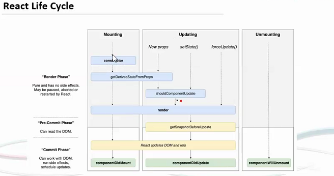

# React

* React is a JavaScript library for building user interfaces
* Used for building single page UI Components
* Requires knowledge of HTML,CSS and JavaScript
* Requires ```node``` and ```npm``` for them check ```npm -v``` and ```node -v```
* To do multi-line comment, select the code and press ```Shift+Alt+A```
* In React we have an in-built class called ```Component``` which can be called as ```import {Component} from 'react'```

# Features
1. JSX
2. Components
3. One Way Data Binding
4. Virtual DOM
5. Simplicity
6. Performance

# Virtual DOM
* It is an abstract lightweight copy of DOM
* DOM stands for Document Object Model
* DOM defines the structure of components and how they are accessed
* Instead of loading the complete page again, ```React``` just reload the part which requires changes

# Notes
* To create project, run ```npx create-react-app myfirstreact```
* npx -> runs a package
* To Initiate the project, run ```npm start```
* NPM starts the server and access the application at default server ```http://localhost:3000```
* ```index.js``` file stores the ```ReactDOM.render``` function which takes 2 parameters ```html``` and ```element id``` using which it executes the app
* To convert string to number we can use ```parseint()```

## Components
* In React there are 2 types of components
    1. Functional
    2. Class
* Sample Code of Functional Component
```js
import React from 'react'

function Greet(){
    return <h1> Hello,This is my functional component</h1>
}
/* export default makes the function available to Apps to be used*/
export default Greet

/* The Code to be used in App.js is
<Greet/>
```
* To Call any new component, write ```import Greet from './components/Greet'``` in the ```App.js``` file and mention the ```function name``` as ```tag``` like ```<Greet> </Greet>```
* To send any parameter through HTML, we can do it as ```<function-name variable="Value">```
where our function will be as 
```js
import React from 'react'

/* props is preferred for properties*/
function Greet(props){
    return <h1> Hello {props.name}.This is my functional component</h1>
}
/* export default makes the function available to Apps to be used*/
export default Greet

/*
The code to be used in App.js is
<Greet name="Piyush"/>
*/
```
* An Example of class component
```js
import React,{Component} from 'react'

class Welcome extends Component{

    render(){
        return <h1> Hello {this.props.name} This is a class component</h1>
    }
}
export default Welcome
```

# State
* States can be understood as working with objects that can be modified and used in the projects
* State can be used only with the ```Class Component```
* An Sample Code using State is 
```js
import React,{Component} from 'react'

class DemoState extends Component
{
    // this will be called whenever class name is used as tag in App.js
    constructor(){
        super()
        this.state={
            message:'Welcome Voter'
        }
    }
    changeMessage(){
        this.setState({
            message: 'thanks for voting'
        })
    }

    render(){
        return (
            <div>
                <h1>{this.state.message}</h1>
                <button onClick={()=>this.changeMessage()}>Vote</button>
            </div>
        )
    }
}
export default DemoState
```

# React Life Cycle
* It has 3 phases:
    1. Mounting
    2. Updating
    3. Unmounting

