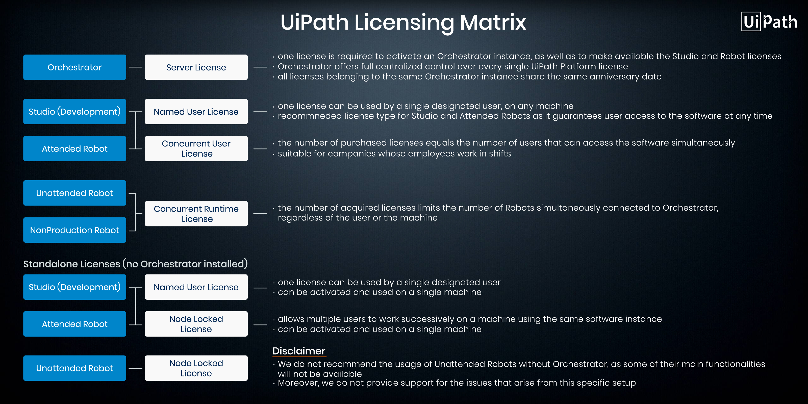
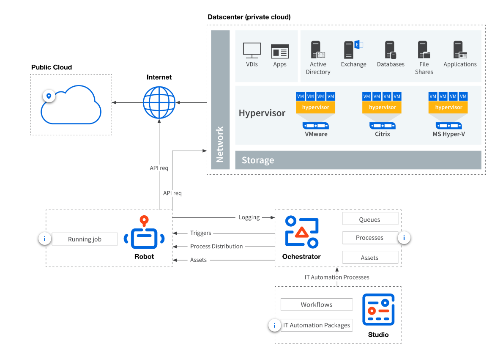

# RPA Robotic Process Automation
# Date: 29th August 2019


## Notes:
* Global Exceptional Handler ~> The job of RPA Developers becomes easier by using this feature, since the handler only needs to be defined once per each automation project and, unlike the Try Catch blocks, does not need to be attached to each activity. It will execute every time an activity fails to execute.
* Repo Browser ~> It allows you to browse through, open, and save shared automation projects stored in TFS and SVN repositories.
* WebHook ~> Regardless of how complex the app network that was integrated with Orchestrator is, information can be sent to a variety of tools such as dynamic case management, business process management or even customer relationship management programs.
* Development Robot Decoupling feature ~> a “floating” robot can be used between multiple machines by the Administrators in a Development environment without having to associate it with a certain machine. In addition, Standard Attended robots can also be converted to “floating” robots. and only Administrators can access this robot
* VB - > Visual Basic
* To create a variable click on activity dialog box and then create 
* Single activity can have multiple input boxes
* Message box is used to print some output to screen, generally used to print the variabes
* Open Browser-> To open a browser by program
* Get visible Text -> used to indicate which text to work on and in output section select the variable name to store the data
* Write Line-> used to write lines
* Open Application -> used to open an application
* Type Into -> used to write something inside the application
* To generate new random values we can use the function ```new Random().Next(range)```
* To close any application, we can use the ```close application``` activity.
* To get the path of the ```Desktop```, use ```Environment.GetFolderPath(Environment.SpecialFolder.Desktop)```
* To Apply filter in ```Get Outlook Mail Messages``` activity, you can use something like ```@SQL=urn:schemas:httpmail:subject LIKE '%your-mail-subject%'``` as string value which is known as ```DASL Query```
* To Apply multiple filters, try ```@SQL=(urn:schemas:httpmail:subject LIKE '%your-mail-subject%') AND (urn:schemas:httpmail:sendername = 'sender-email')``` as string value
* To filter mails based on Received Date ```"@SQL=(urn:schemas:httpmail:datereceived< '19/07/2021 00:00AM') AND (urn:schemas:httpmail:datereceived > '12/07/2021 00:00AM')"```
* For filter with Gmail Smtp we can apply something like ```SUBJECT one-keyword-for-subject```
* To Create a ```delay``` to be variable, you can use ```Timespan.FromMilliseconds(value in ms)``` which will return ```500``` as ```00:00:00.5000000```
* To convert a Dates timezone from one country to another, you can use ```TimeZoneInfo.ConvertTime(DateTime.Now,TimeZoneInfo.Local,TimeZoneInfo.FindSystemTimeZoneById("Middle East Standard Time"))```
* To Install ```Chrome Extension``` during bot execution, use ```Start Process``` activity with ```FileName``` as ```C:\Program File (x86)\UiPath\Studio\UiPath\SetupExtensions.exe``` and ```Arguments``` as ```/chrome```.

## Properties
* Present on right hand side tab
* used to define what our activity will do

## Input
* Title -> defines a message as for what the input is made for
* Label -> used to define the question the user will be prompted with
* Result -> the variable to store the input to

## Variables 
* In ```UIPATH``` variables can store different types of data like 
    1. Numbers
    2. Text
    3. Images
    4. Files
    5. Colors
* Data Types for variables are:
    1. Integer
    2. String ( between " ")
    3. Boolean
    4. Generic ( All of the above)
    5. Array of ( A list of any type)
* Default column in ```variable``` is used to set some default value for any variable
* ```Scope``` is the region or field inside which a variable will be visible and can be used

## WorkFlows
* There are 2 types of workflows in UIPATH:
    1. Sequence ~> If our process is ```linear``` and involves execution of several consecutive actions,its best
    2. Flowchart ~> If our process involves ```complex connections``` between activities , then ```flowcharts``` are more convenient

## Assign
* It is used to ```assign``` some value to a variable
* something like ```x=7``` with x as variable

## Control Flow
* It is the process of defining the rules and the automatic decisions that will be taken during the execution of workflow,through the use of if/else decisions,loops,and so on.

## Operators
* ```%``` is represent by ```mod```
* ```!=``` is represent by ```<>```
* ```==``` is represent by ```=```
* ```**``` is represented by ```^```
* ```//``` is represented by ```\```
* Binaray left shift operator is represented as ```<<```
* Binaray right shift operator is represented as ```>>```

## FlowChart
* To check some in condition inside a flow chart we use ```Flow Decision```

## Sequence
* It uses ```If``` activity for checking coditions
* It consists of 3 columns
    1. Condition ~> check the ```True``` or ```False``` condition
    2. Then ~> it does the work if a specific condition is set True
    3. Else ~> this block is run when the condition is found ```False```

## Loops
* Loops are structures most often used to automate repeatitive tasks 
* easily implemented in Flowcharts
* Always make sure to provide an exit point in the flowchart

### Types of Loops in Sequence
    1. while Loop (pre - condition check)
    2. Do While Loop (post - condition check)
    3. For Each Loop ( it works on iteration over items of a list just like iteration in python list)
      
## Select Folder
* it is an action that allows you to access all files inside the specifed folder
* To get files from a folder, in this ```Misc``` section of ```Select Folder``` type into the ```Value``` field
* to get the list of files use the command ```Directory.GetFiles(path-of-folder)```
* Type of variable should be array of strings ```System.String()```

## Generic Value Methods
* Certain functions inbuild in UIPATH that are helpful in type conversion are :
    1. Split
    2. Replace
    3. Substring
    4. Length
    5. Contains
    6. Trim
    7. IndexOf
    8. ToUpper,ToLower
    9. ToInt
    10. ToString

## Data Manuplation
* <u> Scalar Variables </u> ~> Holds a single value of a fixed type, for example Characters , Booleans , Numbers, Date Times
* <u> Collections </u> ~> Like Arrays, Lists and Queues or Strings, Dictionaries
* <u> Tables </u> ~> A Table is siilar to an array of dictionaries where values are accessible by row index and column names
* <u> Generic Value </u> ~> It can represent basic types of data, including text,number and date/times.
* ```ctrl + k``` create the variable with appropriate ```data type``` in properties of a particular activity
* To Remove certain elements from an ```Array``` we can use ```Array_Var.Except(New String() {String1,String2,String3_to_remove}).ToArray()```


## Get Password
* By default ```UiPath``` is not able to type in a `string` into a password element
* For that purpose, we use ```Get Password``` activity to create or convert a ```string``` to ```password``` type varaible\
    ```qwerty12345 to ********```
* After creating a password type variable simply use ```Type Into``` activity to perform the task
* To convert ```System.SecureString``` to ```System.String```, we use ```new System.Net.NetworkCredential(String.Empty,SecureString).Password```

## Array and Lists & Dictionary
* TO define an array type variable, with variable type``` Array of T``` or ```String[]``` and default array can also be written
* To define an list we set the variable data type as ```List<String>``` and with default value as ```new List(of String) from ['v1','v2']```
* ```Invoke Method``` is used to append new elements to the ```List```
* Dictionary has the data type ```Dictionary<String,String>``` and values can be appended to it using simply ```Assign``` function and works like normal ```dictionary``` does
* Syntax for dictionary is ```new Dictionary(Of String,Int32) From {{"key1",val1},{"key2",val2}}```

## String Functions
* The string functions here works similarly as ```python```
* For example, to check if a ```String``` contains a particular ```word``` just use
    ```variable-name.Contains(word-to-find)```
* In ```Split(" "c)``` function,we can use ```ctrl + shift + space``` to find all kinds of examples we can use with ```split``` method
* ```c``` in ```Split``` stands for ```toCharArray```
* In split function we can pass more then one delimeter to split string using an ```array``` as ```variable.Split({"word1 "," word2"},StringSplitOptions.None)```
* UiPath offers 2 different activities to apply regular expression on text:
    1. Matches -> provides a list of all matches from a string based on provided regular expression, output syntax is like ```Output-variable(item-no).value``` with data type as ```System.Text.RegularExpressions.Match```
    2. IsMatch -> It checks for a single value, if it matches a particular value or not -> output as ```True``` or ```False```
* To replace multiple new lines, spaces, tabs, blank lines etc, we can use ```String.Join(" ",Variable-Name.Split({Environment.NewLine,vbcrlf,vblf," ",vbtab,vbcr,vbNewLine},StringSplitOptions.RemoveEmptyEntries))```
* To get the ```ASCII Value``` of any character, we can use ```Convert.ToByte(Convert.ToChar(variable))``` and can later convert to int for manipulation

## Handling Text
* To print date just use the functioon ```Now.ToString```
* To print only Month And Year use ```Now.ToString('MMMM yyyy')```
* ```Datetime.ParseExact(“12/05/2019”,“dd/MM/yyyy”,System.Globalization.CultureInfo.InvariantCulture)``` to convert a string to ```DateTime``` data type
* To Convert the Date Timezone, we can use ```TimeZoneInfo.ConvertTime(DateVariable,TimeZoneInfo.Local,TimeZoneInfo.FindSystemTimeZoneById("GMT Standard Time"))```.
 

## Table Activity
* Read ```csv``` files by using activity ```Read CSV```
* To create a ```Table``` from csv file use the function ```output data table```
* it is preferable used while web scrapping 
* To access data from table just like ```DBMS``` use something like ```variable-name.Select("condition")```
* ```Table-Name.Select("Age > 20 AND Age <50").CopyToDataTable```
* To access a specific column of a specific row , use ```sampleData.Rows(0)("Name").ToString```
* We must use ```[]``` with the ```Select```     method when the column name contains spaces.
* Accessing a specific value from a row, ```row("First").ToString```
* To color any cell, we can use ```set color range``` activity which takes an ```System.drawing.Color.red``` variable to highlight any cell with particular color

## Quiz Lesson 3
1. How can a string variable called myString be converted to an all-capitals representation for future use?
Ans. ```By using an Assign activity with myString on the left side and myString.ToUpper on the right side.```
2. Which .Net method of the datatable object can be used to filter a table by a condition?
Ans. ```Select```
3. Which activity can be used to loop through each row from a DataTable?
Ans. ``` For Each Row```
4. Which activity can be used to modify the value of an existing cell in a DataTable?
Ans. ```Modify Cell Activity```
5. How can you identify a column in a data table?(Select all that apply.)
Ans. ``` Using column index and name```
6. Which of the following statements are true regarding the Output DataTable activity?
Ans. ```Returns the data contained in a DataTable as a string in a csv format```
7. The String.Format(“Input = {0} and Output = {1}”, “1”,”2”) expression returns which of the following text:
Ans. ```Input = 1 and Output = 2```
8. How can we test if a given address (a string variable called fullAddress) can be found on a particular street (a string variable called streetName)?
Ans. ```fullAddress.Contains(streetName)```
9. How can the index integer variable be displayed inside a Message Box activity?
Ans. ```“Current index is: “ + index.ToString```


## Recording
* Single time ```ESC``` pause the recording
* Double Time ```Esc``` Stop the recording
* To use some kind of ```hot-keys``` , do the following
    1. Press ```Esc``` once ~> To pause the recording
    2. In ```Type``` option use the ```send Hotkey``` option to use any shortcut
* ```F2``` pauses the recording for 3 seconds
* ```Right-click``` exit the recording
* In ```web``` recording , it will work similarly as ```selenium``` waiting time
* UiPath has 4 types of Recording:
    1. Basic
    2. Desktop
    3. Web
    4. Citrix
* Citrix is used for automating stuff with virtual machines
* The recorder is able to record:
    1. left clicks on buttons,checkboxes and other clickable items
    2. Typing into editable fields
* Some non-recordable things to remember are:
    ```These are Manual Recording```
    1. Keyboard Shortcuts
    2. Modifier Keys
    3. Right click
    4. Mouse hover
    5. etc
* Desktop recorder is different from basic just because it provides a container based workflow that is different actions in same application are separated by different containers
* ```Indicate on Screen``` is a good function that can be used to change the snapshot used for automation
* ```Text``` function in recorder has ```copy``` function, that can be used to copy some text and store in a ```variable``` which is created itself

### Basic Recording
* generates a full selector for each activity and no container, the resulted automation is slower than one that uses containers and is suitable for single activities.
* Actions are self-contained
* Simpler Workflow
* Can cause interference

## Desktop
* suitable for all types of desktop apps and multiple actions; it is faster than the Basic recorder, and generates a container (with the selector of the top-level window) in which activities are enclosed, and partial selectors for each activity.
* Actions are contained inside an AttachWindow component
* No interference issues
* More Complex workflow

## Web Recoring
* designed for recording in web apps and browsers, generates containers and uses the Simulate Type/Click input method by default.

## Citrix 
* used to record virtualized environments (VNC, virtual machines, Citrix, etc.) or SAP, permits only image, text and keyboard automation, and requires explicit positioning.
* The Citrix Recording toolbar enables you to:
    1. Click an image or text
    2. Simulate keystrokes or hotkeys
    3. Select and copy text from a window
    4. Scrape UI elements
    5. Look for elements or wait for them to vanish
    6. Find an image or wait for it to vanish
    7. Activate a window

## Manual Recording
* Various types of single actions that can not be automated by simple recording are done using manual recordings
* Various Types of Single Actions are:
    1. ```Start and Stop an App or Browser``` ~>These single actions enable you to open an app or browser, as well as close them, by pointing and clicking them. 
    2. ```Click``` ~> These types of actions enable you to record clicks on the desktop or a running application, select an option from a drop-down list or combo box, and select a check box or a radio button
    3. ```Type``` ~> These single actions include those that require input from the keyboard, such as keyboard shortcuts and key presses. To achieve this, two pop-up windows are used to retrieve your keyboard input.
    4. ```Copy``` ~> These actions enable you to copy a selected text from an opened application or web browser, so that you can use it later in the project. Screen scraping is also available under the Copy menu, as it enables you to extract images and text from an app or browser.
    5. ```Mouse Element``` ~> These types of actions enable you to simulate mouse movements that cannot be recorded but give you access to more functionalities, such as right-clicking, hovering or double-clicking. 
    6. ```Find Element``` ~> These types of single actions enable you to identify specific UI elements or pause the automation until a particular window closes or an UI element is no longer displayed. The find relative element action is useful with apps that do not allow direct interaction with UI elements, such as Citrix. 
    7. ```Window Element``` ~> Window element actions enable you to close windows. Studio does this by hooking in the operating system to make sure the application is closed. 
    8. ```Text``` ~> Text single actions enable you to select or hover over text to make tooltips visible for scraping, right-click to make the context menu visible, copy and paste text and many others.
    9. ```Image``` ~> Image single actions enable you to wait for a specified image to disappear, to find a specific image in an app or website, right-click or hover over an image and others. This type of manual recording can be useful with UI elements that are saved as graphics, as they cannot be highlighted as normal fields or text

## Lesson 4 Quiz
1. How can you delay the Automatic Recording?
Ans. ```By hitting the F2 key```
2. Can you combine automatic recording with step-by-step recording in the same recording sequence?
Ans. ```Yes```
3. Which recording wizard would you use to automate Virtual Machine actions? 
Ans. ```Citrix Recording```
4. When is it recommended to use Desktop recording?
Ans. ```When you automate more steps in the same window```
5. Which container will Basic Recording generate?
Ans. ```No container```

## Data Scraping
* Data Scraping is a function which can be used to Record any kind of data which is available in ```link``` form 
* For any kind of link to be extracted as data, you need to specify atleast two links together
* Then click on ```next``` and provide the ```column names``` of each column or data type you wish to scrap data and want in ```csv``` or ```excel``` file
* To extract more data of different type , click on ```Extract correlated data``` and follow the above steps only
* The maximum number of fields represent the number of entries you wish to scrap over the webpage
* After this, click on ```finish``` and click on the ```next``` button over the ```webpage``` from which you are scraping the data
* The above task will make sure that the page will be click next as soon data from single page is extracted successfully
* Data Scrapper is also able to extract a ```tabular data``` as well very easily, as it extracts the table itself on just single click


## Input Methods
1. Default (Generally used,hotkeys can be used)
2. Window Messages(Can work in background,hotkeys can be used)
3. Simulate Type (Fastest,used or prefered with Virtual Machines,hotkeys can not be used)

## Output Screen Scraping
1. Full Text ~> High speed and accuracy, can work in background and able to extract the hidden text
2. Native ~> Get text by position with high speed but unable to work in background
3. OCR ~> uses google and microsoft OCR and works great with citrix automation


## UI Activities Properties
* There are multiple activities that can be used to automate apps or web-apps and you can find them in the Activities panel, under the UI Automation category. 
1. ContinueOnError – specifies if the automation should continue, even if the activity throws an error. This field only supports boolean values (True, False). The default value in this field is False.
2. DelayAfter – adds a pause after the activity, in milliseconds.
3. DelayBefore – adds a pause before the activity, in milliseconds.
4. TimeoutMS – specifies the amount of time (in milliseconds) to wait for a specified element to be found before an error is thrown. The default value is 30000 milliseconds (30 seconds).
5. WaitForReady - Before performing the actions, wait for the target to become ready. The following options are available:
    * None - Does not wait for anything except the target UI element to exist before executing the action
    * Interactive/Complete - Waits all of the UI elements in the target app to exist before actually executing the action.

## Lesson 5 Quiz
1. Which is the best option for scraping tables from a web page?  
Ans. Data scraping wizard
2. What is the Data Scraping wizard for?(Select all that apply.)  
Ans. [Extracting whole tables from the web or other applications,Extracting correlated data from the web or other applications]
3. By using the Full Text scraping method, the robot is able to:  
Ans. [Get editable text.,Get hidden information.,Get the entire visible text.]
4. Which of the text extraction methods can return the hidden text from a UI element?  
Ans. FullText
5. Which of the following text scraping methods preserve the text position?  
Ans. [OCR,Native]

## Selectors
* Selectors are the way we identify User Interface elements on the screen. They are a xml string which contain some properties that uniquely define the specified element. 
* These are of 2 types:
    1. Full Selectors ~> Used in general automation
    2. Partial Selectors ~> Comes in use when containerisation automation is done
* A selector has the following structure:
    ```<node_1/><node_2/>...<node_N/>```

## WildCards
* There are basically 2 types of wildcards in UiPath that are:
    1. ```*``` ~> Replace any number of characters
    2. ```?``` ~> Replace exactly one character

## Highlight
* It is an activity that is used to simple ```Highlight``` an UI Element as the name suggestes

## UIExplorer
* It is Automation Tool which is used to easily manage or edit the Selectors 
* To add some variable inside the selector the following way should be followed
    ```
    <wind some-selectors-code "+ variable name +" further selector code>
    ```
* It is used to be able to automate and manage dynamic selectors faced during web automation

## Anchor Base Activity
* This activity is used to find ```elements``` with unreliable selectors
* It uses the position of elements on screen
* ```Find Element``` this column is used to indicate the reliable field in the element we wish to search for our automation such as the name of the field
* ```Activity Field``` is used to declare the task to be done once the indicated element or field is finded by ```Anchor Base Activity```
* ```Anchor Position``` ~> it is the property of this activity which can be used to define the position where the required element to search for

## Relative Selector
* It works in background and relies on the internal structure of application

## Properties
* Various properties of selectors are:
    1. <u>Validate</u> ~>The button shows the status of the selector by checking the validity of the selector definition and the visibility of the target element on the screen.
    2. <u>Indicate Element</u> ~>Indicate a new UI element to replace the previous one.
    3. <u>Repair</u> ~> Enables you to re-indicate the same target UI element and repair the selector. This operation does not completely replace the previous selector. The button is available only when the selector is invalid.
    4. <u>Highlight</u> ~> Brings the target element in the foreground. The highlight stays on until the option is disabled with a click. The button is enabled only if the selector is valid.
    5. <u>Edit Attributes</u> ~> Contains all the application components needed to identify the target application (a window, a button etc.). This section is editable.
    6. <u>Edit Selector</u> ~> Holds the actual selector. This section is editable.
    7. <u>Open in UI Explorer</u> ~> Launches the UI Explorer. The option is enabled only for valid selectors.

## Lesson 6 Quiz
1. Can variables be used to build dynamic selectors?
Ans. ```Yes```
2. How can you see the full list of attributes of Ui elements?
Ans. ```By using the UiExplorer tool.```
3. What is a Selector?
Ans. ```The “path” to the UI element, starting from the root, all the way to target element.```
4. Which of the following is true regarding the Anchor Base activity?
Ans. ```Use the screen position of the anchor and the target element.```
5. What are the supported wildcard characters for selectors in UiPath Studio? 
Ans. ``` * and ? ```


## Image and Text Automation
### <u>Mouse Activities</u>
* Using ```click image``` we can click on almost anything that is button,checkbox,textfield etc
* ```Click Text``` uses oCR to scan the screen of Virtual Machine... where as ```click image``` faster and more reliable ut fails only if background color changes
* This is done using ```Image Recording```, it is preferred to be used when we are working on an image of a system that could be referred as the ```AWS instance``` or a ```Virtual Box```
* In this , the main function of recording is ```click image``` and the recording to be done manually only
* ```click image``` -> this functin or activity is used as dragging and selecting an area with respect to which we can decide where to click 
* ```click Text``` it does the same way as ```click image``` but in a different manner, it takes an OCR of the image and tries to find the element with same ```name``` as provided and ```click``` with respect to its position

## <u>Keyboard Actions</u>
* If sometimes, the ``` mouse actions``` fails to find the element , we can use the keyboard actions and automate the workflow using the ```keyboard shortcuts``` such as ```tab```,```ctrl+v``` etc.

### Select and Copy
* this activity is used to copy the ```selectable``` fields inside an virtual environment
* it works similarly as , selecting the field we wish to copy

### Scrap Relative
* This activity is used to copy data from ```non-clickable``` area which is done or preferred to be done using ```Google OCR``` and it can be set to find element with respect to some ```relative position```

## Lesson 7 Quiz Time
1. Creating automations in a Citrix environment is challenging because:
Ans. ```You need to interact with the app using Image Recognition or OCR.```
2. Is Reset Clipping Region mandatory to be executed at the end of a scrape relative sequence?
Ans. ```No, for the next actions we can use other Clipping Regions.```
3. What activities can be used to interact with applications in a Citrix environment?
Ans . ```Type into, Click Image, Click Text```
4. How can you scrape a field on a Citrix Environment when the value in that field changes each transaction?
Ans. ```Find a static element nearby and use Scrape Relative```
5. Click Image and Click OCR Text are not 100% reliable in Citrix environments. What method can be used instead (when applicable) to have safer actions?
Ans. ```Setting focus on a reliable element and then navigating around the app using keyboard (up/down arrows, tab, etc) or using keyboard shortcuts.```
(Failed in above attempt)
6. Having an app in a Citrix environment with multiple text-boxes that look the same (size/style), how can you identify one of them to type into?
Ans. ```By clicking relative to an unique text/image next to the textbox., You can’t identify it if it doesn’t have something unique next to it (text/image).```
7. Is it possible to click a button with Click Image Activity if the target is not visible on the screen?
Ans. ```No, you could click a button which is not visible only using selectors```
8. Consider having an application in Citrix Environment that has a button named ‘Accept’ and also a label that contains the Accept word. How can Click Text be customized in order to access the correct button?
Ans. ```By using the Occurrence property.```
9. How can you improve accuracy when scraping with OCR a region that contains only digits?
Ans. ```Use Google OCR with “Numbers Only”```
(Passed in above attempt)


## Advanced Citrix Automation

### Find Image
* This activity is used to ```pause``` the state of program until an certain ```Element``` is not found or loaded completely
* As output it gives the ```element``` which is defined to be found

### Highlight
* it is used to detect/show/highlight a certain element over screen
* Highlighting a certian element can be done using
    1. Clipping Region
    2. Selector
    3. Element
* Highlight Time ~> The timeout or the amount of time for which to ```highlight``` a certain element is calculated in ```microseconds``` that is ```2000 == 2 sec```
* In highlight the color can be defined as well for customized workflow

### Working with opening applications
* A better practice to open a certain ```app``` or ```application``` is to set ```shortcuts``` and open the app using ```send hotkey``` activity

### Pick Activity
* This activity is a container based activity which further accomodates ```Pick branches```
* This activity is used to set a certain activity to be completed in different possible conditions or scenarios 
* Basically we provide a same action like ```opening a folder``` to be automate but in more then one possible condition of ```screen``` or ```background```

## Lesson 8 Quiz Time
1. What can be done when the Windows Remote Connection doesn’t allow sending hotkeys?
Ans. ```It should work if the Windows Remote Connection is in ‘full-screen’ mode.```
2. How can the robot pass a variable argument when opening an application in Citrix (eg: a web address for a browser)?
Ans. ```In the command prompt, type in the path to the application and the argument```
3. Which of the following activities can be used to select an item in drop down list, in Citrix?(Select all that apply.)
Ans. ```Click Image , Click OCR Text```
4. What happens if Find Image doesn’t actually find the desired image?
Ans. ```An exception is thrown..```
5. What is the EASIEST navigation method to be used in a form within Citrix?
Ans. ```By sending keyboard commands/hotkeys```
(Passed)


# Excel Automation
* ```Excel application scope``` ~> it is a container based activity and is used to do all workflows regarding the Excel file
* ```Visible``` ~> It is an inbuilt activity which if we checked tells ```UiPath``` to work on file using ```MSOffice``` and if not then all tasks are performed internally
* While using Direct access only single process can work where as while using MSOffice multiple can be done at the same time
* A range can be specified by defining the cells separated by ```:```.
    ```A1:C5```
* ```Build Data Table``` ~> this activity is used to create more data tables with very easy and simple GUI
* ```Add Data Row``` ~> this activity is used to add another row(data) inside the build data table activity or table made from it
* ```Append Range``` ~> It is used to append more data to same file
* Data tables are ```zero-indexed``` same as a ```list in python```
* ```sort data table``` ~> This activity is used to sort some tabular data based on a certain column
* ```Select Range``` ~> This activity is used to select a range of cells over which further actions like ```copy/delete/paste``` can be performed
* ```Join Data Table``` ~> This activity is used to perform the ```JOIN``` operation
    * The ```Join Operation``` is of 4 types:
        1. inner join
        2. left join
        3. full join
* The table join ```criteria``` can be defined using either ```column data type``` or simple by ```column name``` written inside ```double-quotes```
* the conditions can be set as more then one or either on one using ```AND``` and ```OR``` logical operators
* ```Output Data Table``` ~> This activity is used to convert a ```data table ``` type variable to ```String```
* ```Read Cell``` ~> used to read a specific cell from an excel file
* ```Write Cell``` ~> used to write  in a specific cell from an excel file
* All numeric data read by ```Read Range``` function from Excel is interpreted as an ```Double``` data type
* ```Get row item``` ~> this activity is used to fetch the values of a specific column from a certain row
* ```Add data row``` ~> this activity is used to add a new row in an ```Excel file``` using an ```array of data``` which is defined using ```circular or curly``` brackets as ```(var1,var2) or {var1,var2}```
* ``` inputsTable.Rows.Count``` ~> it can be used to count the total number of rows
* Use of ```Workbooks``` is prefferable over ```Excel files``` as they do not require Excel to be ```installed```
* To reverse a ```DataTable``` object, we can do so by ```Datatable-name.AsEnumerable.Reverse.CopyToDatatable```

## Using Macros with Excel
* Macros can only be used with ```Excel Application Scope```
* Macros are saved in file with ```Macro Enabled Workbook extension``` that is ```.xlsm```
* Macros are written in ```vba``` and can be recorded in excel and edited for ease of use
* The Macros activity has 2 inputs
    1. Path of file that contains our macro
    2. Object Array of parameters to be passed to the macro
* The Macro activity has 1 output that can be used when working with ```Function``` instead of ```Sub```
* To Execute the Macro available in different file, we can give the macro name as ```FileNameContainingMacro.xlsm!MacroName```
* To Suppress any application alerts like ```delete confirmation```, use ```Application.DisplayAlerts=False```
* To Create a Pie Chart, for any data use the following code sample
```vb
Sub PieChart()
'Code to create a Pie Chart
    ActiveSheet.Shapes.AddChart2(251, xlPie).Select
    ' Set the range of the data to create chart from
    ActiveChart.SetSourceData Source:=Range("Sheet1!$A$1:$B$5")
    CoverRangeWithAChart
End Sub
```
* To Create a Bar Chart, for any data use the following code sample
```vb
Sub BarChart()
'Code to create a Bar Chart
    ActiveSheet.Shapes.AddChart2(201, xlColumnClustered).Select
    ActiveChart.SetSourceData Source:=Range("Sheet1!$A$1:$B$5")
    CoverRangeWithAChart
End Sub
```
* To move the position of any chart, with reference to cell range, use the code sample
```vb
' Code to change the position of a chart
Sub CoverRangeWithAChart()
         Dim RngToCover As Range
         Dim ChtOb As ChartObject
         ' Define the range where you wish to put your chart at
         Set RngToCover = ActiveSheet.Range("L5:S19")
         Set ChtOb = ActiveChart.Parent
         ChtOb.Height = RngToCover.Height ' resize
         ChtOb.Width = RngToCover.Width   ' resize
         ChtOb.Top = RngToCover.Top       ' reposition
         ChtOb.Left = RngToCover.Left     ' reposition
End Sub
```
* To Merge multiple columns
```vb
' Code to merge multiple cells of an excel
Sub MergeCell()
    Range("A1:F1").Select
    Selection.Merge
End Sub
```


## Invoke VBA
* Requires ```Trust Access to the VBA``` to be enabled inside the Excel
* Invoke VBA activity enables developer to execute macros from outside the file without opening excel
* Basically ```Invoke VBA``` activity works inside ```Excel Application Scope``` and is used to execute any ```VBA``` code present anywhere in the local system
* The VBA code should be saved in a ```.vb``` extension file
* This Activity requires ```Three parameters```
    1. File Input Path
    2. Name of the Procedure to call
    3. ```Array<object>``` for paramters to be passed
* A sample vba code can be:
```vb
'Save this in a .vb file

Sub Macro1(Word1 As String, Word2 As String)
    Range("C2").Select
    ActiveCell.FormulaR1C1 = Word1
    Range("D2").Select
    ActiveCell.FormulaR1C1 = Word2
    Range("E2").Select
    ActiveCell.FormulaR1C1 = Word1 + " " + Word2
    Range("E3").Select
End Sub
```

* This activity would be useful in scenarios where macros are not to be saved inside the same input file and thus no need to open the macro file for automation


## Lesson 9 Quiz Time
1. What happens if the AddHeaders option is checked for Read Range Activity? 
Ans. ```The first row from the specified range is considered to be the column names```
2. In order to loop through all the rows of a data table, which activity should be used?
Ans. ```For Each row```
3. What activity can you use to create a DataTable from an input string?
Ans. ```Generate Data Table```
4. What happens if you try to use a Write Range activity to a .xlsx file that does not exist?
Ans. ```It will create that file for you and write the data in it.```
5. Can Excel related activities be used without having the Excel Application installed? 
Ans. ```Yes, but only for xlsx files```
(Passed)


# PDF Automation
* ```Read PDF``` ~> This activity is used to read text from a PDF
* ```Read PDF with OCR``` ~> It goes by the name and is able to read the ```Image Text``` present in the PDF
* While using OCR to read PDF's , we have got 3 options
    1. Google OCR
    2. Microsoft OCR
    3. Abby's OCR ~> Maintains the structure of text present in PDF
* PDF activities are categorised into 2 parts:
    1. Processing large chunks of data
    2. Working on specific part of the file
* Anchor base method is more reliable then others since it can handle structural changes
* While trying to read text it is preferable to use ```Read PDF``` rather then ```Read PDF with OCR``` as OCR is more prone to errors
* In properties of PDF, the range of PDF pages can be set in the following format ```"1-4"```

## Lesson 10 Quiz Time
1. Will the Read PDF with OCR activity open the PDF document on the screen in order to read it?Will the Read PDF with OCR activity open the PDF document on the screen in order to read it?
Ans. ```No```
2. What is the easiest way to get the invoice number from a native PDF file? 
Ans. ```Open the PDF file with Adobe Acrobat Reader and scrape only the relevant information.```
3. Which of the following activities requires the PDF file to be opened with Acrobat Reader in order to read it?
Ans. ```Get Text```
4. How can a robot read only the first page of a PDF file, using the PDF activities? 
Ans. ```Set the Range property to: “1”```
5. If the PDF contains both images and native text, what activity should you use to read all the text from it?
Ans. ```Read PDF with OCR```

# Email Automation
* Various activities supported in ```email automation``` are:
    1. SMTP ~> used to send mails
    2. POP3 ~> used to recieve mails supported by various domains
    3. IMAP ~> supports reading messages as well as marking them read or shifting to different folders
    4. Exchange ~> Microsoft supported activity for all kinds of email activities
    5. Outlook ~> automate the pre installed outlook software
* Four activities present to check mail are :
    1. POP3
    2. Outlook
    3. IMAP
    4. Exchange
* The data type of messages is ```System.net.mail.message```
* ```Save Attachments``` activity is used to save attachments from a mail, it requires two arguments a ```mail type instance``` and path to save folder
* ```mail.Headers('Date')``` provides the Date Timestamp for any mail
* to filter mails fetched by UiPath set a filter in the properties menu such as
    ```"[RecievedTime] > '14/10/2019 09:41 AM'"``` or ```"[RecievedTime] > Now.AddDays(-1).ToString('MM/dd/yyyy hh:mm tt')"```
* ```Take Screenshot``` is the activity used to take a screen shot at run time which is to be saved in a certain location using ```save image``` activity
* The ```attachment``` section of the ```Send Mail``` activity requires a file path to be sent 
* To make something like message Dynamic in ```sending messages``` we can use format type same as ```python``` just replace the content to be changed dynamically with ```{0}``` and provide the argument in ```body section``` of send mail activity
* To Access Different Folders from ```Gmail```, use the following format for ```MailFolder```:
    1. Inbox -> ```INBOX```
    2. All Mail -> ```[Gmail]/All Mail```
    3. Drafts -> ```[Gmail]/Drafts```
    4. Sent Mail -> ```[Gmail]/Sent Mail```
    5. Spam -> ```[Gmail]/Spam```
    6. Starred -> ```[Gmail]/Starred```
    7. Trash -> ```[Gmail]/Trash```

## Quiz Time Lesson 11
1. What activity can you use to send an email without entering the username and password of the email account?
Ans. ```Send Outlook Mail Message```
2. What activities can you use to send an email message?
Ans. ```Send Outlook Mail Message. and Send SMTP Mail Message.```
3. What is the supported variable type in the Output property field of all Get Mail activities (POP3, IMAP, Outlook, Exchange)? 
Ans. ```List (MailMessage)```
4. If you are using the For Each activity to loop through a list of MailMessage variables, what should you set the TypeArgument property to?
Ans. ```System.Net.Mail.MailMessage```
5. The Send Outlook Mail Message activity will work without having Microsoft Outlook installed:
Ans. ```False```
6. Which of the following properties are found in the Get Outlook Mail Messages activity? 
Ans. ```MailFolder```
7. Which of the following activities will allow you to only retrieve only unread messages?  (Select all that apply.)
Ans. ```Get OUTLOOK Mail Message and Get IMAP Mail Message```
8. If you want to get only filtered MailMessage variables, what activity should you use?
Ans. ```Get Outlook mail messages```
9. Which Visual Basic property within the MailMessage class will you use to get the Date of an email? 
Ans. ```Headers(“Date”)```
(Passed)


# Debugging And Exception Handling
* Slow Steps ~> This is the tool provided with ```Debugging Toolkit``` , it highlights each activity executing 
* In Options ~> Highligh Element activity , ```highlights``` the ```UiElement``` being interacted with a ```Red Color```
* Breakpoint ~> It is set an activity where we feel some error migth occur and then we have 3 options to continue our program execution
    1. Continue
    2. Step Over
    3. Step Into
* In ```Input Activities``` we have an option ```Simulate check``` in their properties which tend to send the input using ```Background Processes``` without using the ```mouse or keyboard```
* ```Timeout``` property makes the ```activities``` wait for an element to appear or the activity to execute before giving an error
* ```Element Exists``` ~> This activity returns a ```boolean``` value that is ```True``` or ```False``` for an Element to be present on sceen or not
* ```Log Message``` ~> this activity can be used to set or give some message in output tab given in right side Properties panel... that is seen while execution
* ```Find Element``` ~> Stops the workflow until an element is found
* ```Wait Element Vanish``` ~> Waits for an element to disappear before continuing

## Try Catch Finally
* ```Try Catch``` activity ~> it works same as in programming , if any activity fails in ```Try``` block then ```catch``` block will run followed by ```finally``` block
* ```System.Exception``` ~> It catches all types of errors
* To select all activities, it is easy by just dragging the cursor on all
* Once the type of Exception is selected in ```catch``` block.. followed by ```enter``` collapses the ```try``` block and we can start addig activities to work when error occurs
* ```rethrow``` activity ~> is used in ```catch``` block to show an error popup
* ```exception.message``` this is a ```primitive``` variable which contains the error message that might have occured

## Logging Levels
* There are 6 log levels in UiPath:
    1. Verbose
    2. Trace 
    3. Information
    4. Warning
    5. Error
    6. Critical
* Each log level has its own significance
*  Verbose < Trace < Information < Warning < Error < Critical 
* <b>Creating user-defined log fields that have the same name as a default log field causes the logging process to become corrupted and may cause issues in the workflow you are running.</b>
* Various Default Log Fields are:
    1. Message - The log message.
    2. Level - Defines the log severity.
    3. Timestamp - The exact date and time the action was performed.
    4. FileName - The name of the .xaml file being executed.
    5. jobId - The key of the job running the process.
    6. processName - The name of the process that triggered the logging.
    7. processVersion - The version number of the process.
    8. windowsIdentity - The name of the user that performed the action that was logged.
    9. robotName - The name of the robot (as defined in Orchestrator).

* for type conversion to integer we can use ```CInt``` as ```CInt(variable)```
* You can separate individual components of your automation into different workflow files and then call them using ```Invoke Workflow.```

## Quiz Time Lesson 12
1. If you need to know if a UI Element is available on the screen or not, what activity should you use?
Ans. ```Element Exists```
2. What does the Locals panel display when you are working in Debug mode?
Ans. ```The current values of your variables.```
3. How many Catches can you have in a Try/Catch block?
Ans. ```There is no limit on the number of catches.```
4. What activity can be used in a Citrix environment to check whether a UI element is displayed or not?
Ans. ```Image Exists```
5. The Finally block of a Try/Catch activity is executed when:
Ans. ```Every time, regardless if an exception occurred or not.```
(Passed)


# Project Organization
* Following the best practices makes our project:
    1. Reliable ~> Solid Robust workflows that can handle errors
    2. Efficient ~> Shorter development time and smooth execution in production environment
    3. Maintainable ~> Easy to update when changes are required
    4. Extensible ~> New Usecases can be added

## Best Practice
* Pick an appropriate layout for each workflow
    1. main WF -> flowchart/ state machine
    2. bussiness logic -> flowchart
    3. Ui Interactions(woring in same order) -> Sequence
    4. Avoid nested If else and use flowchart instead
* Break the whole process into smaller workflows
    1. Develop and test pieces independently
    2. reuse workflows across projects
    3. collaborate working on separate files
* Use Exception Handling
    1. Put problematic workflows inside Try_Catch
    2. Put externally invoked Workflows
    3. Implement recover sequence
* Make your workflows readable 
    1. Give descriptive names to activities
    2. leave explanatory notes and comments using ```comment``` activity
    3. log real time execution process
* Keep it clean
    close applications,windows and web pages not being used

## Invoke Workflow
* UiPath offers an activity same as ```import``` in python that is ```Invoke Workflow``` activity
* In this activity , we can execute any workflow and even pass arguments and import arguments
* Arguments just work as values which are provided for variables and these arguments or values of variables, can be either given as input or can be extracted as an output for another activity
* ```Direction``` column in variables define the redirection of values which can be ```In``` or ```Out``` or both ```In/Out```
* ```Deserialize JSON``` activity ~> It is used to parse a ```json``` file and can be used to read or extract data from it
* to convert a variable... we can do it like ```convert.ToInt32(variable-name)```

## Quiz Time Lesson 13
1. What is the recommended layout for sequential activities?
Ans. ```Sequence```
2. What type of arguments can you use in a workflow?
Ans. ```In/Out Out  In ```
3. Is notifying the user via a Message Box activity a good way to keep track of a workflow’s execution progress ?
Ans. ```No```
4. What is the recommended layout for a sequence of UI interactions?
Ans. ```Sequence```
5. Which of the following is a good example of a workflow name?
Ans. ```GetCustomerNumber.xaml```
(Passed)


# RPA Developer Foundation Training - Final Test
(Passed Successfully)

-----
# Level 2 Orchestrator Training
<a href='https://cdn2.dcbstatic.com/files/u/i/uipath_docebosaas_com/1572411600/MyKk8x1tGHs0mwWm_M1sNw/item/e815437971b14c9b896d9f5064e968915d0d1e0e.pdf'> Link TO Version Details Of Different Orchestrators</a>

* ```UiPath Orchestrator``` is a web based application
* It Enables efficient resource management
* It allows Workload allocation, Scheduling and monitoring of robots
* Streamlines the teamwork

## Should Stop
* This activity is used in workflow to stop a executing process from ```Orchestrator```
* It return a ```Boolean Value``` which can be used by ```Decision Flow```

## Asset
* In UiPath Studio we have an activity called ```Get Asset```
* It gets the ```asset``` value from the Orchestrator and this activity works only when the ```workflow``` is published to Orchestrator
* ```Asset``` is basically just a variable which can be defined in the Orchestrator and used by the workflow
* It can be specified for multiple robots or individual that is using same ```asset variable``` for multiple bots with ```different values```
* In properties panel, name of asset should be written as string that is if the name is ```Name``` then in properties write it as ```"Name"```
* Assets are of 4 Data Types:
    1. Credentials
    2. Text
    3. Boolean 
    4. Integer

## Get Credentials
* Credentials type requires 2 input values (Username and Password) in ```Studio``` as well as Orchestrator
* Basically when ```Credential Asset``` is made with two values which are ```Username``` and ```Password```
* Then they are fetched and used at run time in Studio using ```Get Credential``` activity
* To use the pass acquired from the ```Get Credentials``` we would need to use ```Type Secure Text``` activity
* To use Windows Credentials use ```UiPath.Credential.Activities```

## Type Secure text
* This activity is used to decrypt the ```.NET``` secured string from encrypted password to normal decrypted text

## Queue
*  the transaction items in a queue are processed in chronological order
* The items inside Queues can be processed by multiple Robots.
* The priority order of a queue item is based on ```Priority``` and ```Deadline```
* The Priority is given in order that is ```High Priority and Low Deadline``` if any ```deadline``` is specified and if ```no deadline``` is specified then ```Only Priority``` is checked
* A Queue Item with ```Priority and Deadline defined``` has more priority over a queue item with ```high priority and no deadline defined```

## Add Queue Item
* This activity is used to send values or add the items to Queue in Orchestrator
* ```DeadLine``` ~> This property is used to set a sepecific time limit within which the queue item is supposed or required to be processed
e.g., ```datetime.Now.addHours(24)```
* ```PostPone``` ~> This property is used to postpone the activity upon reaching ```Deadline``` by some ```time``` like ```datetime.Now.addHours(2)```
* Multiple robots can be assigned to process the same Queue
* ```Reference``` property can be set to an item to identify it uniquely in Orchestrator
* ```ItemInformation``` ~> this property is used to define the values to be added in the Queue present in Orchestrator


## Get Transaction Item
* This activity is used to fetch values or items from the ```Queue``` made in Orchestrator
* When this activity is set into loop it iterates over and fetch all the items in the Queue
* ```transaction.SpecificContent("Column-name").toString```

## Set Transaction Status
* It is used to set status of the processed item from the Queue
* If the Status is not set by the ```Robot``` then it is set to ```Abandon``` automatically after 24 hour

## Set Transaction Progress
* It is used to set some Value for the progress column in Orchestrator regarding the Processes in Queues

## Complete Documentation can be found at 
<a href = 'https://docs.uipath.com/orchestrator/'> <b> Orchestrator </b></a>

## Terminating and stopping a process
* Pressing Stop requires you to use the Should Stop activity in Studio while developing the process. The activity returns a boolean value. It informs  whether the Stop button has been pressed in Orchestrator by the time the Control Flow reached the Should Stop activity. This is similar to a Save Game function in a computer game.
* Pressing Kill is the equivalent of stopping a process from the Studio. Orchestrator will connect to your Robot and send a stop command to the process.

## Trigger
* Trigger is like  Scheduling a process that is having Orchestrator press Play for you at a time which you specify.

## Steps to Use Orchestrator
1. Create your workflow that you wish to deploy over Orchestrator
2. Open the Following url <a href='https://cloud.uipath.com'>Cloud Uipath</a>
3. In ```Service``` section , select the ```StudentDefault``` service (UiPath Orchestrator will be opened)
4. Create a machine
    1. Click on Machine in Left panel under ```MANAGEMENT``` section
    2. Click on ```+``` icon followed by ```Standard Machine```
    3. In Name write the Name of your Laptop(you can get that from next step) and Description as you like
    4. Click on Provision
5. Open UiPath Robot on your local Machine 
    1. Click on ```Settings``` icon
    2. Select ```Orchestrator Settings``` option
    3. Enter the Machine Key(you can get that by clicking on ```edit``` on Machine made in previous step)
    4. In Orchestrator Url type the cloud-orchestrator-url
    5. Click on Connect(Local System gets connected to Orchestrator at cloud)
6. Now to Add your Robot
    1. In ```UiPath Studio``` , click on ```Publish``` button given in Design Panel(just click ok)
    2. Select ```Machine Name``` given in previous step
    3. In Username, type the name configured with your ```UiPath Studio```
    4. Click create
7. Set Environment
    1. In Robots tab, Click on environments
    2. add a new environment
    3. Click on ```manage``` in properties of environment
    4. Select your ```robot``` and click on ```Update```
8. Set The Process
    1. Go to ```Process``` Tab
    2. Click on ```+``` icon
    3. Select the ```Package Name``` and ```Environment```
    4. Click on Create
9. Finally you are ready to run/execute your bot
    1. Go to ```Jobs```
    2. Click on Start Button
    3. Select The Process made in previous step
    4. Select your ```Robot```
    5. Click Start and all done

----

# Level 3 Advance Training

# UiPath Robotic Enterprise Framework
* This Framework is a Template provided by UiPath for ```transactional``` activities or workflow
* <b> Transactional Activities</b>~> Basically every project can be divided into 4 states
    1. Initial State ~> Start/Open all applications
    2. Get Transactional Information ~> Take Input or Fetch from Queue/Excel all the Data need to be processed or used for processing
    3. Process Transaction ~> Process all the information(calculation,Decision taking,Data Conversion etc)
    4. End Process ~> Close all the applications which are not required
* It can be accessed through ```START``` panel of ```UiPath``` Studio in the ```Template``` Section
* REFramework consists of few pre-build workflows which are used to simplify the Automation Task in a proper manner that are:
    1. InitAllSettings ~> Processes / Reads the config file containing essential details
    2. InitAllApplications ~> Start the Initial State and Open all neccessary applications
    3. GetAppCredential ~> In terms of Login , gain user credentials with proper security
    4. GetTransactionData ~> Get Transactional Information from User/Queues/Excel Files etc
    5. SetTransactionStatus ~> Set the status for information being used(Processed/retried/abandon/NeedToBeProccessed etc)
    6. KillAllProcess ~> To Stop the Process completely on recieving ```STOP``` signal
    7. CloseAllApplications ~> Close the applications in Workflow as soon as their work is completed
    8. TakeScreenshot ~> During Exception Occurrence, Used to Take Screenshot and store in ```Exceptions_Screenshots``` folder,to help developer
* RefFramework is based on the principle that data is stored in the form of a ```Queue``` that is ```FIFO```
* Building productive Robots require:
    1. Proper Exception Handling(try_Catch)
    2. Recovery Abilities(ReStart or Recover from Possible failures)
    3. Effective Logging(Secure the Status of Each part of workflow)
    4. Reporting Functionalities(logs and screenshots)
    5. High Maintainability
    6. Extensibility(Easy to modify)
    7. Reusability
    8. Ease of Development
* The Framework files can be downloaded from the following ```Github``` Repository link <a href='https://github.com/UiPath/ReFrameWork'>FrameWork</a>
* ```Request Credential``` ~> This is an activity used to get ```credentials``` from user same as ```input dialog```
* This Framework mainly  works on State machine activity which includes 
    1. Main State Machine
    2. Exceptions Handling
    3. Recovery Methods
    4. States
        1. InitState(Config file,InitAllApplications) ~> Initialization(Open Application,login to website,startup required values etc)
        2. Get Transaction Data(TransactionItem,TransactionNumber)
        3. Process Transaction
        4. End State
    5. SetTransactionStatus
    6. GetAppCredentials
* The Flow of ```State Machine``` is like First the ```entry action``` is complete, then the ```triggers``` for the state's transitions are scheduled. When a transition to another state is confirmed, the activities in the ```exit action``` are executed, even if the state transitions back to the same state. After the exit action completes, the activities in the ```transition's action execute```, and then the new state is transitioned to, and its entry actions are scheduled.

## InitAllSettings
* In The Reframework, it is the Initial ```xaml``` file to be used
* It contains a Config workbook with 3 sheets
    1. Settings ~> We can store any configuration related to the business process such as Urls,filepaths,credentials and any process specific piece of information
    2. Constants ~> It stores the technical settings that are useful for Developers, it contains information like number of delays , retries, timeouts,image accuracy settings, static log parts
    3. Assets
* In Settings Sheet , there are 3 columns
    1. Name ~> Always contains a string which is the key in the Dictionary
    2. Value ~> Holds the dictionary value
    3. Description ~> Holds the detailed account of each setting

## Exceptions
* There are 2 kinds of Exception that are:
    1. Business Exception ~> In Case of issues in data , invalid data,missing information in data.
                                business rule exceptions are something you defined while building the process(exceptions which are expected and there is no chance of record getting success even if we retry)
        Transaction status is ```set as failed``` and transaction is ```not re-tried```
    2. System/Application Exception ~> In case application not available(UI Element not available or unknown error)
        Transaction is ```re-tried```
* We can generate exceptions using the ```Throw``` activity, like to generate ```Business Exception``` use ```new BusinessRuleException("Message to Pass with Exception")```

## Working of REFramework
Note: 
* In case Exception occurs anywhere we set ```SystemError``` to ```exception``` with data type ```Exeption```
* At Every Phase of This Framework , logging is done for better development experience and Easy Debuggig
1. We always initiate the workflow with ```main.xml``` file
    * It contains a Flowchart with following Transactions
        1. Init
        2. Get Transaction Data
        3. Process Transaction
        4. End Process
2. Starting With ```Init``` transaction, It contains a Try_Catch_Finally block of activity
    * Assign a ```SystemError``` variable to nothing which used for Exception Verification
    * For first Time,by default reads the config file present at ```Folder/Data/config.xlsx``` to acquire basic pre-set settings/values and kills all initally running processes as defined in ```KillAllProcesss.xaml```
    * Run ```InitAllApplications.xaml``` to open all required application upon which we have to work
3. Upon Failure of above process we move to ```EndProcess Transaction``` else
    * Move to ```Get Transaction Data``` transaction
    * It checks for ```StopSignal``` that is recieved from ```Cloud Console```
    * Starts to access/fetch data from Queue in Orchestrator using ```Get Transaction Item``` which gives an Queue as output
    * If some Error occurs,logs are set and ```TransactionItem``` is set to ```Nothing```
4. If no data/TransactionItem is fetched from above Transaction, The workflow moves towards ```End Process``` transaction else
    * Move to ```Process Transaction``` 
    *  In this, we initiate the main ```Processing``` workflow ```xaml``` file that uses the input and complete the task
    * If Some Error is Faced the workflow sets the ```Bussiness Exception``` and ```System Exception``` to initiate the Recovery Process
    * Most of the time, Upon recieving Error, its best to stop the processing
    * After Completion of the activities.. a ```Finally``` block is used to always set the ```transaction status``` of each Transaction Item
5. Upon Reaching the ```End Process``` transaction
    * It intially try to normally ```Close``` all applications and upon not being able to do so
    * It uses ```KillAllProcess``` to forcefully to its work


## Transaction Processing
* A transaction represents the minimum amount of data and the necessary steps required to process the data, as to fulfill a section of a business process
* Once processed, the data is no more required

* A Business process can be divided into 3 categories:
    1. Linear ~> The steps of the process are performed only once and, if there is the need to process different data, the automation needs to be executed again.
    ```
    INIT ~> GET DATA ~> PROCESS DATA ~> END
    ```
    2. Iterative ~> The steps of the process are performed multiple times, but each time different data items are used
    ```
    INIT ~> GET DATA ~> | Process Data in Loop | ~> END
    ```
    3. Transactional ~> Similarly to iterative processes, the steps of transactional processes repeat multiple times over different data items. However, the automation is designed so that each repeatable part is processed independently

* Dispatcher ~> The dispatcher is a process used to push transaction items to an Orchestrator queue. It extracts data from one or multiple sources and uses it to create Queue items to be processed by Performer robots.
* Performer ~> The performer is a process used to pull transaction items from an orchestrator queue and process them as needed in the company. Queue items are processed one at a time.It uses error handling and retry mechanisms for each processed item.

* Dispatcher and Performer models advantages:
1. Better seperation of processes (between dispatcher & performer)
2. Better separation & distinction between architecture and process layers
3. Better error handling and retry mechanism
4. Possibility to run processes across several machines (availability)
5. Better re-usability within your project's created components
6. Improved built-in configuration & Orchestrator integration
7. Previous workflows created without REFramework can be easily adapted and deployed in order to use REFramework and the dispatcher / performer model


## Re-Framework Meetup Learning
* In Config file, we have got 3 sheets
    1. Settings ~> Contain data we wish to access such as email,url,username or password
    2. Constant ~> Something like retry count
    3. Assets ~>
* A Config variable is of ```Dictionary (String,Object)```
* Reframework can be used for multiple input types (queues,datatable,array,list et)


# UiPath Security Training

## Layers in Orchestrator
1. Presentation Layer(accessed via browser)
    * Communication between clients (browser,robots) and Orchestrator is encrypted using the secure https channel 
    * user session is saved in a session cookie(with a configured expiration time)
    * the password complexity is configurable
    * account automatic locking after a configurable number of failed attempts
    * Protection against CSRF token
2. Service Layer(containing the business logic)
    * Role-based access control(RBAC)
    * no data sent outside customers network
    * logging - default actions are logged for auditing, and so are the  users actions
    * the section containing the encryption key in the configuration files can be encrypted
3. Persistence Layer ~> Build using SQL and elastic search
    * encrypted communication with SQL server
    * each password is encrypted with a different encryption key
    * login attempts are logged - result ,IP Address, timestamp , browser info
    * user roles can be defined for data stored in SQL server to prevent unauthorized access

## Potential Risks associated with RPA Projects are:
1. Robots having access to Credentials normally used by human workers
2. Robots having access to privileged information such as personal data of commpany staff, financial data
3. Unauthorized modifications of automation workflows in the development or testing phase
4. Unauthorized modification of automation workflows or runtime parameters in the production environment

## Features
Features are the characteristics that are embedded in the product or solution and implemented in order to enhance the security and mitigate risks

## Guidelines
Best Practices to be used while setting up RPA workflows

## Code Review
* It aims to ensure that the process that will run on the live data is safe and no security breaches are possible
* Checks whether the credentials are used only where needed and are not passed outside the trusted environment
* Prevent sending sensitive data outside the trusted scope

## Notes
* We can keep track of RPA projects with multiple developers in working by keeping the source code files(XAML files) in  ```Source Code Control System```
* To Store Credentials in UiPath we use:
    1. Orchestrator Credential Assets ~> encrypted using ```AES 256``` and stored on the ```SQL server base``` but should be configured with ```value per robot``` to prevent unauthorized access
    2. Windows Credential Manager ~> works as a local machine storage and should be used only in case Orchestrator in not accessible

## Protect Sensitive Data
1. Configuring a trusted Channel : VPN Connections,secure FTP sesions, HTTPS websites
2. Data encryption, when using untrusted channels
3. Usage of limited access environments, such as restricted shared folders or restricted Sharepoint domains

## Environment Isolation
* During RPA Projects the ```Developer Team``` and ```Production Team``` should work in different environments
* Development Environment
    1. The RPA Developers and their robots interact only with systems that have sandbox environments
    2. the robots should not be able to connect to the UAT and production orchestartor
* Production Environment
    1. The robots permanently monitored for malicious tempering of packages and the execution of correct version of the package
    2. access to the robots in the production should be restricted to the trusted individuals

## Multitenancy
* It is a feature of Orchestrator that allows complete seperation of Data among tenants, providing a dedicated share of the instance including its data,configuration, user and role management up unitl license management
* In simple terms, using Single Orchestrator Instance an organisation can have, multiple role based users each having having seperate:
    1. Robots
    2. processes
    3. Assets
    4. Queues
    5. Data
    6. Configuration
    7. Users
    8. Roles

## Protecting data in Transit and at Rest using
1. Transport Level Security 1.2 Protocol
2. Advanced Encryption Standard on 256-bit cipher
3. Secure Hash Algorithm 2

## Quiz Time
1. What are the main differences between guidelines and security features?
Ans. ```Guidelines are recommended general best practices, while security features are already implemented in the product```
2. User access to the Orchestrator web app is protected using the following features:
Ans. ```a) communication between client and Orchestrator is encrypted with HTTPS; b) Password complexity is configurable; c) the account is locked after a configurable number of unsuccessful attempts```
3. Is Storing Credentials a feature or a guideline?
Ans. ```Feature```
4. Authenticating the users on the Orchestrator platform can be done with:
Ans. ```Google accounts with OpenAuthentication 2.0,Local username and password,Active Directory username,using Windows Authentication, Azure Active Directory authentication```
5. A valid SSL certificate is required to install Orchestrator.
Ans. ```True```
6. Is Package Securing a feature or a guideline?
Ans. ```Feature```
7. With the Account Lockout security feature you can prevent additional logins for a period of time after a number of failed attempts.
Ans. ```True```
8. The Audit page on the Orchestrator platform allows you to filter by:
Ans. ```Component and Action```
9. What is the common practice to keep the different versions of each XAML file in an RPA project?
Ans. ``` Source Code Control System```
10. Packages uploaded into Orchestrator (either manually or published from Studio) are automatically uploaded by Orchestrator to all robots that can execute these packages.
Ans. ```False```
11. Orchestrator offers the functionality to create any number of custom roles.
Ans. ```True```
12. In an organization with Development, Testing and Production environments, an RPA Developer should not have access to the Production Environment
Ans. ```true```
13. CyberArk can be integrated with the Orchestarator in order to retrieve the robot credentials from CyberArk instead of SQL Server DB.
Ans. ```True```
14. Is Isolating Environments a feature or a guideline?
Ans. ```Guideline```
15. Security risks can appear in:
Ans. ```Both development and production phases```


# UiPath Licensing Training

## License for Studio
1. Named User ~> Single specific User, enables each user to access the software at any time ,on any machine
2. Concurrent User ~> Useful in  BPO scenarios,indicates how many users can access the software simultaneously
3. Concurrent Runtime ~> Indicates the number of robots that can be simultaneously connected to Orchestrator , regardless of the user or machine
4. Server License ~> is required to install orchestrator instace

## Notes
* All the licenses for all the robots can be easily managed by Orchestrator
* Named and Concurrent User License can not coexist in single orchestrator instance
* All the platform license must have same anniversary date

## Host Licensing
* It provides full control of all the licenses belonging to an organization
* Allows centralised license management and distribution

## StandAlone License
* Used when Orchestrator is not used
1. Named User License
2. Node Locked License ~> completely similar to ```Concurrent User license```



## License Activation
* To Activate any license in machine follow the following steps:
1. Open CMD as administrator
2. CD to Uipath studio folder
3. run command ```regutil activate /email_address /license_code```
4. To check if license activated successfully run command ```regutil.exe get-info```, it shows complete information about license
5. To export the information to a file, run command ```regutil export-info /out_file=Path-to-store```

## QuizTime
1. What Robot type is used to test an automation workflow?
Ans. ```NonProduction```
2. A Node Locked License...
Ans. ```Can be activated and used on a single machine,allows multiple users to work successively on a machine using the same software instance, is available for unattended robots```
3. A developement robot
Ans. ```Activates studio,enables workflow execution on local machine,ensures the ability to connect the local studio instance to orchestrator```
4. A Concurrent User License is dedicated to a single specific user.
Ans. ```False```
5. Which license types are available for Attended Robots and Studio?
Ans. ```Named User and Concurrent User```
6. Which UiPath Platform licenses can be managed through Orchestrator?
Ans. ```Concurrent User,Named User, Concurrent Runtime```
7. Concurrent User licenses are usually suitable in BPO scenarios, for companies whose employees work in shifts. 
Ans. ```True```
8. Named User and Concurrent User licenses can coexist within a single Orchestrator tenant.
Ans. ```False```
9. All the platform licenses (managed through Orchestrator) must have the same anniversary date.
Ans. ```True```
10. For Unattended Robots, the only available Standalone License option is
Ans. ```Node Locked```
11. The number of Concurrent Runtime licenses indicates...
Ans. ```The number of robots that can be simultaneously connected to Orchestrator , regardless of the user or machine```
12. What is the required license type in a scenario where employees must be able to execute processes whenever needed?
Ans. ```Named User```


# SAP Automation
* When automating SAP,start with recording the actions, most of the time it will work fine
* To Interact with unrecognised elements you can use ClickText & ClickImage and keyboard shortcuts to reach difficult buttons or menu items
* For ```Elusive UI Elements``` , simulate human activities that is what human will do activate it
* For tabular data you have to use loops , although that is hardly SAP specific
* To Read an tabular data of unknown length, read each row in an infinite loop until an operation fails
* To work on checkboxes and special elements , use the ```getAttributes``` activity, it shows a bunch of hidden information that can prove to be very useful

## QuizTime
1. Can SAP client be automated if it is web hosted?
Ans. ```It's a trap. SAP is not available on web```
2. In a situation where a data table cannot be scraped by using Data Scraping but each cell is accessible by selectors, how can the robot extract all the cells from a column with a large number of rows?
Ans. ```By generating a selector for the first cell and configuringits TableRow property to iterate through all the rows```
3. If you want to record a Click activity on an ephemeral element that appears only after focusing on a text-box relative to it, can that be done?
Ans. ```Yes, press F2 and in the 3 second pause put the focus on the text-box.```
4. In a SAP application, you would like the robot to click on a specific folder in a folder hierarchy. The panel containing the hierarchy doesn’t allow more granular selectors inside of it, thus no selector can be created for a specific folder. What can be used?
Ans. ```A Click Image activity, A Click Text activity with Native as scraping method.```
5. Some UI Elements are not selectable in SAP client, but some of them are. Which might be the problem?
Ans. ```The scripting is enabled only on the client side```
6. Which is the easiest method in order to extract a table from SAP that has the scripting enabled on both sides?
Ans. ```Using the Data Scraping wizard```
7. How can the robot identify if a checkbox is checked or not?
Ans. ```By using get Attribute activity```
8. Consider having to click a button which cannot be accessed by using a selector. What other options can be used?
Ans. ```Click relative to an element that can be identified by a selector,Use a Click Image activity set to click the image of that button, See if clicking the button can be replaced with sending a combination of keys.```

# RPA Developer Continuous Learning

## Regex Selectors
* A Regular Expression, regex or regexp is a sequence of characters that define a search pattern.  
* In order to use it:
1. You can specify the target search tag by using matching:<tag_name>=’regex’;
2. You can specify the search pattern by using <tag_name>='<regex_command>'
e.g., ```aaname={{regex}} matching:aaname='regex'``` where ```regex is variable with required expression```

## Fuzzy Selector
* Fuzzy string matching is a technique to search strings which are not 100% match, and match a pattern approximately, rather than exactly.
* A selector’s fuzzy search capability enables you to locate strings based on a pattern, rather than on an exact match to your input. 
* In order to use the fuzzy search capabilities, you need to include in the top-level tag of the target selector a matching option:
1. You can specify the target search tag by using matching:<tag_name>=fuzzy;
2. Determines the matching threshold by using fuzzyLevel:<tag_name>=<numerical_value>. 
3. The values supported are numerical from 0 to 1, a closer to 0 value returns results with lower similarity, and a value closer to 1 returns the results with higher similarity.
* If more elements are found, the target action is executed on the first one. 
e.g., ```aaname={{regex}} matching:aaname='fuzzy' fuzzylevel:aaname='0.7'```

## Non-Greedy Selector
* Non-Greedy search gives you the option to search the subsequent tags in all the windows that match the top-level tag.
* In order to use the Non-Greedy search capabilities, you need to include in the top-level tag of the target selector an Idx() attribute:
    You can search through all active window instances for the element matching the top-level tag by using <idx='*'>.
* Please note that the <idx='1'> option only searches through the window instances in focus. 
* So if there are multiple tabs open and you want ```Bot``` to apply or find the given selectors to all tabs without bringing them to foreground then we use these ```Non-Greedy Selector```
* Non-Greedy  Selectors are supported only for <wnd> and <html>.

Note:
* You should extend the selector definition to have a new namespace for search matching and for the fuzzy level where:
```matching = regex, fuzzy, fuzzywords, fuzzyLevel = 0 .. 1```


# WebDriver
* WebDriver is a remote control interface that enables introspection and manipulation of Document Object Model (DOM) elements in web browser.
* The Document Object Model (DOM) is a cross-platform and language-independent interface that treats an XML or HTML document as a tree structure wherein each node is an object representing a part of the document.
* Using this protocol, headless browser automation (simulate work) becomes possible automating web pages through the WebDriver API,without having to install extensions and even without using the GUIs
* Headless testing is when you run a UI-based browser test without showing the browser UI. It's running a test or running a script against a browser but without the browser, UI starting up.
* Types of supported drivers:
1. <a href="https://chromedriver.chromium.org/">Chrome Driver </a>
2. <a href="https://github.com/mozilla/geckodriver/releases">Mozilla Firefox </a>


## Installing the Web Driver Protocol
1. Start by downloading the WebDriver executable corresponding to the browser you want to use;
2. Install and download WebDriver in a location of your choice,such as ```C:\webdriver\Chrome```
3. Select the Path variable either from User or System and Edit
4. Click and set path as ```C:\webdriver\Chrome``` 
5. Restart the Robot Service for the changes to take effect and you are good to go

## Activity Configuration
1. To enable the ```WebDriver``` capabilities in your browser activities select the browser you are using from the ```BrowserType``` field , then the WebDriver option from the ```Communications Method```
2. To perform activities without the ```Headless Browser``` leave the ```Hidden``` checkmark ```unchecked``` within the ```Properties panel``` else vice-versa

# Triggers
* In New Orchestrator, we have 2 types of triggers:
1. Time Triggers (ex Schedule) : plans a recurrent job
2. Queue Trigger : Triggers job whenever new items are added to Queue
* A Queue can have only 1 trigger associated with it
* When we enable an SLA,the association between the process and the queue is automatically made

# Credential Store Integration in Orchestrator
* A Credential Store is a named location within a secure store from which you can retrieve robot credentials and credential assets when needed.
* Mostly Used ones are:
    1. CyberArk <a href="https://docs.uipath.com/orchestrator/docs/cyberark-integration"> integration </a>
    2. Azure KeyVault <a href="https://docs.uipath.com/orchestrator/docs/azure-key-vault-integration"> integration </a>
    3. Orchestrator database (default)
* To add 3rd party plugins, edit the ```web.config``` file found in the ```installed orchestrator``` files by looking for ```plugins.SecureStores``` and add file names simply by adding values using comma```.``` and restart orchestrator service


# IT Automation
* The activities are built on top of the official APIs or SDKs provided by the technology vendors (e.g. Microsoft, Amazon, VMware, Citrix, and others)
* The activities run in the background, not via the UI
* The activities are developed and owned by UiPath
* They are published on the official feed and we offer long term support and official maintenance
* The activities are certified and scanned with ```VERACODE``` and ```FOSSA```


## What are the capabilities of IT Automation Activity Packages?

* Easy to Use - Easily create, update, manage and run IT automation processes
* The list of supported technologies is continuously expanding - Automation for On-Premise and Cloud IT infrastructures & services, User Management systems, Virtualized Environments;
* Seamless integration - secure integration with your existing Systems & Applications.
* Examples: Deploy Server(Cloud/onprem), AD-Create User/Reset User Password, VMware export VM to OVF...and many more

## Features
* easy to use by drag and drop
* reduced setup time
* background running via APIs
* no additional costs with implementation
* blends with your existing partner ecosystem
* secure Veracode certified
* official long-term support by UiPath

## Integration
1. Self Service & Delegation, Triggers, Integrations
    * schedule jobs from the Orchestrator web application - for example, the controlled maintenance power-off of a datacenter
    * jobs automatically triggered by an event - for example, a password reset based on a ticket
    * nightly trigger a servers power-off job to stop unused computers and save costs.
2. Orchestrator mobile app
    * start process jobs from your mobile devices
    * access logs and reports on the go
    * reply to Long Running Workflows approval requests
    * react to critical IT requests in real time.
3. Integrate the existing IT scripts in the UiPath automations
    * increased security - for example, credentials can be safely stored in Orchestrator assets or secure vaults
    * access control - delegate workflow executions to other colleagues
    * mobility: run them on the go
    * integrated with approval and persistence
    * support for Audit / ISO certifications - logging layer and reporting.



## Important Terms 
1. Microsoft Active Directory
* Active Directory (AD) is a directory service that Microsoft developed for the Windows domain networks. It is included in most Windows Server operating systems as a set of processes and services. Active Directory uses Lightweight Directory Access Protocol (LDAP) versions 2 and 3, Microsoft's version of Kerberos, and DNS.
* <a href="https://en.wikipedia.org/wiki/Active_Directory">Fore more info</a>

2. Domain Controller
* A Server running in Active Directory Domain Service(AD DS) is called a domain controller.It authenticates and authorizes all users and computers in a Windows domain type network-assigning and enforcing security policies for all computers and installing or updating software

3. sAMAccountName
* The sAMAccountName property is a login name used to support clients and servers from the previous versions of Windows, such as Windows NT 4.0,Windows 95,Windows 98, and LAN Manager.The login name must be less than 20 characters and be unique among all security principal objects within the domain
* <a href="https://docs.microsoft.com/en-us/windows/win32/ad/active-directory-domain-services-reference">Fore more info</a>

4. Microsoft Exchange Server
* Microsoft Exchange Server is a mail server and calendaring server developed by Microsoft. It runs exclusively on Windows Server operating systems
* <a href="https://products.office.com/en-us/exchange/microsoft-exchange-server">Fore more info</a>

5. MailBox
* User mailboxes are Exchange mailboxes that are associated with people,typically one mailbox per person. Each user mailbox has an associated Active Directory account that gives the person access to the mailbox to send and receive email messages and create meetings and appointments
* <a href="https://docs.microsoft.com/en-us/exchange/recipients/create-user-mailboxes?view=exchserver-2019">Fore more info</a>

6. Exchange Management Shell
* The Exchange Management Shell is built on Windows PowerShell technology and provides a powerful command-line interface that enables the automation of Exchange administration tasks.
* It can be used to:
    1. Create email accounts
    2. Create Send connectors
    3. Receive connectors
    4. Configure mailbox database properties
    5. Manage distribution groups
    6. Bulk Operations
* In fact, when you do something in the Exchange admin center (EAC), the Exchange Control Panel (ECP), or the Exchange Management Console (EMC), it's the Exchange Management Shell that does the work behind the scenes. 
* <a href="https://docs.microsoft.com/en-us/powershell/exchange/exchange-server/exchange-management-shell?view=exchange-ps">Fore more info</a>


## Active Directory and Exchange Server Activity
### Prerequisites for Active Directory
1. Active Directory Server
2. Username
3. Password

* It offers activities for Microsoft Active Directory Domain Services (AD DS)
* It provides a hierarchical data storage for objects in a network.This set of activities enables IT professionals to easily automate important operations with Active Directory objects like users,groups,and computers

* Possible operations that can be automated are:
    1. Creating and updating user groups
    2. Managing group membership
    3. AD object management
    4. Access control and 
    5. rights management

### Microsoft Exchange Server
1. Install Exchange Management shell on the Exchange Server
2. The machine where the workflow is running should be domain-joined with the Exchange Server, and access should be available - FQDN(Fully Qualified Domain Name ) of the Exchange Server should be known/resolved by the robot machine.
e.g., Mail.devsl.local

* It offers administration activities for On-Prem Microsoft Exchange Server 2016 and 2019
* With these activities, you can delete and create Exchange mailboxes , as well as enable and disable archiving for existing mailboxes.

## Various Possible Processes that can be automated
1. Employees Onboarding
* When a new employee is hired in a company, the HR department provides the input for a UiPath automation process which can be in any format, let's say Excel.

* Our workflow will create a corresponding new user account in Active Directory, will generate a random password for it and will set it to expire after the first login, and lastly adds the user account to a list of specified groups. 

2. Employees Offboarding
* When an employee leaves the company, the associated Active Directory user account is removed from the groups it belongs to and the user account is disabled.

3. Password Reset & User Account Unlock
* These are the most common IT operations that are happening on a daily basis in any company. Automating them will make the life of IT admins easier. 

* For example, employees can make requests to an IT Help Desk Chatbot which automatically triggers a UiPath process to respond to their requests for password reset or user account unlock. This can happen almost instantly.

4. Active Directory Objects Management
* These are the most common IT operations that are happening on a daily basis in any company. Automating them will make the life of IT admins easier. 

* For example, employees can make requests to an IT Help Desk Chatbot which automatically triggers a UiPath process to respond to their requests for password reset or user account unlock. This can happen almost instantly.

5. Access Control & Rights Delegation
* You can manage the access to miscellaneous resources via Active Directory group memberships.


# Orchestration Process

### Long-running workflows
* A Long running workflow is a workflow which needs to wait for an external service to complete a period of time to pass or a Human user to provide input before it can continue
* These go into a ```suspended state``` until the conditions are met for it to resume. This greatly reduces resource usage
* While the long-running workflow is waiting, the workflow context (The state variables ad of the execution) remains persistent

### Asynchronous Processing
* When executing a set steps ```synchronously```,like in the case of a ```For Each``` activity, the system waits for each iteration of the loop to complete before executing to the next one.
* When executing the steps ```asynchronously```,like in the case of a ```Parallel for Each``` activity ,multiple transactions can be processed at the same time. The transactions are executed in different ```threads```. Threads are series of activities that can run concurrently.


### When should we choose Orchestration Process
* When our process will run in an unattended environment and requires that we use a rules engine to stitch together robot tasks, human tasks and asynchronous processing.

* When the execution of our process needs to wait for an event to complete and we don't want the robot to keep polling for resources


# Universal Blob Storage
* The ```Universal Blob Storage``` allows you to publish a set of generic storage API methods. By using this approach, the application services become agnostic of the native storage provider
* The UBS makes the process of switching between different flavours of storage solutions easy and transparent, facilitating cost optimization, performance scaling and data center improvements


<center>UiPath - Storage Framework </center>

## Definition of Terms
1. Storage ~> Abstract a key-value storage solution.The Storage Client API interface is compliant with the Object Storage cloud terminology.The API user should design the data with respect to a flat model(bucket like).
2. Storage Provider ~> The underneath implementation of the persistence system, the storage wapped by the Storage Client API interface
3. Storage Bucket ~> Bucket as it is described by the Object Storage concepts. By analogy with the traditional file systems, the bucket should be read as a disk volume
4. Storage Content ~> The actual data being persisted into the wrapped storage solution
5. Storage Content Prefix ~> The mechanism to logically group the saved content under a single bucket
6. Storage Location ~> It fully describes the location of the content inside the storage, that's the tuple (key,prefix,bucket). The key must be unique across the enclosing bucket
7. Storage Transaction ~> It's a best effort mechanism to address the all-or-nothing request for a set of storage commands

## AI Computer Vision Demo
* To install, first we need to remove ```UIAutomation``` activities which comes pre-installed
* Go to Manage Package and install ```Computer Vision``` activities package given officially by ```UiPath```
* It Gives various activities and Computer Vision Recorder
* server path is ```cv.uipath.com```
* ```ESC``` ~> Stop Recorder
* ```F2``` ~> Delay
* ```F5``` ~> Refresh CV scope
* ```ALT + left``` ~> to back to main page
* All the activities are selected based on ```Anchors```
* ```yellow color``` ~> Similar selections are present on screen
* ```red color``` ~> Selection is not unique or does not have proper unique anchor
* ```green color``` ~> selection and its anchor is unique and usable
* ```CV Highlight``` ~> This activity is used to highlight any particular element in our workflow during execution. It can use ```output object``` of some activity as its ```input object``` to detect and highlight an object/element
* <a href="https://activities.uipath.com/docs/about-the-ai-computer-vision-activities-pack">Article for more learning </a>

## Intelligent OCR Activities
* ```Taxonomy Manager``` ~> Create and edit a set of document types that are sorted by Groups and Categories
* The created taxonomy can be used by converting it into a  .NET data type with the ```Load Taxonomy``` activity
* The ```Digitize Document``` activity is used to turn the docs into digitalized docs generating classification algos used by the ```Classify Document Scope``` activity
* The ```Classify Document Scope``` activity allows for the usage of any classification algorithm to identify the type of a document
* ```classificationResults.Any``` tells if classification is possible or data is possible to be extracted
* The ```Data Extraction Scope``` activity enables us to retrieve information from documents based on the taxonomy and document type by calling the data extraction algorithms we configure
* The object can be mapped to a DataSet using the ```Export Extraction Results``` activity, or used as-is for more complex queries
* The ```Train Classifiers and Extractors scope``` activity allows for the completion of the feedback loop for any classifiers and data extraction algorithms capable of learning ( the Keyword Based Classifier for example)
* Important Docs to be referred when using these activities <a href="https://docs.uipath.com/activities/docs/app-integration-intelligentocr">Intelligent OCR activities</a>
* These are similar to IQBot functioning


## UiPath Remote Extension
* Used to automate applications inside Remote Applications
* Needs to be installed in Remote Systems
* Can be obtained through Contacts form from UiPath website easily
* helps to use any NativeDesktop RDP and Citrix Automation


# RPA Solution Architect Role
* The RPA Solution Architect will design the end-to-end architecture of the RPA solution,typically this is achieved through a diagram that represents the logical connections between the robots, the entities used, all the involved sub-processes, and the input and output data
* Involved in various stages such as development,testing and performance analytics
* Decide how many robots to be used,what their configurations are going to be and how they will be split between files and Orchestrator assets as well as what Queues, schedules and documents will be used
* Logging and Reporting
* Needs knowledge of Servers,storage,firewalls,load balancers, routers etc.

## Stages of an RPA Project
1. Infrastructure Setup (Enable)
* Designing the server architecture
* Installing and configuring the architecture
* Setting up dev,test & production environments

2. Project Governance (Preparation)
* Agreeing on the project development approach
* Reviewing the RPA best practices

3. Workflow Design (Design)
* Filling the Process Design Document (PDD)
* Creating test cases and data
* Designing the solution

4. Workflow Development (Build)
* Building the workflows
* Performing Unit and Functional testing
* Creating the Development Specification Document (DSD)

5. Quality Assurance (Test)
* Executing the test cases
* Reporting the results
* Making the Go/NoGo descision

6. Hypercare (Sustain)
* Performing workflow support
* Managing Changes and improvements


# Python

* The Python Activities can be used using the Package ```UiPath.Python.Activities```
* This Package Consists of following activities:
    1. Python Scope
    2. Load Python Script
    3. Invoke Python Method
    4. Get Python Object
    5. Run Python Script
### <u>Python Scope</u>
* This Activity is used to set or connect UiPath robot with python environment installed on your system.
* This activity requires path to the folder containing the ```python.exe``` file
* UiPath currently only supports python version < 7
* The Path to ```python.exe``` can be acquired from the Windows Environment Variables tab
* Make sure ```python 3.6 or less``` version can be accessed by cmd using ```python``` keyword.

### <u>Load Python Script</u>
* This activity enables two kind of inputs
    1. Code ~> You can just type the complete code as within "" ( Double Quotes)
    2. File ~> Best approach is to write your code in a python file and give path to the file in this input field
* This activity gives an python ```instance``` to be referred to in another activites

### <u>Invoke Python Method</u>
* This activity is used to execute specific functions from our python code that are present in ```python instance``` which is the output of the ```Load Python Script``` activity
* This activity enables 3 kinds of parameters:
1. Input Parameters ~> Any number of input you would like to provide to your function. This input should be in the format of ```object```
The object should be like ```{"some string","charcater like /"}``` Assuming our python code is 
```py
from collections import Counter

def CalculateCharacterLength(string,char):
    strDict = Counter(string)
    return strDict[char]
```
2. Instance ~> It takes ```python instance``` to work upon
3. Name ~> The input to this field is the exact function name to be called
* The output of this activity is a ```python object``` or ```python instance``` which again needs to be converted to ```.net object``` to be used along with other activities

### Get Python Object
* This activity is used to Convert ```Python object``` to required data type to be used in other uipatha ativities

### Run Python Script
* This activity is used to execute any python code as similar to double-clicking an python ```.py``` file

### Use Case
* To Send Images in Email Body embeded inline, we can use following python code along with our bot
```py
# Send an HTML email with an embedded image and a plain text message for
# email clients that don't want to display the HTML.
import smtplib
from email.mime.multipart import MIMEMultipart
from email.mime.text import MIMEText
from email.mime.image import MIMEImage

def SendMail(From,To,Password,Message,Subject,ImgPath):
    # Define these once; use them twice!
    strFrom = From
    strTo = To

    # Create the root message and fill in the from, to, and subject headers
    msgRoot = MIMEMultipart('related')
    msgRoot['Subject'] = Subject
    msgRoot['From'] = strFrom
    msgRoot['To'] = strTo
    msgRoot.preamble = 'This is a multi-part message in MIME format.'

    # Encapsulate the plain and HTML versions of the message body in an
    # 'alternative' part, so message agents can decide which they want to display.
    msgAlternative = MIMEMultipart('alternative')
    msgRoot.attach(msgAlternative)
    
    #msgText = MIMEText('This is the alternative plain text message.')
    #msgAlternative.attach(msgText)
    
    # We reference the image in the IMG SRC attribute by the ID we give it below
    # '<b>Some <i>HTML</i> text</b> and an image.<br><br>Nifty!'
    msgText = MIMEText(Message, 'html')
    msgAlternative.attach(msgText)

    # This example assumes the image is in the current directory
    fp = open(ImgPath, 'rb')
    msgImage = MIMEImage(fp.read())
    fp.close()

    # Define the image's ID as referenced above
    msgImage.add_header('Content-ID', '<image1>')
    msgRoot.attach(msgImage)

    # Send the email (this example assumes SMTP authentication is required)
    
    smtp = smtplib.SMTP('smtp.gmail.com',587)
    smtp.starttls()
    smtp.login(strFrom,Password)
    smtp.sendmail(strFrom,strTo,msgRoot.as_string())
    smtp.quit()
    return "Mail Sent"
```


# UiPath Test Suite
* Software Testing ~> Software testing is the process of verifying that a software meets certain requirements and behaves as expected
* The requirements can be differentiated into 2 aspects:
    1. Functional ~> refers to an expected behaviour
    2. Non Functional ~> System Efficiency
* Different levels of Testing:
    1. Unit or Component Testing ~> In this one we focus on testing individual 'code' units, down to the level of methods and functions (done by software developers)
    2. Integration Testing ~> In this we focus on the interactions between the components or systems
    3. System Testing ~> In this we focus on the behaviour of an entire software system or product. Also referred to as End-to-End testing
    4. Acceptance Testing ~> In this testing, we include end users and other key stakeholders, to check how the users behave with the software differently or as intended.
* Different types of testing:
    1. Black Box Testing ( Focus on Input & Output ) ~> Black box testing solely focuses on providing a certain input and verifying the output
    2. White Box Testing ( Access to Implementation ) ~> White box testing provides a certain amount of access to the source code to the tester

    1. Manual Testing (Run by a person)
        It is further divided into 
            * Scripted (Requires Processing) ~> pre-defined steps of operations, followed by specific verification steps
            * Exploratory (Requires Thinking) ~> Manually performed, but it typically provides only a high-level charter,then it leaves the rest to the actual testing to explore in detail.
    2. Automated Testing ( Run unattended by a Robot )
        It is further divided into
            * UI Testing ~> Test the business layer
            * API Testing ~> Test the API layer. It includes several interfaces and protocols, such as Soap, Rest, Queues and many other

* Activity Coverage Widget -> The Activity Coverage Widget calculates the total number of activities that were successfully run form the original workflow or flowchart.Once an activity has run successfully it will be become green.While the workflow runs the widget gets updated in real time.
* The coverage of each individual workflow can be verified individually by highlighting them;
* When creating new test cases in StudioPro by right-clicking an RPA Workflow and selecting ```Create Test Cases``` you will be presented with the standard Given, When, Then containers structure
* The RPA workflow which was right-clicked was automatically invoked in the When section
* The Then section acts as the verification point. This is achieved by using a Verify Control Attribute activity that checks if the path for the output folder has been created.

* ```Data-driven test cases``` can be easily created by right-clicking simple test cases and selecting ```Add test data``` or by selecting the ```Create Data-Driven Test Case``` button from the ribbon section
* For any changes in the excel, the user needs to reload that test data into the bot
* The Studio, itself builds ```arguments``` with same name as ```column name``` to use excel data

* Verify Control Attribute -> This activity checks if the output of any activity is equal to the given fixed input
* The output of this activity is visible in the ```Output Panel```


* For more info on ```Jenkins``` integration with ```RPA```, <a href="https://forum.uipath.com/t/ci-cd-in-the-context-of-rpa/210866">Check Out </a>


# UiPath Document Understanding
* This topic is divided into 7 sections:
    1. Introduction
    2. Taxonomy
    3. Digitize
    4. Classify
    5. Extract
    6. Validate
    7. PostPreprocessing

1. <u>Introduction</u>
* Document Understanding is the ability to extract and interpret information and meaning from a wide range of document types, storage formats (e.g., images, PDFs, text), and objects (e.g., handwriting, stamps, logos).
* There are two types of data extraction methodologies:
    1. Rule-Based data extraction
    2. Model-Based data extraction
* Rules-Based data extraction ~> It relies on a set of rules to extract data from a document (like using regex)
* Model-Based data extraction ~> It is based on Machine Learning
    1. Semi-structured document ~> it extracts the same data from each document, and it requires a pre-trained ML model with further retraining
    2. Non-structured document ~> It needs to "read" the text to extract the meaning and identify the right data.Thus it also requires pre-trained models and retraining.
* OCR is a method that reads text from images,recognizing each character and its position.It comes handy in the <b>Digitize</b> step of the process when dealing with non-native documents, like scanned files

## Document Understanding Framework
1. Taxonomy ~> In this pre-processing step, you can add multiple document types and the fields you are interested in extracting.e.g., Total Amount,Patient Name , User/Product Id etc
2. Digitization ~> As the documents are processed one by one, they go through the digitiation process.The outputs of this step are the ```Document Object Model``` and a ```string variable``` containing all the document text and are passed down to the next steps
3. Classification ~> If you are working with multiple documents types in the same project, to extract data properly you need to know what ```type of document``` you're working with. The important thing is that you can ```use multiple classifiers``` in the same scope,you can ```configure the classifiers``` and, later in the framework, ```train``` them. The classification results help in applying the right strategy in extraction
4. Extraction ~> Extraction is getting just the data you are interested in. In this framework, you can use different extractors, for the different document structures, in the same scope application.The extraction results are passed further for validation.
5. Validation ~> The extracted data can be validated by a human user through the Validation Station. Validation results can then be exported and used in further automation activities
6. Export ~> Use the validated information or save it in datatable or anywhere else you want.
7. Training Classifiers and Extractors ~> Classification and Extraction are as efficient as the classifiers and extractors used are.If a document wasn't classified properly, it means it was unknown to the active classifiers.
The same way goes for the incorrect data extraction.

## Intelligient OCR Activities
1. Taxonomy Manager ~> With the Taxonomy Manager Wizard, you can create the Taxonomy for your document understanding project, meaning the information that you want to extract and the type of that information. e.g., Data Table,Text,Date etc
2. Load Taxonomy ~> Loads the taxonomy created with the help of the Taxonomy Manager into a variable that can be further userd with other activities
3. Digitize Document ~> For scanned documents or images, this activity will use OCR to extract the text and the ```Document Object Model```, a JSON object containing information regarding the positions of the words on the document.
(For digital documents, the text will be extracted without the use of the OCR engine)
4. Classify Document Scope ~> The scope allows multiple classifiers to be used in order to classify the documents. You can find classifiers in the intelligent OCR actvity package, as well as in other UiPath or third-party packages(e.g., Abbyy activities)
5. Configure Classifiers Wizard ~> Use it to configure the Classify Document Activity. It allows multiple classifiers to be used in order to classify the documents. You can also establish a confidence threshold for each type of classifier
6. Data Extraction Scope ~> The scope allows multiple extractors to be used in order to extract the data from the documents. e.g., UiPath.DocumentUnderstanding.ML.Activities or your own extractor
7. Configure Extractors Wizard ~> With this Wizard, you can customize which extractors will be used for each individual field,of each document type.
8. Present Validation Station ~> Opens the Validation Station, which enables you to review and correct document classification and automatic data extraction results.
9. Integrated Validation Station ~> This activity pair allows for the creation of Validation Station human tasks in a web-based environment, through UiPath's Actions
10. Validation Station ~> The extracted data can be corrected and confirmed by a human user through the Validation Station
11. Export Extraction Results ~> Once you have extracted information, you can use it as it is, or save it in a DataTable format that can be converted very easily into an Excel file
12. Train the Classifiers and Extractors used ~> Sometimes, the workflow may fail to recognize the document or extract the correct data. To improve the classifiers and extractor's performance, even if they recognized the correct data, they should be trained.

## Taxonomy
* It starts with categorizing the documents and defining the information you want to extract.
* Group the documents based on the department or purpose of the documentextract tables and names or even pick the language document is written in.
* There can be only ```one taxinomy file``` per project stored in ```Document Processing``` folder under the project folder
* Once the taxonomy file is created then it can be used in the workflow using <a href="https://docs.uipath.com/activities/docs/load-taxonomy">```Load Taxonomy```</a> activity

### Taxonomy Manager
1. Defining the Document Type:
    * Select or create the group and category that the document is a part of
    * Add new document type and define its fields
    * Note: A group can contain multiple categories and a category can contain multiple document types
2. Defining Document Fields
    * Editing the name of the document,its belongings, and define the fields that interest you in extracting
    * Defining the fields in the document, selecting the area and pairing them with their respective variable
    * New Field ~> Selecting <b>New Field</b> opens up the window on the right,where you can edit the field's information
3. Editing the Documents Field
    * Choose a name for the field,specify whether it is multi-value and choose its type
<a href="https://docs.uipath.com/activities/docs/taxonomy-managerhttps://docs.uipath.com/activities/docs/taxonomy-manager">Taxonomy Manager Doc</a>
<a href="https://docs.uipath.com/activities/docs/document-taxonomy-class">To store taxonomy file at different location</a>


## Digitizing Scanned and Native Documents
* All the documents that are to be processed (native and scanned) must pass through this step in order for the robot to understand the kind of document it's working with and what data is relevant
* Turning the document into a ```DOM``` and extracting the text is done with the ```Digitize Document``` activity
* The ```Degree of Parallelism``` defines how many pages the workflow will analyze in parallel
* Supported Entensions are: .png, .gif, .jpe, .jpg, .jpeg, .tiff, .tif, .bmp and .pdf
<a href="https://docs.uipath.com/activities/docs/digitize-document">More About Digitize Documentation </a>

### Document Object Model
* This contains basic information regarding the processed document such as name,content type,text length, and information about each page
* Variable data type is ```document```
* It is used during validation
<a href="https://docs.uipath.com/activities/docs/document-processing-contracts-dom">For More... </a>


## Document Classification
* This step is used when dealing with multiple document types
* It is done using ```Classify Document Scope``` activity
* The ```Document Classification Scope Wizard``` will open at selecting the ```Configure Classifiers``` option and it allows users to customize which classifier will be used for each individual type of document
* For this, first we create a classify.json file
* We have 2 classifiers by default
    1. Intelligent Keyword CLassifier
    2. Keyword Based Classifier
* Keyword based requries various kinds of keywords that may came up in the document in different forms, such as for Invoices : statement,invoice,invoiec , in-voice, in voice etc
* Configure Classifier is used to select the document type for which the classifer is supposed to be used
* We can have multiple classifiers used at the same time

### Present Classification Station
* In Many cases, document files comes as a ```package```. within the same file, there are multiple document types that contain different sets of information and which need to be treated separately as far as data extraction and post-processing goes.
* This activity is used to :
    1. manually ```split``` files into logical documents, by selecting a document type and a tange of pages applicable for it
    2. Verify any automatic classification and splitting of a file into logical documents and perform correctios to the automatically proposed classification and separation
* Steps:
    1. After the ```Classify Document Scope```, add the ```Present Classification Station``` activity
    2. At run time, the classification station will open and show the automatic classification results
    3. If needed, one can adjust the Classification results.
    4. After clicking on the Save button, the workflow continues with the human validated classification information
<a href="https://docs.uipath.com/activities/docs/present-classification-station">Classification Station Doc</a>

## Data Extraction
* This is the step to extract the required data from the documents

### Data Extraction Scope
* Based on the structure of the document, different extractors come to play
* The ```Data Extraction Scope Wizard``` will open at selecting the ```Configure Extractors``` option and it allows users to customize which extractors will be used for each individual field
* It allows users to mix and match extractors as well as use extractors in parallel based on which extractor has the highest confidence level
* If ```classification result``` is provided then ```Document ID``` is not required
* Steps to work with ```form extractor```:
    1. We added the Form Extractor inside the Data Extraction scope and provided the API Key from the Cloud Platform account. Next, we started to Manage Templates
    2. Created a new template for the W-4 form, using a file from the project's folder, and the OmniPageOCR and we stared configuring it
    3. We matched the first page with representative keywords. To make the multiple selections, we pressed the CTRL key
    4. We started matching the fields with the values defined in the taxonomy. We did this either by choosing the selection mode or pressing the D+X keys.
    5. When we finished mapping all the values, we saved the template.
* For unstructured or semi-structured data, we can also ```regex based extractor```
* For semi-structured data, ML Extractors can also be used
* They can be installed using ```UiPath.DocumentUnderstanding.ML.Activities``` package
* Things to remember:
    1. The endpoint for community work is ```https://invoices.uipath.com```
    2. API key can be found at ```platform.uipath.com```
    3. Set-up each field in correspondant to pre-configured field types/names
    4. <a href="https://docs.uipath.com/lang-de/automation-cloud/docs/about-licensing#section-document-understanding-endpoints">Other Endpoints can be found at</a>


## Validation
* For 100% accuracy of the results, human validation is always recommended. This step is triggered by the ```Present Validation Station``` activity

### Present Validation Station
* This activity triggers the opening of the validation station.
* It's the tool that allows you to review and, if necessary correct the document classification and automatic data extraction results
* Use this activity inside a Try-Catch activity to check and workaround of business exceptions
* <a href="https://docs.uipath.com/activities/docs/present-validation-station"> For More... </a>

KeyBoard Shortcuts


## Exporting Extraction Results
* After you validate the extracted data, you can export it to whatever environment you need in order to consume it. The extraction results can be exported as a DataSet variable which can be further processed. 

### Export Extraction Results
* This activity export the data extracted to a DataSet.
* When used with the automatic extraction results and the ```IncludeConfidence``` flag is to True, it is the perfect way of accessing the extracted data,with the purpose of any RPA-based validation logic available
* The DataSet variable output by the ```Export Extraction Results``` activity has a fixed structure as follows: 
1. Table named ```Simple Fields``` ~> Contains columns with name equal to each field name in your document type, and the values ( on the subsequent lines ) pertaining to each field. More than one value in a column is possible if :
    * You define a field as ```multi-value``` in your taxonomy
    * for a field, with multiple ```suggestions```
2. Table named ```Simple Fields - Formatted``` ~> it is same as ```simple fields``` but it provides the output in proper formatted way like for date ```YYYY-MM-DD``` and for Address and Name fields, these values contain a JSON representation of the Address and Name parts respectively
3. A collection of tables ~> two for each table field in the document type

Note:It is strongly recommended, for easy identification and understanding of the output DataSet content, to exercise by ```looping through``` the ```DataSet.Tables``` in a ```For Each``` activity, and writing each Table in a sheet of an Excel file using the Write Range activity.

## Train Classifiers Scope
* This activity has ability to train the classifiers using either the output of the Human Validated Classification Station or the output of the Validation Station - as both sets of information are human confirmed and can be ingested by the classifiers to self-learn
* It is used using ```Train Classifier Scope``` activity 

### Intelligent Form Extractor
* Used got extracting handwritten words/characters from documents
* Has few limitations for Community edition:
    1. The size of the documents is limited at 1 page.
    2. Community endpoints are rate-limited per IP address at 50 requests per hour.
    3. If the rate-limit is reached, an 429 - Too Many Requests error is displayed, and the IP address is blocked for 1 hour.
<a href="https://docs.uipath.com/activities/docs/v206-intelligent-form-extractor-preview">To Learn More... </a>

### <a href="https://www.uipath.com/webinar-recording/document-understanding-ai-enhanced?mkt_tok=eyJpIjoiTTJJellqWTRZV1E0WWpZMiIsInQiOiJJUVYyeDBpVWVGYlVFZGJud0ZKVEYzakpxU1ZrXC91alpkYkxlVGRRbFprYkV4ME01SmxFdWdKV1lXQXVaZVg1Mm54c0tMUDA3aXVpQ2ZkSko2NEhDdmc1SEVXQ0F1cThpNkE3eWJnMXVrZlc3VUxRdDVhQ0FpNHpvZTFXQ1hYRjEifQ%3D%3D">Access to On Demand Webinar to Document Understanding </a>


# Schedule Task using Windows Scheduler
* Note: This process is not officially supported by UiPath
* To Schedule your bot, follow the given steps
    1. Publish your bot to packages that is create a ```.nupkg``` file
    2. Create a ```.bat``` file with content as ```"Path-to-UiRobot.exe" -file "path-of-nupkg"```
    e.g.,
    ```"C:\Users\piyus\AppData\Local\UiPath\app-20.6.0-beta0093\UiRobot.exe" -file "C:\ProgramData\UiPath\Packages\JU.ParentPortal.1.0.1.nupkg"```
    3. Open Windows Task Scheduler
    4. Click on Create Task
    5. Give some name to your Bot Schedule
    6. Set ```Configure for ``` to ```Windows Vista , Windows Server 2008```
    7. In ```Triggers``` tab create a new trigger, select ```On a Schedule``` and set some time
    8. In ```Actions``` tab, set things as
        * Action: Start a Program
        * Program/Script: cmd
        * Add a argument: /c "file-name-with-extension"
        * Start in : path-to-the-directory-containing-file(without double quotes)
    9. In ```Conditions``` tab, uncheck the box with ```Start task only at AC Power```
    10. Click ok and close the scheduler, bot is scheduled successfully


# Automation Hub
* It ia collaborative tool for automation opportunity identification,pipeline management and process repository
* Automation Hub is used by :
    1. Employees with automation ideas ~> Business users need transparency on the automation program, on the one hand,and an easy way to contribute their ideas and expertise
    2. The C-suite ~> The C-suite needs a single source of truth on the performance of the automation program, as well as reliable and easy to read information for the decision making process
    3. Center of Excellence Leaders and their teams ~> Center of Excellence members need one place to store all the information, documentation and contribute to the automation ideas to turn them into reality.

# Process Mining
* UiPath Process Mining is a Process Mining Solution that transforms data from your IT systems into visual interactive dashboards,allowing you to see existing value decreases, bottlenecks and discrepancies, as well as understanding the root-causes and possible risks.


## Product Architecture


1. <u>Admin Panel</u> ~> A cloud hosted web application that allows the customer to configure the projects. The portal enables an admin to invite and manage users, configure project settings and visualize results from past projects

2. <u>User Workstation (Recorder)</u> ~> The Recorder runs on the users machine and collects data about the tasks they perform. To be more specific, the recorder collects data about the application that the user interacts with, captures keystrokes and clicks,and takes a screenshot for each action

3. <u>Processing Queue</u> ~> The Data Preprocessing component analyzes locally all the captured data and removes the non-essential or confidential information, based on the configurations that the admin set. It also encrypts and packages the data in order to prepare it for uplaod.

4. <u>Internal Storage</u> ~> The packaged data is stored on customer premises, in internal storage

5. <u>Uploader Application</u> ~> Using the uploader application, the data is uploaded to the UiPath cloud

6. <u>Analyzer</u> ~> Analyzer will decrypt the data and will apply AI to identify tasks. After the analysis is finished, data can be imported and visualized in the admin panel.


## Other Features
1. Dashboard Tab ~> The Dashboard tab is used to track the progress of the project and keep the stakeholders informed by using the graphical displays of the real-time data available.

2. Users tab ~> The admin can invite users to participate in a study and they can view and manage the users recording status and the user's activity

3. Settings Tab ~> Helps the admins configure the projects by setting up the data volume limits, configuring the folder path for the data to be stored, and managing the list of applications to be recorded

4. Processes Tab ~> The admin can view information about the completed processes and import new files provided by the UiPath Representative after the Analyzer stage has been completed


# Task Capture
* It is a process discover tool that helps you get detailed insights about automation candidates directly from your employees.

* It is mainly used by employees with deep expertise on the process analyzed (or Subject Matter Experts, as they are called often) and by Business Analysts.

* Task Capture is not licensed separately, but rather comes bundled with Automation Hub. For every Automation Hub license, you will get an unlimited amount of Task Capture activations.

* Features
    1. New Process Definition Document (PDD) template
    2. Save the diagram as an image
    3. New localizations
    4. Offline activation


# Telegram API Messaging
* To send any message using telegram bot API, we will require a bot agent to send messages as a user
* To create a Telegram Bot:
    1. Open Telegram and search for BotFather (telegram official user)
    2. Join the channel and send message ```/newbot```
    3. Give a name to your Bot and a unique Username
* Once done you will receive a message similar to
    ```
    Use this token to access the HTTP API: 136XXXXXXX:AAHYYYYYYY
    Keep your token secure and store it safely, it can be used by anyone to control your bot.
    ```
* Save the ```HTTP API``` token which is your ```BOTToken``` very securely as it can be used to send messages using your created bot.
* To use the created bot, we need to add it in some group and for that:
    1. Create a new group
    2. Add all the members you want to be in that group
    3. click on ```Add Member``` and search for ```@BotUsername``` where BotUsername is the username provided by you while creating Telegram Bot
* Now the final thing required is our ```chatid``` for that:
    1. Open Browser
    2. Navigate to ```https://api.telegram.org/bot<YourBOTToken>/getUpdates```
    3. You will see a message similar to
    ```
    "message":{"message_id":2,"from":{"id":607760321,"is_bot":false,"first_name":"Piyush","last_name":"Agarwal","username":"Pykid","language_code":"en"},"chat":{"id":-1001266203044,"title":"Test","type":"supergroup"},"date":1598157993,"text":"Hello"}}]}
    ```
    4. Copy and save the chat id as found in this message ```-1001266203044``` and now we are ready to integrate it with our own Bots
* In Manage Packages, include ```UiPath.Web.Activities```
* Using ```Http Request``` activity set, the end point as ```https://api.telegram.org/bot<BOTToken>/sendMessage?chat_id=<ChatID>&text=<TextToSent>```
* Request Method can be ```POST``` as well as ```GET```
* Accept response as ```JSON```
* Authentication is not required so set it as ```None``` and ```Client Certificate fields``` as ```Empty```
* You can test by clicking on ```Preview``` and if you receive the Response as 
```
{
  "ok": true,
  "result": {
    "message_id": XX,
    "from": {
      "id": XXXXXXXX,
      "is_bot": true,
      "first_name": "Testbot",
      "username": "Testbottestingbot"
    },
    "chat": {
      "id": XXYYYYYYY,
      "title": "Test",
      "type": "supergroup"
    },
    "date": 1598160256,
    "text": "Hello World"
  }
}
```
* And you Bot is ready.

# Database Connectivity with UiPath
* UiPath uses ```UiPath.Database.Activities``` package to inegrate with database
1. Connect ~> To connect to the ```MySql``` database set the connection string as ```"Server=localhost;Database=db-name;Uid=user-name;Pwd=user-password;"``` and create an output connection ```conn```
2. Execute Query ~> To Perform ```Select operation``` on database, use it by giving existing connection as ```conn```
3. Execute Non Query ~> To Perform ```Insert/Update/Delete``` operations on the database
4. Insert ~> To perform insert operation for a set of rows, this activity is used to insert a complete tabular data in the datatable inside database
5. Stored Procedures ~> It can be used by using ```Execute Query``` activity by changing the ```command type``` to ```stored procedure```

# String Builder
* It can be used to create a long string
* Its syntax is ```new StringBuilder``` with data type ```System.text.StringBuilder```
* A good use-case is to send DataTable as Mail Message to anyone
* Steps to Convert Excel DataTable into Html Table:
    1. Create a ```StringBuilder``` variable called ```strbuilder```
    2. Use ```Append``` function of ```StringBuilder``` to append text for ```HTML``` code 
        ```html
        builder.Append("
        <html>
        <head>
        <style>th,tr,td{border: 1px solid black;}</style>
        <body>
        <table><tr>")
        ```
    3. For each column name to be inserted as header, use ```For each``` activity with value as ```DataTable.Columns``` and data-type as ```System.Data.DataColumn```
    4. Append the column headers as
        ```html
        builder.Append("
        <th>"+item.ColumnName.ToString+"</th>"
        )
        ```
    5. Similarly Append cells values for each row and every column of individual row


# Windows Application using UiPath Apps
* UiPath Apps is the latest feature of UiPath 2020 that gives you freedom to develop & customize an App like interface and integrate with your Orchestrator & UiPath Bot
* For this Application, ```npm``` should be installed in system. 
* You can download it using <a href="https://nodejs.org/en/download/">Node JS</a>
* Once the Process is ready -> Convert into package and publish it to Orchestrator
* Go to <a href="https://github.com/UiPath/AppsClientSample">UiPath Sample Application</a>
* Download the Zip file
* Open ```Main.js``` file and do the required minor changes
    1. Change RUNTIME URL : This is the URL of your UiPath App, After publishing your app when you open it, the url of the browser is what we need
    2. Window Paramet : if you wish you can change the window size
* Open ```package.json``` , here you can change the ```display name``` which is the title of windows application
* ```icon.jpg``` image is the Windows Application icon, that you can replace with any other image just with same name
* Once done, open your ```cmd``` and move to respective directory with files
* Run the command, ```npm start``` -> It will verify for requirements necessary for our application
* Run the command, ```npm run dist``` to develop the final ```.exe``` files which can be run on client machine
* This application requires ```Bot``` to be connected to ```Orchestrator``` so that app can properly trigger the bot

## Allow any User to use UiPath App
* We can create an app and allow any person to access it without installing UiPath in his system
* The User would need to just create an account on <a href="https://cloud.uipath.com">UiPath Cloud</a> and the creator of app should add the user in his organization
* Role -> It can be understood as an position in the Tenant with specific powers/privileges to services
* Group -> It is a group of users you want to categorise with similar powers
* UiPath App Roles -> In UiPath app there are 2 roles which can be provided to a user (only one per user)
    1. User (can run) -> User with this role will only be able to run the app
    2. Co-Author (can edit and run) -> User will be able to edit the app and run as well

### Process
1. Create a new ```Group``` (will be helpful with multiple users)
    * Login to your <a href="https://cloud.uipath.com">UiPath Cloud</a>
    * Go to ```Admin``` -> ```Users and Groups```
    * Click on ```Groups``` -> ```Add Group```
    * Give a name, say ```UiPath Apps```
2. Create a new ```Role```
    * Launch your ```Orchestrator```
    * Go to ```Tenant``` -> ```Roles```
    * Add a new ```Role```, say ```AppUser```
    * Add Tenant Permission : Webhook (View) and Folder Permission: Job (Create)
    * Click Review and Submit
3. Add the group created in step 1 to ```Orchestrator```
    * In ```My Folders```, select ```Default``` -> the folder to which user would have access
    * Go to Settings (Top Right)
    * Click on ```Assign User or Group```
    * Enter ```UiPath Apps``` and click on ```Assign```
4. Assign a role to this group
    * Go to ```Tenant``` in ```Orchestrator```
    * Go to ```Users```
    * You will see ```uipath apps``` listed, click on ```More Actions```
    * Select ```Edit``` and choose ```Role``` as ```AppUser``` and ```Update```
5. To add any user to this group
    * Go back to your <a href="https://cloud.uipath.com">UiPath Cloud</a>
    * Go to ```Admin``` -> ```Users and Groups```
    * Click on ```Users```
    * Click on ```Invite Users```
    * Select Group membership as ```UiPath Apps```
    * Enter the users email and click on ```Invite```
6. Finally to give access to run your app,
    * Go to your ```UiPath App```
    * From the ```More Options``` of your created ```App``` select ```Share```
    * Click on Add User
    * Enter the user name to whom you want to give access
    * Assign a Role, say User (can run)

* With this when user accepts the invite and create his account he will have access to your Tenant and will be able to access apps
* User will not have any access to other services or Orchestrator and will only be able to see Webhook calls
* And next time to add a new user, you will just have to add him to ```UiPath Apps``` Group and give access to specific ```App``` you want.

# Custom Input
* This activity is used to get data from HTML webpages
* It requires a ```JS``` to be embeded into the code that is
```html
<!DOCTYPE html>
<html>
<!-- Simple HTML Code -->
<body>
<h2>Simple Form</h2>

<form action="/action_page.php">
  First name:<br>
  <input type="text" name="firstname" id="FirstName">
  <br>
  Last name:<br>
  <input type="text" name="lastname" id="LastName">
  <br>
  Age:<br>
  <input type="text" name="age" id="Age">
  <br><br>
  <input type="submit" value="Submit" id="SubmitButton">
</form> 
<!-- Simple Html code ended -->
<!-- Important Script to get data -->
<script>
   document.getElementById("SubmitButton").onclick = function() {
   		var FirstName = document.getElementById("FirstName").value;
   		var LastName = document.getElementById("LastName").value;
   		var Age = document.getElementById("Age").value;
   		var OutputString = "{\"First_Name\":\"" + FirstName + "\","  +  "\"Last_Name\":\"" + LastName + "\"," + "\"Age\":\"" + Age + "\"}";

   		window.external.setResult(OutputString);
   		};
</script>
<!-- Important Script to get data ended -->
</body>
</html>
```
* For better use of the ```Output Variable```, we can use the ```deserialize JSON``` activity from the ```UiPath.Web.Activities``` to create an ```JSON``` object that can be easily used.

# Forms
* It provides a look of ```BootStrap```
* Dismissed Property -> Used to check if the form is filled or abruptly closed that is ```True``` if closed abruptly
* To insert data inside forms from outside, we can use ```FormFieldsCollection``` where ```Name``` refers to ```FieldKey``` and Value we want to insert
* To Convert a ```datatable``` into a ```Json Object```, we use ```Newtonsoft.Json.JsonConvert.SerializeObject(Table-Name)```
* If above code doesn't work, then open ```Imports``` and add ```Newtonsoft``` namespace in it
* To insert a ```DataTable``` data inside a form, we just same ```TextFields``` to represent tabular data for single row with ```Same FieldKey Name``` as ```Column Name``` placed inside the ```DataGrid``` Component
* ```DataGrid``` and ```EditGrid``` both works the same way just different with looks
* To Create drop-downs dynamically,probably like States and respective city names
```js
// This code will make the do block of form execute without closing the form
const.updateOnChange = instance.updateOnChange;
instance.updateOnChange = function(flags,changed){
    if (flags.modified){
        instance.emit('dropdownChanged','drop');
    }
    return updateOnChange.call(instance,flag,changed);
}
```
* And if the body is executed then again the parameters/variables are reassigned into the form


# Action Center
* <b>UiPath Action Center</b> is the component of the UiPath RPA Platform meant to enable Humans to start processes, then step in, validate, and make decisions regarding the work of Robots in complex processes that require exceptions, escalations, and approvals. Thus, it provides the means for end to end process automation
* Whenever bots require human validation,make decisons or anything in which human input is required then, it can use ```Actions Center``` to create a form and wait for the input or pause the current task and move to another work
* Regardless on how ```Action Center``` is accessed, be it from On-Premises or Cloud Services, the functionality of the platform will be the same
* Users can have ```different levels of permission``` with the platform, being able to ```View``` or ```Manage``` activities.
* Users can ```resolve tasks``` as well as ```start processes``` from the Action Center platform
* If you are looking for a specific task, you can either search for it directly if you remember the ```task's name```, use the ```Sort by Priority``` or ```Filter by Priority``` functions
* ```Activities outside Action Center``` such as creating a ```Jira ticket``` or ```adding data to Salesforce``` can also ```trigger task creation and completion``` inside Action Center.

## Parts of Action Center
1. Actions Panel -> This is where tasks are managed.Here you can view, select, search for specific tasks and filter through them
2. Controls -> Different control options will be displayed depending on the type of interaction required by the assigned activity
3. Tab Selection -> From here you can access the Home,Actions and Processes Tabs.
4. Tasks -> Here one can view at task in detail.

## Action Status
1. Unassigned Action Status -> Once an action is generated for a Human user, it will be displayed in the Actions page with the ```Unassigned Status```.This means that no user has been allocated to it
2. Completed Actions Status -> Once an action is completed by our Human user, it will be displayed in the Actions page with the ```Completed status``` and this will allow the Robot to ```resume``` the automated business process
3. Pending Action Status -> If an action is already assigned to a Human user it will be displayed in the ```Action page``` having the ```Pending status```. Most likely a queue of such items will form and will be completely in order depending on their priority


# UiPath ChatBot
* UiPath gives the feature to create your own chatbot by integrating the Orchestrator with the dialogflow and leveraging the power of google ```dialogflow``` engine and ```NLP power```
* To create your own chatbot, visit ```chatbot.uipath.com```
* Steps:
    1. Click on ```Create new (+)```
    2. Give a name to the ```Connection``` and Save
    3. Next go to ```https://dialogflow.cloud.google.com/```
    4. Create an ```Agent``` and ```chatbot``` with features as you like and test in dialogflow
    5. In Build Part, Connect your ```Dialogflow agent``` and ```Orchestrator Service```
    6. In Map Part, Map the process with ```single intent``` that has all the required variables
    7. You are all set

## Steps to Connect Dialogflow agent
1. Open your ```Dialogflow Console```
2. Click on ```Settings Gear``` icon
3. Copy the ```Project-ID``` and paste in connection details
4. Open ```https://console.cloud.google.com/```
5. Select your Project, ```Same as Project ID```
6. Go to ```Navigation > IAM & Admin > Service Accounts```
7. Create a ```new Service Account```
8. Give any name to account and role of ```Dialogflow API Admin``` and click on Done
9. Copy the Email to Chatbot Connection as ```Service Account```
10. Generate a key from ```Service Account``` by clicking on the side 3 dots and copy the ```Private Key``` to ```Chatbot Console```
11. Click on connect and you are done

## Steps to Connect Orchestrator Service
1. Set Deployment type as ```UiPath Cloud```
2. Open ```https://cloud.uipath.com/```
3. Go to ```Admin```
4. Open the ```Drop-down``` of your ```Tenant Name```
5. Click on ```API Access```
6. Copy all the details to ```Chatbot Console```
7. Click on Connect and you are Done

# Encrypt Text
* Encryption of content can be done using ```UiPath.Cryptography.Activities```
* It consists of 4 features:
    1. Encrypt Text
    2. Decrypt Text
    3. Encrypt File
    4. Decrypt File
* The Algorithms that can be used are:
    1. AES
    2. DES
    3. RC2 (Non-FIPS)
    4. Rijndael (Non-FIPS)
    5. TripleDES
* The ```Key``` or ```Password``` for the files to be encrypted with are ```user-defined``` and thus you can basically ```Password-Protect``` your files using this package
* Encoding field are the inputed with the methods of ```System.Text.Encoding```
* The activites are easy to use and can be utilized for maintaining data security over the cloud


# LINQ Query
* LINQ stands for Language Integrated Query
* Its general syntax is ```for <range> in <iterable> where <condition> group <grouping> select <result>```
* Few examples for using LINQ with UiPath are:
    1. To get all rows of datatable as enumerable ```from row in DT1.AsEnumerable select row```
    2. To get all distinct values present in a particular column ```(from row in DT1.AsEnumerable group row by variable1=row.item(column-name/index) into grp=Group select variable1).toList```
    3. To convert the data table of list elements like above, ```(from row in DT1.AsEnumerable group row by variable1=row.item(column-name/index) into grp=Group select Convert.toString(variable1)).toList```
    4. To list different columns from a table just like ```SQL``` using ```aggregate functions```, ```(from row in DT1.AsEnumerable group row by var1=row.item(0) into grp=Group let col1_sum = grp.SUM(Function(x) CDbl(x.item(column-index))) let col2_sum = grp.SUM(Function(x) CDbl(x.item(column-index))) select {var1,col1_sum,col2_sum})```
* LINQ queries are way faster then normal uipath activities probably ```10 times```

## Structure of Linq
1. Obtain Data Source
2. Define Filters
3. Define Grouping Operations
4. Define Result

* Its general syntax is ```for <range-variable> in <iterable> where <condition> group <grouping-logic> select <result>```
* To get a list of range of numbers using LINQ, you can use ```(from num in list1 select num+1).toList```
* To get the type of Linq Query result, you simply use ```GetType``` function

## Linq with Excel
* Enumerable Data is a collection of data that can be iterated over, though AsEnumerable is not really required in latest uipath versions
* ```Group``` keyword refers to a ```Group``` type for a variable name
* ```New With``` is something we use when we want to group our rows based on multiple columns and it is used together with another keyword called ```Key```
* To get the entires column values for a particular column, ```from row in DT1.AsEnumerable select row.item(0)```
* To get the desired data type for the values in our collection, ```from row in DT1.AsEnumerable select Convert.toString(row.item(0))```
* To get a list of distinct items in a column, ```(from row in DT1.AsEnumerable select Convert.toString(row.item(0))).toList.Distinct.toList``` or ```(from row in DT1.AsEnumerable group row by pn=row.item("column-name"/index) into grp=Group select pn).toList```
* To get sum of a column for duplicate columns, ```(from row in DT1.AsEnumerable group row by pn=row.item("column-name"/index) into grp=Group select grp.Sum(Function(x) x.item("column-name"/index))).ToList```
* To get multiple columns altogether, ```(from row in DT1.AsEnumerable group row by pn=row.item(0) into grp=Group let var1=grp.Sum(Function(x) x.item("column-name"/index)) select {pn,var1.ToString}).ToList```
* To convert the list to a dictionary, we can use ```ToList.ToDictionary(Function(x) x(0),Function(x) x(1))```
* To use select function of Group method, syntax is like ```grp.Select(Function(x) x.Field(OfString)("columnName"/index))```
* To group rows based on multiple column conditions, use ```(from row in DT.AsEnumerable group row by pn=New With {Key.A=row.item("column-name"/index),Key.B=row.item("column-name"/index)} into grp=Group select {pn.A,pn.B}).ToList```
* To merge different row values for a particular column, use ```(from row in DT.AsEnumerable group row by pn=New With{Key.A=row.item(0),Key.B=row.item(1)} into grp=Group select {pn.A,pn.B,String.Join("/",grp.select(Function(x) x.Field(of string)("Status")))}).ToList(0)```
* To get a list of ```DataRow``` object which is grouped based on some specific columns, we can use ```(from row in DT.AsEnumerable group row by pn=New With{Key.A=row.item(0),Key.B=row.item(1)} into grp=Group select grp.First).ToList``` -> In this rows will be grouped on the basis of first and second column and the first group item will be available
* To get all records from a data table in which certain condition is matched, we can use ```WHERE``` keyword as ```(from row in DT1 Where Convert.ToInt32(row("ID")) = 2 Select Convert.toString(row("Position"))).ToList```


# AI Fabric

* ML Skill -> activity used to check the input
* Upload File -> activity used to re-train the model
* In Enterprise Trial, we get only 2 Robots which is equivalent to using 4 ML Models and we would need to keep one license free for pipeline if we want our ML Model to train as well
* To retrain any model, go to <a href="https://docs.uipath.com/ai-fabric/v0/docs/object-detection"> Object Detection </a>
* ML Skills are deployed on an ```Tenant``` and not on ```Orchestrator``` such that ```ML Skill``` created on Tenant1 won't be available on Tenant2

## OOTB Models
* Also known as Out of the Box Packages
* Can be found under ML Packages
* It contains various machine learning models for different use-cases

## Image Analysis
* It has two packages: ```Image Moderation``` and ```Object Detection```
* Image Moderation is used to check the moderation level of images
* It is non-trainable

## Object Detection
* Identify objects from images
* Trained on <a href="cocodataset.org">COCO Dataset</a>
* It is Retrainable

### Guide for Object Detection
* Go to AI Fabric
* Create a Project
* Click ON ML Packages
* Select Object Detection from Open Source Packages
* Create a package using basic informations
* Go to ML Skills
* Package Major Version = 1, Minor Version = 0, create the package (takes 3~4 minutes)
* Status of package can be check in ```ML SKills``` Tab in the orchestrator
* Requires the Package ```UiPath.MLServices.Activities``` in Studio
* Create ```Input``` ```Output``` folder in the home directory and store the test data in input folder
* Use ML activity to upload the file and get an json output having ```base64``` string of identified objects and prediction data
* To convert the ```base64``` string to image, we can leverage the ```https://marketplace.uipath.com/listings/encode-decode-activities``` custom activity


## English Text Classification
* It is a retrainable model
* It is based on ```RoBERTa```
* <a href="https://docs.uipath.com/ai-fabric/v0/docs/english-text-classification">Documentation</a>
* <a href="https://github.com/harish2020Code/MachineLearning-Classification/blob/master/Train.tsv">Micah's Data Set for classification</a>
* Restaurant Sentiment Analysis <a href="https://www.kaggle.com/apekshakom/sentiment-analysis-of-restaurant-reviews#">Kaggle Data</a>
* Language Detection is supported by Facebook and can detect the language of the text
* A Good approach to re-train the model, would be to do it weekly

### Guide to English Text Classification
* Get the data to train the model
* Use Restaurant Data <a href="https://www.kaggle.com/apekshakom/sentiment-analysis-of-restaurant-reviews#">Kaggle Data</a>
* The above data is classified into Positive and Negative
* The standard splitting of data should be ```80-20```
* Replace all ```1``` to ```Yes``` and ```0``` to ```No```
* Create New Project
* Click on create ```DataSets```
* Create a folder for ```Train Set``` and upload the ```Train.csv``` data
* Create a folder for ```Test Set``` and upload the data
* Navigate to ML Packages and select the ```English Text Classification``` Model
* Go to pipeline and create new
* Choose the ```Train run``` and ```Train Data``` folder
* First Column name used be ```input``` and second as ```target```, if you want different headers,create parameters
* Save the pipeline
* Download the trained model from the pipeline which can be used later on in any projects
* Once the ```Train``` data is ```deployed```, run the same on ```Evaluation``` pipeline where data will be ```Test Data```
* For ML skills , model versions are ```minor & major as 1```
* Create a new process with ```ML Package``` and ```Web Activities``` package
* Rest procedure is same as earlier with ```Object Detection```


## Sentiment Analysis
* We don't need any dataset as it is an ```Pre-trained Model``` and thus can not be ```Retrained```
* Open sourced by facebook research, trained on Amazons product data review
* Possible predictions are ```Very negative```, ```Negative```, ```Neutral```, ```Positive```, ```Very Positive```
* Mostly used AI Fabric model
* <a href="https://www.uipath.com/community/rpa-community-blog/uipath-ai-fabric-ootb-models-use-cases">Blog with Usecases </a>


### Guide to Sentimental Analysis
* Create your ML Package (V2)
* Create ML Skill
* Simply your skill is ready and thus it can be utilized in any studio workflow
* The ML skill would definitely give an error if no input is passed to it


# Language Comprehension
* All the models are NLP based models

## Question Answering
* Can give answer for any question by analyzing given paragraph
* We don't need any dataset as it is an ```Pre-trained Model``` and thus can not be ```Retrained```
* Input is in the form of json string
* Example ```"{\"paragraph\": any text,\question\: any question}"```
* Newline characters are not supported inside paragraph

## Semantics Similarity
* Finds similarity between 2 sentences
* Score of 0 -> No Similarity
* Score of 5 -> High Semantic Similarity

## Text Summarization
* Works for about 300 characters only as of now
* Provides back an summary of paragraph provided to it as an input


# Language Translation
* All the packages are ```Non Re-Trainable```
* There are few language translation models:
    1. English To French
    2. English To German
    3. English To Russian
    4. German To English
    5. Russian To English
* The models are open-sourced by Facebook AI Research
* Input and Output are simple strings
* To detect the language of any string, there are two ways:
    1. Language Detection model
    2. Google Vision Package -> Can detect language from image
* Deploying these models are also very simple and easy to use, same as other


# TPOT Model
* It is an ```Trainable``` model
* After ```Successful``` training, it provides us with ```Trained ML Model``` that is ```model.sav```
* Need to Train the Model :
    1. By Train Pipeline
    2. By Evaluation Pipeline
* The Ratio should be of 80:20 Percentage
* The TPOT Model takes input in an ```json format``` as 
```
{"column-name1":[value-column1],"column-name2":[value-column2],"column-name3":[value-column3]...}
```
* Predicted values are not exact but close to the range of expected value
* Accuracy is directly proportional to the Training Data


# Invoke Method
* The Invoke method activity helps us call a method that is outside the standard built-in activities
* The activity calls a public method of a specified type or object
* It acts either on ```Target Type``` or ```Target Object```

## Uses
* When we have a class library/DLL in vb.net or c# and want to call the method
* When we want to use a method which does not generate an output, thus can not be used in an ```Assign activity```
* When we want to use a method which generates several pieces of output (example, TryParse which generates a Bool and Int32)

## Method Types
* Method Type define the way of configuring the ```Invoke Method``` activity
* It is of 2 types:
    1. Static -> Target Type and MethodName are used (TargetObject not)
    2. Instance -> The object from which the method or members are derived needs to be defined (TargetObject is used)
* To figure out whether a method is a Static or an Instance method, you can check the Method signature in on the <a href="https://docs.microsoft.com/en-us/dotnet/?view=netcore-3.1">MSDN website</a>. Below, you can find the signatures for a Static method, Round(Decimal), and an Instance method Sort(Comparison<T>). 
* A quick way to tell what kind of method you are dealing with is to check if the method signature contains the word "static. If it does, the method is static. If it doesn't, it's instance.


# GSuite
* There are various ```GSuite``` features that we can leverage using ```UiPath```
* Such as
    1. Sheets
    2. AppsScripts
    3. Calendar
    4. Docs
    5. Drive
    6. Gmail
* Everything works inside the ```GSuite Application Scope```
* There are 2 things required to use ```GSuite Activities```
    1. ClientID
    2. ClinetSecret
* Set the ```OAuthClient``` to ```Custom```
* In ```Configure scopes```, select the ```Suite Apps``` you want to use
* Now you can drag and use any activity from ```GSuite``` inside the Scope
* To Access the applications on ```Gsuite```, first time user will have to give access to the application on ```Browser``` opened by ```UiPath``` and ```Google``` might show the ```Application``` to be ```Untrusted``` but nothing to worry and ```Move Advance``` and ```Give the Required Permissions```
* ```Delete File``` activity removes the file from the ```Drive``` completely that is it can not be retrieved from ```Bin```
* ```Configure Scope``` is an activity that is used to provide access to the Application to specific resources, ```needs to be done only once```

## Generating ClientID and Secret
1. Goto ```https://console.cloud.google.com/```
2. Create a ```New Project```
3. Goto ```APIs & Services``` in the ```Left Navigation Bar```
4. Open ```Library```
5. Select ```Google Drive API``` and ```Google Sheets API```
6. Repeat ```Step 3``` and Go to ```OAuth Consent Screen```
7. Create an ```new app```, give any ```name``` you prefer
8. Repeat ```Step 3``` and Go to ```Credentials```
9. Create a credential, and save the ```ClientID``` and ```SecretKey```
10. <b>Remember not to share these with anyone</b>

## Object ID of Sheet
* In ```GSuite```, we do not access files based on ```names``` rather using ```objectId```
* To get the ```ObjectId```, we have got 2 ways:
    1. Through URL as in ```https://docs.google.com/spreadsheets/d/1Bmi3TMxLE2OMGk2Wz1mFm3O3HJyDdyAwrvZcXxEz2Fw/edit#gid=0``` the object id is ```1Bmi3TMxLE2OMFk2Wz1mFm3O3HJyDdyAwrvZcXxEz2Fw``` that is betwwen ```/d/``` and ```/edit```
    2. Through Drive activity ```Find Files and Folders```, we specify the ```SearchExpression``` as ```"name = 'nameoffile-withoutExtension'"```

## Access Files from Folder
* To access all the files from a folder, we need the ```object id``` of the respective folder
* To get the ```Object Id``` of folder, we can use the ```Find files and Folders``` activity with input as ```"name='Folder-Name'"``` and save the ```Id``` in a variable say ```FolderId```
* To get a list of ```Google.Apis.Drive.v3.Data.File``` which is basically a ```file``` present in ```Google Drive``` again use ```Find files and Folders``` activity with input as ```"'"+FolderId+"' in parents and name contains '*'"``` which will give a list of files available in the mentioned folder

## Bugs
* FileExtension property does not return any string
* FullFileExtension property does not return any string
* Download File activity will download the files with just path being given but will download "Excel" as "PDF" only


# Generate QR Code
* QR Codes can automated using ```UiPath.QRCodeLib.Activities```
* It provides us with activities to read ```QR Code``` from images directly or by providing an path to the image
* It also gives us activities to generate ```QR Code``` either directly saving image to path or creating an image variable to be used


# Fix Robot Error
1. Install all latest Windows Updates.
2. Uninstall Studio from Apps & Features menu
3. Navigate to these folders and make sure to delete any leftover files
    ```sh
    rmdir /s /q "C:\Program Files (x86)\UiPath"
    rmdir /s /q "C:\Program Files (x86)\UiPath Platform"
    rmdir /s /q "C:\Program Files\UiPath"
    rmdi    r /s /q "C:\Program Files\UiPath Platform"
    rmdir /s /q C:\ProgramData\UiPath
    rmdir /s /q %APPDATA%\UiPath
    rmdir /s /q %APPDATA%\NuGet
    rmdir /s /q %LOCALAPPDATA%\Temp\nuget
    rmdir /s /q %LOCALAPPDATA%\Temp\NuGetScratch
    rmdir /s /q %LOCALAPPDATA%\NuGet
    rmdir /s /q %LOCALAPPDATA%\UiPath
    rmdir /s /q %APPDATA%\Roaming\UiPath
    rmdir /s /q %USERPROFILE%\.nuget
    ```
4. Get your latest Stable Studio Community Edition .exe installer from our Automation Cloud resources:
5. After installation, you get a few choices to license your Studio. The most foolproof method is to connect your Robot to Orchestrator


# Microsoft Teams
* To send an message to any channel, we can use ```Incoming Webhook``` connector
* To configure this connector in any channel:
    1. In the left panel, click on ```...``` icon
    2. Search for ```Incoming Webhook``` in ```Find an app```
    3. Click on ```Add to a team```
    4. Select the channel name
    5. Click on ```setup a connector```
    6. Give any name to webhook
    7. Upload an image for it (optional)
    8. click on create and copy the end-point


* Use ```HTTP Request``` from ```UiPath.Web.Activities``` to send an message in backend to teams as
    1. Request Type: Post
    2. BodyFormat: application/json
    3. Body: "{'Text':'Any message you want to send'}

    
# API
* To call any API certain parameters are fixed which can be created as variables like
    1. Tenant Name
    2. Account Logical Name
    3. Folder Id
    4. Orchestrator Url
* To call API 2 headers are always required 
    ```json
    {
        "Authorization": "Bearer <access_token>",
        "X-UIPATH-TenantName": "<tenant Name>"
    }
    ```
## Authenticating API
* For this, use ```Postman```
* Get the following information from uipath cloud
    1. User Key
    2. Account Logical Name
    3. Tenant Name
    4. Client Id
* Create a ```POST``` request on url ```https://account.uipath.com/oauth/token```
* Headers as
    ```json
    {
        "Content-Type": "application/json",
        "X-UIPATH-TenantName": "<Your Tenant Name from above>"
    }
    ```
* Body as
    ```json
    {
        "grant_type": "refresh_token",
        "client_id": "<your client id>",
        "refresh_token": "<your user key>"
    }
    ```
* Click on Send
* Copy the ```access_token``` received in ```Response```
* Remember this access token will be valid for the next ```24 hours``` to use any other API

## Get All Environment Names
* To Get folder id
    1. Open your orchestrator
    2. Select the particular folder
    3. from url fetch the id ```fid=xxxxx```
* Use a ```GET``` request using ```{{url}}/odata/Environments?$expand=Robots```
* Set Headers as
    ```json
    X-UIPATH-TenantName: tenantName,
    X-UIPATH-OrganizationUnitId: <copy folder if from url>
    ```
* Set Authorization as
    ```json
    Bearer Token: <access_token>
    ```
* This will result in an ```Response``` in an ```JSON``` format containing the required information
* Similarly we can get multiple details from ```Orchestrator``` like ```Processes```,```Jobs```,```Queues```,```Assets``` etc

## Get Particular Asset
* The idea behind calling any API is same as above
* For this the Request URL will be ```{{url}}/odata/Assets?$filter=Name eq 'Test'```
* for the ```?$filter=Name eq 'Test'``` part, in ```Postman``` go to ```Params``` and set value as ```$filter: Name eq 'assetName'```


# Business Analyst Training

* The main components of a process are :
    1. Inputs - which are events that trigger the process
    2. Process Flows - these are sequences of subprocesses or activities undertaken in the process
    3. Source Applications - representing the applications or systems used to perform the subprocesses or activities of the process
    4. Outputs - which represent the result generated by the process

* A Procedure is a functional document that describes the way a process is carried out.
* Workflows and procedures are created only after the business has decided (based on the input provided by the BA) on what process needs to be automated
* A Procedure mainly explains:
    1. When each part of the process needs to occur
    2. The way a process is carried out
    3. Who is responsible for each part of the process
    4. How to handle exceptions

## Role of BA
* A Business Analyst is a bridge between the stakeholders requesting a solution and the ones delivering the solution
* Understands the business requirements a\& problems
* Transalates the business problem into technology problem and provides a high-level solution
* Assists in solution design and confirms the solution
* Validates that the solution does what was intended to do

## Skills Required
1. Curiosity
2. Communication Skills
3. Patience
4. Business & Industry Knowledge
5. Analytical Skills
6. Vision


# UiPath Integration Service
* This is a platform developed to ease the integration of UiPath with 3rd Party Applications.
* Any Application comprising an API of its service can be integrated with UiPath but this platform makes it far more easier with the selected 3rd party applications. example: Google, One Drive, Service Now, Bamboo etc
* Integration Services comprises of 3 components:
    1. Connectors -> The first part of service that lets you connect your Orchestrator/Cloud Tenant with the 3rd Party applications. The only thing in general this is required is to login to your account and give permission over the requested access.
    2. Connections -> The Existing connections are listed in this component. From here you can manage your added connections.
    3. Triggers -> This helps you create a trigger to execute a certain process for any 3rd party application added connector. The Triggers comprises of 3 possibilities 
        1. Create Record
        2. Delete Record
        3. Update Record
* Whenever a Trigger executes it sends 4 values to UiPath Orchestrator while calling the configured process
    1. UiPathEventConnector -> The Specific connector name that has been triggered by some event
    2. UiPathEvent -> The kind of event has took place be it Create/Delete/Update
    3. UiPathEventObjectType -> The type of the object
    4. UiPathEventObjectId -> The unique id of that particular object which lets you perform specific actions from your RPA Bots.
* The Triggers checks for the state of 3rd party application in every 5 minute.


# Custom Activities
* This is an advanced topic which is suggested for developers who have some prior experience working with Uipath or .Net languages.
* There are 2 tools required to create custom activities:
    1. Microsoft Visual Studio <a href="https://visualstudio.microsoft.com/downloads/">Download</a>
    2. Nuget Package Installer (Available in Microsoft Store) <a href="https://www.microsoft.com/store/productId/9WZDNCRDMDM3">Download</a>
* The coding part is done in C# (preferably) and in the ```Microsoft Visual Studio``` where as the Compilation of ```DLL``` into a package that we generally see in ```Manage Package``` tab is done using ```Nuget Package Installer```

## Nuget Package Installer
* Open the application


* Right click on screen, and select the ```Add Lib Folder``` option.
* Under this folder, we will be adding our dll files which are to be converted in nuget packages.
* Right Click on ```Lib```, select the ```Add Existing File``` option and choose your ```dll``` that was build using ```Microsoft Visual Studio```.
* To perform any changes/add data about your developed package for end-users, click on ```Edit Metadata``` icon present at the top in the left panel or use Short-cut key (Ctrl + K).
* This information includes details like:
    1. Version of the package
    2. Title of your package name (It is to be used by end-users to search for your package in UiPath)
    3. Author/Owners name -> basically your name
    4. Description -> What is the purpose of this package
    5. Any other important information you wish to pass-on to its users (Dependency,Requirement,Licensing etc).

## Visual Studio
* To start creating your ```DLL``` files for your nuget package, you would need to install ```Microsoft Visual Studio```.
* Create a new project of ```Class Library(.NET Standard)```
    1. Lanaguage: C#
    2. Platform: Windows
    3. Project Type: Library
* It gives you a certain code already pre-written
* You need to add 2 ```References``` in your code as mandatory for creating the packages which are:
    1. System.Activities
    2. System.ComponentModel.Composition
* To Add new References:
    1. Click on right-hand panel ```(Search Solution Explorer Ctrl + ;)``` 
    2. Right click on ```References``` and click on ```Add Reference...```
    3. Select the required references and click on ```OK```.

## Concepts to Understand while creating DLL
1. Your Class-Name will be your Activity Name
2. All Classes are supposed to inherit the ```CodeActivity``` class
3. The function ```protected override void Execute(CodeActivityContext context)``` is used to write the functionality of your activity.
4. Few things to understand about ```Properties of an Activity```:
    * The tabs in this panel with name such as Common,Input,Misc,Options etc are referenced in the code as ```[Category("Name of the tab")]``` like ```[Category("Input")]``` or ```[Category("Options")]```
    
    * To Mark certain field as mandatory you need to use ```[RequiredArgument]```
    * To set label for input field use ```[Description("Some label text")]```
    * To Initialize an argument its syntax is like ```public InArgument<data-type> Argument-Name { get; set;}```
    * In the above line, the ```get``` keyword is used to fetch value provided to it by user and the ```set``` value is used to return some value to the argument thus would be used when direction would be ```InOut``` or ```Out```


## Examples for practice
* SayHello -> Takes name from user and gives an output as ```Hello <name>```
* PdfPageCount -> Takes file path from user and gives an output as integer value with no of pages in PDF
* Create NewWorkBook -> Takes path of file to create a new workbook.

### Complete Code
```c#
using System.Activities;
using System.ComponentModel;
using System.IO;
using System.Text.RegularExpressions;
using Microsoft.Office.Interop.Excel;
using System.Reflection;
using System.Runtime.InteropServices;

namespace CustomActivities.Starter
{
    
    public class SayHello:CodeActivity{}

    public class PDFTotalCount: CodeActivity{}
    
    public class CreateWorkbook : CodeActivity{}
    
    // The mentioned functions are defined below.
}
```

### SayHello
```c#
public class SayHello:CodeActivity
    {
        [Category("Input")]
        [RequiredArgument]
        [Description("Enter your First Name")]
        public InArgument<string> FirstName { get; set; }

        [Category("Input")]
        [RequiredArgument]
        [Description("Enter your Last Name")]
        public InArgument<string> LastName { get; set; }

        [Category("Output")]
        [Description("String Variable for output")]
        public OutArgument<string> Result { get; set; }
        protected override void Execute(CodeActivityContext context)
        {
            string name = FirstName.Get(context)+" "+LastName.Get(context);
            string result = "Hello " + name;
            Result.Set(context, result);
        }
    }
```

### PdfPageCount
```c#
public class PDFTotalCount: CodeActivity
    {
        [Category("Input")]
        [RequiredArgument]
        [Description("Enter PDF Path")]
        public InArgument<string> PdfFile { get; set; }

        [Category("Output")]
        [RequiredArgument]
        [Description("Total Count of Pages")]
        public OutArgument<int> PageCount { get; set; }

        protected override void Execute(CodeActivityContext context)
        {
            string FilePath = PdfFile.Get(context);
            StreamReader reader = new StreamReader(FilePath);
            Regex reg = new Regex(@"/Type\s*/Page[^s]");
            MatchCollection matches = reg.Matches(reader.ReadToEnd());
            int Count = matches.Count;
            PageCount.Set(context, Count);
        }
    }
```

### Create NewWorkBook
```c#
public class CreateWorkbook: CodeActivity
    {
        [Category("Input")]
        [RequiredArgument]
        [Description("Please enter the path of new workbook")]
        public InArgument<string> WorkbookPath { get; set; }

        [Category("Output")]
        [Description("Workbook type variable")]
        public OutArgument<Workbook> ExcelWorkbook { get; set; }

        protected override void Execute(CodeActivityContext context)
        {
            string FilePath = WorkbookPath.Get(context);
            Application xlApp = new Application();
            Workbook xlWorkBook = xlApp.Workbooks.Add(Missing.Value);
            xlWorkBook.SaveAs(FilePath);
            // Missing.Value is used when you do not wish to pass any value to an required argument.
            xlWorkBook.Close(true, Missing.Value, Missing.Value);
            xlApp.Quit();
            ExcelWorkbook.Set(context, xlWorkBook);
            Marshal.ReleaseComObject(xlApp);
            Marshal.ReleaseComObject(xlWorkBook);
        }
        
    }
```
